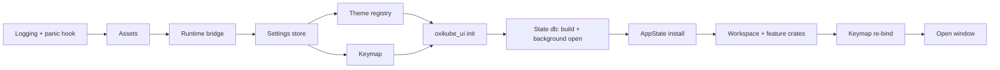

# Oxikube architecture

Oxikube is a native Kubernetes desktop client written in Rust on GPUI (Zed's UI framework).
It is organised as a hexagonal (ports & adapters) workspace so that the domain and the
use-cases never know about kube-rs, GPUI, SQLite, Argo CD or ACP. Adapters implement ports;
the binary wires them together.

## Layers and dependency direction

```
domain  ←  ports  ←  app  ←  (ui, bins)
             ↑
          adapters        (implement ports; never depend on app or ui)
platform                  (settings / keymap / theme / runtime / extension host; → domain, ports)
bins/oxikube              (wires adapters into app, mounts ui)
```

| Layer (`crates/<layer>/`) | May depend on (internal) | Must not depend on (external) |
|---|---|---|
| `domain` | nothing | gpui*, kube*, k8s-openapi, tokio, reqwest, rusqlite, wasmtime |
| `ports` | domain | gpui*, kube*, k8s-openapi, reqwest, rusqlite, wasmtime |
| `app` | domain, ports | gpui*, kube*, k8s-openapi, reqwest, rusqlite, wasmtime, agent-client-protocol, rmcp |
| `adapters` | domain, ports | gpui* |
| `platform` | domain, ports, platform | kube*, k8s-openapi, gpui-component |
| `ui` | domain, ports, app, platform, ui | kube*, k8s-openapi; `gpui-component` only inside `oxikube_ui` |
| `testing` | domain, ports | gpui-component |
| `bins`, `xtask` | anything | – |

`cargo xtask lint-deps` parses `cargo metadata` and fails CI on any violation. Dev-dependencies
are exempt so tests can use `oxikube_testkit` freely.

Why so strict: multiple agent teams work in parallel. The layer rules are what let a team
replace an adapter (kube-rs → something else, gpui-component → in-house) or add an integration
(Argo CD, Flux) without touching the core, and let the domain/app layers be tested with fakes
in milliseconds.

## Crate map

See `docs/PLAN.md` ("Workspace layout") for the one-line responsibility of every crate, and each
crate's `README.md` for its allowed dependencies. Highlights:

- `oxikube_domain` — ids, `ResourceKind`, the thin `Resource { meta, json }` model, view-models,
  `Quantity`, `Age`, session state and `NamespaceSelection`, `Command` / `Capability` vocabulary,
  safety types (`Risk`, `ConfirmTier`, `Initiator`), `AuditRecord`, telemetry-free records
  (`LogLine`, `Event`, `MetricsSample`, `ContextBlock`), the error taxonomy and the pure
  secret scrubber `redact` (`redact(&str) -> Cow<str>`, `Redacted<T>`, the pattern catalogue).
  Terms are defined in `docs/CONTEXT.md`.
- `oxikube_ports` — every async, object-safe trait (`ResourcePort`, `LogPort`, `ExecPort`,
  `StatePort`, `IntegrationPort`, `ToolPort`, `AgentPort`, …) with the transport types they
  exchange (`Delta`, `Table`, `ToolDef`, …). One module per port; each names its adapter.
- `oxikube_testkit` — a `Fake*` for every port, fixtures and builders, `TestPorts` (the seeded fakes
  `AppState::test` is built from), and the GPUI test harness (`gpui_test::TestApp` / `TestWindow`,
  `ScreenshotApp` with golden compare; `docs/testing-gpui.md`; the logs test matrix is `docs/testing-logs.md`).
- `oxikube_app` — services: `ClusterSessionManager`, `ResourceStore`, `CommandBus`,
  `MutationGuard`, `LogService`, `PortForwardManager`, `IntegrationRegistry`, `ToolRegistry`,
  `ContextRegistry`, `AgentSessionManager`. No gpui, no kube. Module `sidebar` (E06-S10):
  `review_access` (the rules reviews the cluster sidebar hides sections by; fails open) and
  `discover_custom_resources`; module `integrations`: the `IntegrationRegistry` stub. Module `session` (E06-S01):
  `ClusterSessionManager` connects a context through `ClusterConnectorPort`, holds the returned
  `ClusterPorts` bundle per session, drives `ClusterSessionState` (auth failures to
  `AuthRequired`, transient ones retried with backoff on the `ClockPort`, health reports for
  `Ready` ↔ `Degraded` → `Error`) and broadcasts `SessionUpdate`s; it spawns nothing (callers
  drive `connect` with `spawn_kube`, dropping it cancels the attempt). Per-cluster settings
  (E06-S08): the binary pushes a `ClusterPrefsTable` (`oxikube_ports::cluster_prefs`, resolved by
  `oxikube_settings::ClusterSettings` from `clusters.<id>`) into `set_prefs_table`; new sessions
  start from it and open ones follow it live (read-only, colour, display name; exec policy on the
  next connect), with a `SessionChange` per field for the clusters that changed.
  Module `catalog` (E06-S03):
  `ClusterCatalog` joins the `ClusterSourcePort` contexts (name, kubeconfig cluster and user,
  source file, `problem` when the context names a cluster or user the kubeconfig lacks) with the
  user's favourites and last-used times in the `cluster_catalog` state table; reading it is local,
  never a network call. `ClusterCommands` runs `cluster::Connect`, `cluster::Reconnect` (the
  retry), `cluster::CancelConnect` (only while an attempt is in flight), `cluster::Disconnect` and
  `cluster::ToggleFavourite` (reads, so no `MutationGuard`); the `CommandBus` (E06-S02) registers it.
  A `ClusterSession` also carries the API server URL of its catalog entry (`server()`).
  Module `sources` (E06-S05): `KubeconfigSourcesService` manages the user's kubeconfig sources
  (`add` a file or folder, `add` pasted text, `remove`, `reload`, `rows` with each source's status)
  over a `SourceListStore` (settings in the app), the `ClusterSourcePort` (`set_user_sources`,
  `source_statuses`, `validate_kubeconfig`) and the `FsPort` (`write_private`, `remove`); a pasted
  kubeconfig is stored `0600` as `<config dir>/kubeconfigs/<name>.yaml` (ADR 0015), only such files
  are ever deleted, and the `kubeconfig::*` handlers register with `register_commands`.
  Module `session::namespaces` (E06-S07): `NamespaceService` sets a session's `NamespaceSelection`
  (one `NamespaceChanged` per change, 150 ms debounce on the `ClockPort`), remembers selection,
  favourites and typed names per cluster in `StatePort` (kv `cluster/<id>/namespaces`), lists
  namespaces through `ResourceReader` (a `403` falls back to the typed names), drops stale
  selected names, maps `0`-`9` to All / the first nine favourites, computes a `ScopeDelta` for
  the `ResourceStore`, and runs the `namespace::Select` / `namespace::ToggleFavourite` commands.
  Module `store` (E07-S01): `ResourceStore`, the per-session cache behind every table, sidebar count
  and overview tile. Entries are keyed by (gvk, `FeedScope`: the cluster or one namespace); the
  table-driven `FeedPolicy` picks the port call (reflector or metadata-only `ResourceReader::watch`
  for core kinds, `TableFeedPort::table_feed` for CRDs and unknown kinds, ADR 0006); a `FeedBudget`
  hook admits, degrades or refuses new feeds (evicting idle ones first). `subscribe(StoreQuery)`
  returns a `Subscription` stream of `StoreDelta`s: a snapshot first, then coalesced `RowOp`s with
  positions in the subscriber's own sorted, filtered index (no re-sort per event), plus the
  `FeedState`. Feeds run on an injected `Spawner` (the Tokio bridge in the binary) under
  abort-on-drop guards; the last subscriber's drop starts a grace timer on the `ClockPort`, after
  which the feed is aborted. `Subscription::rescope` follows a namespace change with the
  `ScopeDelta`, keeping the feeds that stay. `ResourceStores` keeps one store per connected session.
  Counts (E07-S11, `store::counts`): `ResourceStore::counts(targets, selection)` answers each kind with a `CountState`
  from the caches' running health tallies (O(1), no feed started; a kind nobody watches is `NotWatched`), `CountsLease`
  holds the feeds a view needs through `subscribe` with a filter that matches nothing (no row index), and `health_of`
  (`oxikube_domain::view`) is the one healthy rule. A forbidden kind is `NoAccess`, a budget refusal `OverBudget`.
  Module `columns` (E07-S02): `ColumnProvider`, the one question a table asks of a kind (`columns(kind,
  caps)` and `cell(object, column, now)`), with two implementations (ADR 0006). `CoreColumns` is a
  table-driven catalogue of ~40 core kinds (computed `Ready` / `Status` / `Restarts` from the domain
  view-models, JSON-pointer columns for the rest, CPU/memory as `Cell::Pending` hooks that a
  `MetricsSource` fills in E13); `TableColumns` maps one Table feed's `columnDefinitions` (priority >
  0 is the `wide` flag) and rows, recovering typed sort keys from the server's text and substituting
  generic Name / Namespace / Age for a `TableSource::Objects` feed. A `Cell` carries display text, a
  typed `CellSort` (number, quantity, age, time, text) and a `Tone`; colours stay in the theme.
  The store sorts by any column through `SortField::Cell(CellSortKey)`: each object ranks by its
  cell's typed sort key, read once per object version from the view's provider (E07-S03).
  Module `actions` (E07-S08): row actions. `RowActionRegistry` says which bus commands are row actions and for which
  kinds (`KindFilter`; E12 registers scale, restart, cordon with `register` and touches nothing else); `RowActions::from_bus`
  joins it with the commands the `CommandBus` really has once, and `actions_for(kind, capabilities)` / `resolve(kind,
  ActionContext, selected)` filter that snapshot (an action the session lacks the capability for is absent, one blocked by
  read-only mode is `Disabled(ReadOnly)`; several selected objects keep the bulk actions). `register_commands` installs the
  `resource::Delete` handler (server dry run, then delete with the chosen propagation, behind the guard's `Mutation`), and
  `DeleteFlow` plans (`DeletePlan`: tier, risk, phrase to type) and runs a delete of one object or a selection, one guarded
  `resource::Delete` per object with per-object `ItemStatus` results and one audit record each. The guard's tier is target
  aware: `Command::effective_risk` raises `resource::Delete` of a Namespace, PersistentVolume, Node or a foreground
  (cascading) delete to type-the-name (`policy::confirm_tier_for`); an ordinary object takes a simple confirm.
  Module `store::filter` (E07-S04) is the `/` filter's grammar and predicates: `parse` turns
  `foo`, `!foo`, `-l k=v` and `-f fuzzy` into a `FilterExpr` (pattern compiled once per edit), and
  `FilterExpr::parts` splits it into a `StoreFilter` (name regex or substring, inverse, fuzzy:
  applied by the store to its cache) and a label selector. A selector is applied by the server:
  `Subscription::set_selector` re-keys the subscription's feeds (`FeedKey` carries the selector)
  without touching its scope, so it composes with the namespace selection. A filter that narrows
  the previous one (one more character) is applied to the rows the subscription already holds, off
  the UI thread (`SortedIndex::narrow`); anything else re-seeds from the cache. A fuzzy filter
  ranks (`SortField::Relevance`, ties on the object key); `StoreDelta::total` is the cache size
  before the filter, for `123 of 4,812`.
  Module `session::restore` (E06-S11): `SessionRestorer` reopens the last session. `prepare` reads
  the saved tabs (`ClusterTabsStore`, moved here from the workspace so the app layer can read what
  the tabs write), matches them against the catalog, opens each cluster as a `Disconnected`
  session in tab order with its remembered namespace selection, and forgets the clusters no
  kubeconfig defines any more (`RestorePlan::dropped`); `connect` connects the displayed cluster
  and, with `RestoreConnect::All`, the rest two at a time, each under its own deadline
  (`ClusterSessionManager::connect_with_deadline`) and with exec-plugin prompts one at a time.
  Module `guard`
  (E06-S02, E06-S09): besides the mutation pipeline, `guard::posture` holds the safety-posture commands
  (`cluster::ToggleReadOnly`, `cluster::SetColour`, `cluster::ApplyPreset`; confirm when lifting
  read-only on a production-flagged cluster, audited, persisted through the `PrefsWriter` the binary
  implements over `ClusterSettings::update_cluster`), and every `Mutation` writer re-checks the
  read-only flag before each request.
- `oxikube_app::logs` (E08-S01) — `LogService`: `open(port, target, options)` returns a `LogSession` for one
  container of one pod (`LogTarget`; the port's `LogOptions` carry follow / since / tail / previous /
  timestamps) and returns at once; the stream is opened and read by one task on the service's `Spawner`
  (abort-on-drop, held by the session). The task collects lines into batches (2 048 lines or one 32 ms tick)
  and commits each to a `LogBuffer`, a ring of the newest `logs.buffer_lines` lines (`LogEntry`: seq, server
  timestamp, shared pod and container names, one `Arc<str>`), with O(1) access by index or seq and range
  reads; older lines are dropped and counted (the "truncated" marker). Readers (`LogReader`, cheap to clone,
  not owners of the stream) poll `LogDeltas`: per-consumer cursors yield `LogDelta { appended, dropped_front,
  first_seq, state }` computed at poll time, so a slow consumer gets one larger delta and nothing queues. The
  state machine is `Connecting`, `Streaming`, `Ended(Completed | StreamClosed | Cancelled)` or
  `Failed(LogFailure)` (kind, redacted message, retryable); `ReconnectPolicy` is the seam of E08-S07.
  `set_buffer_lines` applies a changed setting to open sessions at once; `open_in(cluster, ..)` and
  `set_cluster_buffer_lines` give a cluster its own bound (`clusters.<id>.logs.buffer_lines`, E08-S10; each
  cluster's sessions read one shared cell, so open sessions resize when the override changes). Line text is
  never logged.
  `LogSession::clear` (E08-S06) empties the buffer at the user's request: seqs are not reused and cleared lines are
  not "dropped" (`LogBuffer::cleared`), the stream goes on. Module `logs::export` (E08-S06): `ExportFormat`
  (`[timestamp ][pod/container ]text`), `ExportSpec` (a seq range plus the viewer's `LineFilter`), `chunks` / `save`
  (bounded ~256 KiB chunks read under one short lock, fed to `FsPort::write_stream`) and `copy_text` (capped).
  Module `filter` (E08-S03): `LogFilter { pattern, case_sensitive, inverse }` (a regex; the empty pattern matches
  everything), compiled once per edit to a `LogMatcher` (`matches(&str)`, the predicate the agent's `get_logs`
  `grep` reuses, and the highlight `spans`; an invalid or oversized pattern is a one-line `FilterError`), and
  `MatchIndex`, the sorted seqs of the matching lines over a `LogBuffer`: `scan` tests only the lines appended
  since the last call and drops the matches of lines the ring dropped (a rescan is the same call in chunks),
  with `next` / `prev` that wrap and skip trimmed lines. A property test pins it to a naive full scan.
  `logs::parse` (E08-S05, pure): `parse_line(&str) -> Option<LogRecord>` reads a line that is a complete JSON
  object (per line, so streams mix text and JSON) into a normalised `LogLevel` (trace to fatal, `Unknown`;
  bunyan and pino decades 10-60, names like `warning` / `dpanic`), a `RecordTime` (RFC 3339, epoch s / ms / us /
  ns, floats; the original text is kept when unreadable), the message and the remaining fields in source order,
  under a `FieldMap` of key names (zap, logrus, bunyan, pino and the aliases `severity` / `message` /
  `timestamp`); `pretty` is the expanded form; lines over 64 KB and lines cut by the per-line cap are text.
  The service reads each line's level once as it commits it (`LogEntry::level`, `None` for plain text), before the
  buffer's lock is taken; `LevelFilter` (one byte, a set of level chips) is the predicate a view tests entries with.
  Module `aggregate` (E08-S04): `open_aggregate(ports, spec, options)` returns an `AggregateSession`, the logs of
  every pod a Deployment, StatefulSet, DaemonSet, ReplicaSet, Job or Service (its `spec.selector`) or a typed label
  selector picks, merged into one `LogSession` (one ring bounded by `logs.buffer_lines`, not one per pod). One
  coordinator task (abort-on-drop) reads the object through the `ResourceReader`, watches the matching pods and opens
  one stream task per streamable container (regular and sidecar containers; at most `logs.max_streams` at once, default
  20, the pods left out counted for the "N more pods not streamed" notice); each stream batches like a single session
  and hands its batches to the coordinator over a bounded queue (a slow coordinator pushes back on the connection); the lines waiting in the merge are capped at `logs.buffer_lines` too, so the memory is the ring plus at most as many lines again, whatever the number of pods.
  Lines are merged by server timestamp (`timestamps=true`), then stream id, then position in the stream, through a
  300 ms reorder window (`LogConfig::reorder_window`), never reordering within one pod whatever the clock skew; nothing
  is committed until the first group of streams answered (`startup_wait`, 2 s at most) plus one window; a line that
  arrives later than the window goes in at once after what is there. The `AggregateView` says which streams exist
  (`SourceInfo`), what changed in the pod set (`PodEvent` `Added` / `Ended`, the hook E08-S07 follows replacements
  from; the first list is the baseline), the pods the cap left out, and which pods and containers the user switched off
  (`HiddenSources`; they keep streaming, the viewer filters).
  Module `logs::excerpt` (E08-S09): `LogService::read_excerpt(ports, &ExcerptRequest)` is the bounded, non-following
  read behind the agent hooks: it opens a session (or an aggregate for a workload or selector) with `follow` off,
  waits for it to end (20 s at most on the service's clock), picks the newest `tail` (1 to 2 000, default 200) lines
  the `LogFilter` accepts (a `grep` searches the newest 10 000 lines of each container), writes them as
  `timestamp pod/container text` within 256 KiB with the secrets masked by `oxikube_domain::redact` (applied to the
  joined text, so a PEM block spanning lines is caught too; best effort for free text), and returns a `LogExcerpt`
  whose `notes()` say what was left out (tail, size, search window, timeout, failed streams, pods over
  `logs.max_streams`). `LogClusters` names the cluster's `AggregatePorts` (`ClusterSessionManager` implements it:
  the call's cluster, else the only connected one).
- `oxikube_app::context` (E08-S09) — `ContextRegistry` routes an `@`-mention to the `ContextProviderPort` that owns its
  prefix and keeps one resolution within `ContextScope::max_total_bytes`. `LogContextProvider` owns `@logs`:
  `@logs/<ns>/<pod>[/<container>]`, `@logs/<kind>/<ns>/<name>` (a workload's pods merged), `@logs/selector/<ns>/<labels>`
  and the options `--since`, `--tail`, `--grep`, `--container` as path segments (a mention has no whitespace); the block
  is a `# key: value` header (cluster, namespace, source, container, time span, line count), `# note:` lines and the
  lines. `selection_context` builds the same block from lines the viewer selected ("Send to agent"). `PendingContext`
  is the small queue between the viewer and the agent panel: items wait (32 at most, the oldest dropped and counted)
  until a `ContextConsumer` attaches, which receives them in order, then every later send; nothing is persisted.
- `oxikube_app::exec` (E09-S08) — `ExecService`: `open_shell(pod, container, &ShellOptions)` finds the shell with a quick
  non-interactive exec per entry of the chain (`terminal.exec_shells`, default `bash`, `sh`; exit 126/127 or `executable file
  not found` means missing, anything else stops the search), opens the first the container has over the session's `ExecPort`
  and wraps the backend in a `NoticeBackend` whose first output is one dim line (`bash not found, using sh in web-0/app`);
  `attach` and `exec` open the other two; failures keep their kind with a message that names the pod, a `Conflict`
  (container not running, pod terminating) marked retryable, and "no shell" an `Unsupported` that points to a debug
  container (Windows pods get Windows advice). `PodContainers::of(&Resource)` lists what can open (regular containers,
  sidecars, ephemeral ones, an init container only while it runs; the `kubectl.kubernetes.io/default-container` annotation,
  else the first regular one, is the default), `plan_container` turns a request into `ContainerPlan::Open(name)` (named,
  or the only candidate) or `Pick(ContainerChoices)` (several: the picker's rows with the last container opened in this
  pod, else the default, preselected; `ExecService::remember` keeps it for the session). Nothing here applies policy.
  The policy is the guard's: `pod::Shell`, `pod::Attach` and `pod::Exec` are the **exec class** (`CommandMeta::exec`,
  `meta.exec`): not mutations and never confirmed, but `MutationGuard::run_exec` refuses them on a read-only cluster
  unless `clusters.<id>.exec_in_read_only` (`ClusterPrefs::exec_in_read_only`, read live from the session) is on, fails
  closed when the audit log cannot be written, and audits every open with the initiator, the pod and a `detail`
  (`session=shell container=app`, plus `program=psql` for `pod::Exec`: the program only, never arguments, input or
  output). Their tool stubs (`k8s.pod_shell`, `k8s.pod_attach`, `k8s.pod_exec`) are `risk: high`, `unsafe`,
  `interactive` and `agent_hidden`: `CommandBus::agent_tools(false)` and `ToolRegistry::visible` leave them out until
  the agent epic turns them on. `ActionContext` greys the row actions out on a read-only cluster with the reason.
  Debug containers (E09-S10, `exec::debug`): `ExecService::debug_defaults` (the dialog's start: the image last used in
  this cluster, else `busybox`, `sh`, the containers that can be shared with and the pod's default one),
  `plan_debug` / `DebugRequest::check_fields` (pure: the image is one word, the target exists (default: the pod's default
  container), the name is a DNS label not used in the pod, a finished pod is refused, a generated `debugger-xxxxx` name is
  unique) and `open_debug(&Mutation, &DebugRequest)`, which takes the guard's permit as proof it runs inside `pod::Debug`,
  re-checks read-only, then calls `ExecPort::create_debug_container` (patch `ephemeralcontainers`, wait for Running with
  the request's timeout, attach with a TTY) and keeps the attached session until the new tab claims it through
  `ExecService::attach` (a Reconnect finds nothing kept and attaches to the same container again). `DebugRunner` is the
  dialog's door: it dispatches `pod::Debug` on the bus as `Initiator::Ui` and answers the guard's simple confirmation once.
  `pod::Debug` is not exec-class: it is a low-risk **mutation** (`CommandMeta::interactive_mutation`, simple confirm,
  read-only blocks it for everyone even where `exec_in_read_only` lets a shell through, audit `detail`
  `session=debug image=busybox target=app program=sh`, a dry-run dispatch stops after planning because the port has no
  server dry run of the subresource patch); its tool stub `k8s.pod_debug` is `unsafe`, `interactive` and `agent_hidden`
  (`CommandMeta::interactive` drives the three flags). The confirmation text says the container cannot be removed or edited.
- `oxikube_app::exec::node_shell` (E09-S09) — node shells: `node::Shell` is a **mutation** (it creates a privileged pod), not
  the exec class, so it takes the whole `MutationGuard` pipeline: blocked on a read-only cluster for every initiator
  (`exec_in_read_only` does not lift it), a `Simple` confirmation (`Risk::Medium`) whose summary names the node, the image
  and the namespace (`policy::summary_in` reads the session's `ClusterPrefs`), and an audit record with
  `detail = phase=create image=... namespace=...`. `register_command(registry, service, opener)` registers the handler:
  `ExecService::authorize_node_shell` renders the pod from the settings (`NodeShellSpec::for_node`, `node_shell_manifest`
  in `oxikube_ports`), asks the server to **dry-run** creating it through the command's `Mutation` (so missing RBAC, a pod
  security admission that refuses privileged pods or a quota fails here with the namespace and the setting to change, and
  no tab opens) and leaves a one-shot, 2-minute **permit** for that node; `opener` (the terminal's `TerminalViewSink::
  node_shell_opener`) queues the tab. The tab's launcher calls `ExecService::open_node_shell`, which refuses without a
  permit (`Forbidden`: the UI cannot reach the privileged port around the guard), sweeps the cluster's leftover shell pods
  once per run (label `oxikube.dev/node-shell`, nothing stamped the pod alive for `JANITOR_GRACE`, 15 min: an open shell
  refreshes its pod's `oxikube.dev/node-shell-heartbeat` annotation every minute, so another window's or user's live
  shell is spared however long it lives; each deletion is audited as `phase=sweep`) and has `ExecPort::node_shell` create
  the pod, wait for it, exec `nsenter` into the node's namespaces and hand back the session; the backend is wrapped in
  `AuditedBackend`, which writes the second audit record (`phase=delete`, same who/initiator/node/image/namespace) when the
  shell exits, is killed or the backend is dropped (the tab closed) while the adapter deletes the pod (on exit, error, drop,
  abort; `ExecService::close_node_shells`, called from the quit hook in `bins/oxikube`'s mount, deletes the pods of the shells
  still open and writes their records and the audit backlog, since GPUI drops no terminal on quit; `activeDeadlineSeconds`
  is the last net). The tool stub `k8s.node_shell` is `unsafe`, `interactive`, `agent_hidden`
  (`CommandMeta::interactive_mutation`) and advertises `risk: medium`. Failures are re-worded by `failure::explain` (pod security
  admission, quota, RBAC, image pull, timeout) and keep their kind and `retryable`. `ExecService::set_audit` is wired after
  the bus exists (`MutationGuard::audit_handle`) because the bus needs the service for the handler.
  The template: `ClusterPrefs::node_shell_image` / `node_shell_pull_secret` plus the `node_shell` block
  (`NodeShellPrefs`: `namespace`, `command`, `nsenter_args`, `tolerations`, `labels`, `image_pull_policy`,
  `max_lifetime_seconds`), defaults in `default.json` (equal to `NodeShellSpec::new`, a test checks it), merged field by
  field across layers.
- `oxikube_app::tools` (E08-S09) — `ToolRegistry`: `register` (validates the `ToolDef`, refuses a mutating tool, which
  belongs behind `MutationGuard` in E26, and duplicates), `defs` / `visible(capabilities)` (a tool's `needs`), and
  `invoke(name, args, &ToolContext)` which checks the arguments against the tool's input schema (`validate_args`, the
  flat subset the tool schemas use) before the tool runs. `tools::k8s::get_logs` is `k8s.get_logs`: `pod` or `selector`
  (a label selector or `deployment/api`), `namespace`, `container`, `since`, `tail`, `grep`; read-only (no risk, needs
  the logs capability, idempotent), output as text plus structured counts; both or neither of `pod` / `selector`, a
  `tail` over the cap and an unparsable `since` or `grep` are a failed call (`Err`), a missing pod or a denied
  `pods/log` is a tool error the model sees. The name is the acceptance's `get_logs` in the `k8s.` namespace
  `ToolName` requires (E26-S04's `k8s.logs` can alias it).
  Module `churn` (E08-S07, reconnect and churn following): every followed stream (a session's, an aggregate's)
  reads through `Resumable`, which reopens a stream that broke while its pod runs after a backoff with deterministic
  jitter (`ReconnectPolicy::Backoff`: 500 ms doubling to 30 s; `logs.reconnect_retries`, default 5, failures in a row,
  hot-reloaded through `LogService::set_reconnect_retries`; a stream that delivers a line, or stays open 10 s
  (`Backoff::stable`: a quiet pod behind a proxy that closes idle streams), starts the count again),
  from `sinceTime` = last line - 2 s with the replayed overlap dropped by (server timestamp, text hash) over the last
  512 lines (`Overlap`); state `LogState::Reconnecting { attempt, max, failure }` (aggregate:
  `SourceState::Reconnecting`), then `Failed` after the cap. A container still waiting to start (a rollout's new pod)
  is retried every second, not failed. `open_following_in(cluster, ports, target, options)` gives a single-pod session
  the `ResourceReader` too: it records the pod's `PodIdentity` (uid, controller `OwnerRef`, node) as the stream opens
  and, when it ends, reads the pod again to say why: `EndReason::PodFinished` (`Succeeded`/`Failed`),
  `ContainerFinished` (the followed container exited and will not restart while the pod runs on: a completed init
  container), `PodReplaced` (deleted, terminating or recreated, with a controller) or `PodDeleted` (no controller); a
  container between restarts (`CrashLoopBackOff`) is waited for with growing pauses and no retry counted; still
  running is a dropped connection. `find_replacement(resources, &identity)` names the pod that took over (the Deployment's
  selector for a ReplicaSet's pod; only the namesake for a StatefulSet's, only a pod on the same node for a DaemonSet's,
  otherwise only a pod newer than the gone one, the newest running first; `None` until it exists, never a sibling). `LogSession::reconnect` restarts a failed or ended session in place: the lines stay
  and the new stream continues after them. An aggregate reads a pod that joins after the view opened from its first
  line (no tail, no since).
  Module `logs::kubectl` (E08-S08): `KubectlTail` builds the argv of `kubectl logs -f` for a pod or a label selector
  (`--context=`, `--namespace=`, `--container=`, `--previous`, `--timestamps`, `--since=`, `--tail=`, `--limit-bytes=`;
  a selector adds `--prefix`, `--all-containers` and `--max-log-requests`), values glued to their flag and a pod name
  that starts with `-` refused, never a shell string; `Kubectl` is the cached answer to "is kubectl installed?"
  (`KubectlLookup`, `PathLookup`: `PATH` plus the install folders a GUI launch lacks; refreshed by the caller on a
  background task, "not known yet" reads as "not installed").
- `oxikube_logs_ui` — E08-S01, S10: `LogsSettings` (the `logs` block: `buffer_lines` default 50 000 clamped 100 to
  5 000 000, `default_tail` 1 000 clamped 1 to 100 000, `wrap`, `timestamps`, `json_auto_detect` (JSON mode's starting value, E08-S05); defaults in
  `default.json`, schema generated, per-cluster overrides under `clusters.<id>.logs`, out-of-range values clamped
  with a warning), `log_runtime` (the Tokio-bridge spawner) and `follow_settings` (hot reload of
  `buffer_lines`, global and per cluster, into the `LogService` on a background task; `wrap`, `timestamps` and
  `json_auto_detect` are applied by each open view, `default_tail` by the next read of the tail). Module
  `view` (E08-S02): `LogView`, a pod's log as a workspace `Item` (tab `pod/container`). It holds one `LogSession`
  (the service owns the abort-on-drop read) and polls its deltas into a `LineWindow` (truncated marker, lines by
  seq, state row for Connecting / Ended / Failed), redrawing through `notify_coalesced`; rows are read from the
  ring buffer only for the screen (`uniform_list` unwrapped, `list` over a spliced `ListState` wrapped, the top
  line anchored across the toggle). Autoscroll pauses on a scroll up and the "N new lines" pill counts by seq.
  Options: range (tail 1 000 lines / head 1 MiB / since 1m-1h), container (init, sidecar, regular, ephemeral from
  the pod spec; a pod of several containers is read on its `default-container` or first regular one), previous
  instance, wrap, timestamps, fullscreen (the cluster tab's pane zoom); a change of what is read reopens the
  session. Keys in the `LogView` context (k9s: `0`-`6`, `s`, `w`, `t`, `p`, `f`, `m`, `c`, `shift-c`, `ctrl-s`).
  E08-S06: lines are selected by click, shift-click or drag (by seq, so scrolling and the ring never move a
  selection); `m` marks the focused line (gutter bar, dropped with its line); `c` copies the selection or the
  screen (5 MB cap, toast); `shift-c` clears the buffer (asks when lines are marked); `ctrl-s` / `ctrl-shift-s`
  open the `SaveDialog` (module `export`: scope, line count, timestamp and pod-prefix toggles, the truncation note),
  then the platform's save panel, then the chunked write on the Tokio bridge through `FsPort::write_stream`.
  Copy and save take what the rows show: the search's matches while filter mode narrows the rows, the lines the level
  chips admit, and any filter installed with `set_line_filter` (`LogView::active_filter`); structured lines are copied as
  their raw JSON text. `view::chrome` draws the gutter bar and selection colour on both plain and JSON rows.
  Module `commands`: `pod::ViewLogs` and `logs::SetRange`, `SelectContainer`, `TogglePrevious`, `ToggleWrap`,
  `ToggleTimestamps`, `ToggleAutoscroll`, `ToggleFullscreen` (and, E08-S05, `ToggleJsonMode`, `ToggleLevel`, `ToggleLine`, `CollapseLine`; E08-S06, `Mark`, `Copy`, `Clear`, `Save`; E08-S09, `SendToAgent`; E08-S08, `TailInTerminal`) on the bus (reads, tool stubs), queued to the
  window's `LogViews`, which opens a view in the pod's cluster tab (one per pod, through a `LogHost`) and applies
  the changes. `row_actions`: "View Logs" on pod rows of the resource tables, and on Deployment, StatefulSet,
  DaemonSet, ReplicaSet, Job and Service rows (`workload::ViewLogs`).
  Toolbar (E08-U556; `view::toolbar`): one row that fits at 1024 px and at UI scale 1.5: the breadcrumb (the only part
  that truncates), the container picker (`main (1/2)` with a caret when the pod has several containers), the range
  dropdown (`tail 1000`, `since 5m`, ...), Search, Previous, Wrap, Autoscroll and a "..." menu with the rest
  (Timestamps, JSON, Mark, Copy, Send to agent, Save, Clear, Tail in terminal, Fullscreen); every entry sends its
  command, and each has a key. A crash-looping container (`CrashLoopBackOff`, or restarted with an error exit) gets a
  strip saying that Previous holds its last crash. `view::snap` leaves the body's slack (height modulo one row) empty
  above the unwrapped rows, so the oldest row on screen is never cut in half under the toolbar.
  Tail in terminal (E08-S08; `view::tail`, `kubectl`): the "..." menu's "Tail in terminal (kubectl)" and `shift-t`
  (`logs::TailInTerminal`) ask the window's `TerminalViews` (through `TerminalViewSink::open`) for a terminal tab of the
  view's cluster that runs `kubectl logs -f` for what the view shows: the program is the kubectl that was found (absolute
  path), the arguments come from the view's own options (`KubectlTail`), the tab is a local `BackendDescriptor` of the
  cluster and namespace titled `logs <pod>/<container>`, so the cluster's kubeconfig, context and namespace reach it as
  for `terminal::New` (no second env injection, nothing secret in the descriptor or the argv) and nothing on its screen
  is saved. The action is hidden, not disabled, when kubectl is not installed: `follow_kubectl` looks it up on a
  background task at start-up, on a settings change and every minute (`Kubectl`, never a process on the UI thread);
  the key and the palette's command say "kubectl was not found" instead. A workload view uses its resolved selector
  (`--selector=... --prefix`); before the selector is read the action says to try again.
  Module `search` (E08-S03): the `/` bar under the toolbar (`logs::Find`, also `cmd-f` / `ctrl-f`): a regex over the
  stored lines with case and inverse toggles, in *highlight* mode (all lines, matches painted, `3 of 41`, enter /
  shift-enter or `n` / `N` jump and wrap) or *filter* mode (only the matching lines are rows: the `LineWindow` is
  narrowed to the `MatchIndex`). An invalid pattern shows its reason and the last good one stays. Commands
  `logs::Find`, `NextMatch`, `PreviousMatch`, `ToggleCase`, `ToggleInverse`, `ToggleFilterMode`, `CloseSearch` (reads,
  tool stubs). The matching is `oxikube_app::logs::{LogFilter, LogMatcher, MatchIndex}` (below); an index over a
  buffer of more than 4 000 lines is built in 16 384-line background jobs and published when done, and each delta
  tests only its new lines. The search is kept per window in `SearchMemory` (not on disk), so reopening the same pod's
  logs in the same session restores it.
  JSON mode (E08-S05, `logs.json_auto_detect`, on by default; `j`, `logs::ToggleJsonMode`): a structured line is a row of level chip, time,
  message and its other fields collapsed to `key=value` (`view::columns`, parsed only for the rows on screen and
  cached by seq, `view::json`); a click expands it (`logs::ToggleLine`, closed by `logs::CollapseLine`, JSON mode off or a chip hiding the line) into a pane under the rows with its pretty-printed JSON
  (`view::detail`, rows keep one height); plain-text lines draw as before. Level chips (`logs::ToggleLevel`:
  trace to fatal, and `text` for plain and level-less lines) hide lines through `LevelFilter`; while one is off the
  `LineWindow` keeps the seqs of the lines that are rows (`view::filter`, composed with the search: the rows are the
  matches that also pass the chips), a delta is filtered as it is applied and a changed chip, search or mode is one
  pass over the window's candidate lines. Raw text is what a copy takes.
  Multi-pod (E08-S04): `LogView::workload` is the same tab over an `AggregateSession` (tab `deployment/web`; one tab
  per object; `workload::ViewLogs` takes an optional further label `selector` and container). Module `view::aggregate`:
  each line is led by a fixed-width gutter with the pod's short name (the part of the name its siblings do not share,
  plus `/container` when the pods have several) in a colour hashed from the pod name into the theme's
  `oxikube.log_sources` palette (`log.source.1` .. `10` in a theme's `oxikube` block, derived from the terminal ANSI
  colours by default); a non-modal banner under the toolbar shows "pod web-7d9 added" / "pod web-4c1 ended" (cleared
  after 8 s or dismissed), "N more pods not streamed" and "No pods match app=web"; the toolbar's Sources menu
  (`logs::ToggleSource`) switches pods and containers off and on, which `LineWindow` applies as a filter over seqs
  (hidden lines stay in the ring buffer). `logs.max_streams` is the setting (default.json, schema, hot reload).
  After the stream stopped (E08-S07, `view::recovery`): the state row says why ("Reconnecting (1/5): ...", "Pod
  finished", "Pod replaced", "Pod deleted"), and a strip under the toolbar offers "Follow replacement"
  (`logs::FollowReplacement`, `shift-r`: `find_replacement` on `spawn_kube`, then the tab switches to the new pod with
  the same container and range) or "Reconnect" (`logs::Reconnect`, `r`: `LogSession::reconnect`, the lines kept; a
  multi-pod view reopens). The multi-pod banner lists the streams that reconnect ("web-7d9/app reconnecting (1/5)").
  `logs.reconnect_retries` is the setting (default.json, schema, hot reload).
- `oxikube_resources_ui` — module `exec` (E09-S08): `exec_row_actions` ("Shell" and "Attach" on a Pod's context menu and the palette's list, keys `s` / `a`, the pod detail's header buttons), `ExecFlow` (reads the pod through `ExecService::plan` on `spawn_kube`, then dispatches `pod::Shell` / `pod::Attach` with the container chosen, or asks first) and `ContainerPicker` (a workspace modal: up / down, enter or click opens, escape sends nothing, so cancelling leaves no audit record of an open that never happened). Module `exec::debug` (E09-S10): "Debug" on a Pod's row (order 130, key `shift-d`, the detail header's bug button) opens `DebugDialog` through `ExecFlow::begin_debug` (it reads the pod for the defaults on `spawn_kube`): image, the container to share processes with, command, optional name, the note that the container is permanent; the button runs `DebugRunner` on `spawn_kube`, shows progress while the container starts and an API refusal under the fields, and closes on success (the terminal opens in the bottom dock). Module `actions` (E07-S08): `ResourceActions` (the row actions of the bus and the delete flow, shared by every table through `ResourceTableDeps::actions`), the actions appended to a row's context menu and `ResourceTable::action_entries` (the palette's list, the same), the `delete` / `ctrl-d` key (`resource_table::DeleteSelected`), and `DeleteDialog`, a workspace modal: propagation choice, type-the-name, one confirmation for a selection, a virtualised per-object results list.
  Node rows (E09-S09): `exec_row_actions` also offers "Shell" on a Node (`node::Shell`, key `s` on a node table, a button in
  the node detail's header), greyed out on every read-only cluster; the runner confirms with the node and the image named.
  module `detail` (E07-S05): `DetailView`, the generic detail of one object, one entity with two
  mounting modes: the content of `DetailDrawer` (a `Panel` in the cluster tab's right dock, opened by `resource::Open`) and,
  after `resource::PinDetail`, a workspace `Item` that moves between panes with its tab, scroll and expanded values intact.
  It follows the object as a one-row `ResourceStore` subscription on the table's own feed, reads the full object once (`spawn_kube`)
  for metadata-only and Table feeds (Secret values removed inside that read), and draws header, labels/annotations (copy through
  `resource::CopyLabel`), owner links (`resource::Open`), finalizers, conditions, the `status` summary and the Events tab
  (the namespace's `Event` feed, started on first show) in virtualised lists. The YAML tab (E07-S06, `detail::yaml`) shows
  the complete object as read-only YAML in `oxikube_ui::editor` (gpui-component's editor with tree-sitter YAML): the text is
  `yaml_text`, a pure function over a copy of the object (`metadata.managedFields` hidden unless `resource::ToggleManagedFields`,
  a Secret's `data`/`stringData` values and `last-applied-configuration` replaced by `(hidden)`), made once per object version
  when the tab is shown, never in render; `resource::CopyYaml` and `resource::SaveYaml` (file dialog, then `FsPort::write`) write
  exactly that text. The Describe tab (`detail::describe`) reads the connection's `DescribePort` on the Tokio bridge on first
  show (spinner, error with Retry, `resource::RefreshDescribe`), the previous text staying while it refreshes. The view carries the `Detail` key context (E07-U559, `detail::keys`, `mount == drawer|tab`): `escape` closes the drawer and the workspace refocuses the table, `j` / `k` and the arrows call `ResourceTable::step_detail` on the table it was opened from (the cursor moves and `resource::Open` shows the new object), `1`-`5` switch tabs; conditions are two lines (type, status, age; then the muted reason and message) and label, annotation and status keys are cut with a tooltip. Module `overview_lite` (E07-S11): `WorkloadsOverview`, the first screen of a connected cluster tab
  (a workspace `Item`): one `oxikube_ui::tile::StatTile` per `Tile` of the `TileRegistry` (Deployments, StatefulSets,
  DaemonSets, ReplicaSets, Jobs, CronJobs, Pods) with total and healthy from a `CountsLease`, read once a second and redrawn
  coalesced only on change; a click sends `resource::OpenList`. Module `navigate`: the `resource::OpenList` handler and the
  `KindViews` registry the generic table registers its opener in. The sidebar (`oxikube_workspace::sidebar::badges`) shows count
  badges from the same store: it keeps a lease only on the kinds the store counts eagerly (pods, nodes, namespaces,
  deployments) and reads every other badge off whatever feed is already open. Module `crds` (E07-S07): CRD browsing as plain
  Rust (`CrdInfo`, `served_versions`, `SchemaTree`, the CRD list's row actions) plus the views over it: the CRD row's `crd::OpenResources`
  (Enter; `ResourceViews` reads the CRD, takes the storage version if served, asks discovery and opens the table), the table's
  version switcher and "Basic columns" note (`table::crd`), and the Schema tab of a CRD's detail (`detail::schema_tab`: a lazy,
  bounded, collapsible `openAPIV3Schema` tree).
- `oxikube_describe` (E07-S06) — the `DescribePort` adapters. `NativeDescribe` renders `kubectl describe`-style text in process
  with deskribe (a dependency; 36 specialised kinds plus a generic layout for custom resources) over the connection's kube
  client, finding the kind's plural through discovery; `KubectlDescribe` runs `kubectl --context <ctx> [--kubeconfig <file>]
  describe <plural[.group]> <name> [-n <ns>]` as a child process (stdin closed, killed on drop or after 30 s, nothing secret on
  the command line); `Describer` is the port the app gets and picks by the shared `DescribePreference` at each call: `auto`
  (deskribe, `kubectl` only for a kind deskribe does not cover), `native` or `kubectl` (the `describe.backend` and
  `describe.kubectl_path` settings, hot reloaded by the binary). `oxikube_kube::KubeConnector::set_describe_factory` hands each
  connection's client and discovery to the factory the binary supplies (`bins/oxikube::kube_ports::SourcesConnector`), which
  fills `ClusterPorts::describe` and points `kubectl` at the file that defines the context.
- `oxikube_ui::editor` (E07-S06) — the read-only code view (`read_only_state`, `set_text`, `code_view`) over gpui-component's
  editor with the `tree-sitter-yaml` feature; the manifest editor (E10) builds on the same state type. gpui-component links
  tree-sitter 0.26, so the workspace pins `tree-sitter = "0.26"` (one native library may be linked).
- `oxikube_catalog_ui` — the cluster catalog UI. Module `sources` (E06-S05): `SourcesView`, the
  kubeconfig sources screen (a workspace `Item`): one row per entry of `kubeconfig.sources` with its
  status (found with N contexts, or the error inline next to that one source), add file / add folder
  through the platform picker (async), a paste dialog with a credentials warning (hosted by the
  workspace modal layer), remove with a confirmation that says whether a file is deleted, and
  reload all; a `SourcesBackend` sends the `kubeconfig::*` commands, `SettingsSourceList` keeps the
  list in `settings.json` and `follow` pushes every change (hot reload) to the cluster source.
  Module `namespaces` (E06-S07): the
  `NamespaceSelector` dropdown for the cluster tab toolbar (All, multi-select, favourites with
  their digits, local search, virtualised list, the restricted-cluster fallback), a view over
  `NamespaceService`; it emits `NamespaceSelectorEvent` for the host's toasts. Module `catalog`
  (E06-S03): `CatalogView`, the home screen and a workspace
  `Item`: a virtualised (`uniform_list`) list of every kubeconfig context with cluster, user,
  source file, status badge from the session update stream, last-used and favourite star, a fuzzy
  search (`nucleo-matcher`) in a field that has focus on open, Enter or click to connect, an empty
  state that explains how to add kubeconfigs, and invalid contexts kept with an error badge.
  `model` is plain Rust (order: favourites, last used, name; with a query: match score), `dispatch`
  sends the cluster commands through a `CommandDispatcher` (the bus once it lands), keys live in the
  `Catalog` sections of the default keymaps. Module `hotbar` (E06-S04): `Hotbar`, the strip at the
  window's left edge with every connected and favourite cluster (colour dot, initials, state dot,
  tooltip, right-click menu, drag to reorder, order kept in the `hotbar` state table); the
  displayed cluster comes from `ClusterTabs`, favourites from `ClusterCatalog` and its
  `favourite_changes` stream. Clicks send `cluster::Select` / `cluster::Connect`; the favourite
  toggle is `cluster::ToggleFavourite`. Module `connect` (E06-S06): the connect lifecycle of a cluster
  tab. `ConnectView` follows one session and draws its state (`Connecting`: spinner, server, context,
  Cancel; `AuthRequired`: the plugin's message, the cluster's exec policy and how to sign in, Open
  terminal, Retry; `Error`: summary, expandable and copyable details, Retry, Edit kubeconfig
  sources; `Disconnected`: Connect), `DegradedBanner` is the strip above a degraded cluster's
  content, and `ConnectViewModel::of(state, info)` is the pure state-to-content mapping with every
  text redacted. `connect::install` / `tab_setup` hand both to a `ClusterTab` (`ConnectUi`); Retry,
  Cancel and Connect send `cluster::Reconnect`, `cluster::CancelConnect` and `cluster::Connect`
  through the `CommandDispatcher`. The terminal (E09) and kubeconfig sources (E06-S05) are host
  hooks on `ConnectDeps`: the terminal button is drawn disabled until a terminal exists, the
  sources link is hidden until the sources page exists.
- `oxikube_kube` — the kube-rs adapter (connection, discovery, reflectors, Table API feed,
  mutations, subresources, kubectl-equivalent algorithms, logs, exec, port-forward, metrics,
  events).
- `oxikube_state_sqlite` — the `StatePort` adapter (ADR 0010): rusqlite (bundled) on a dedicated
  thread, embedded ordered migrations, one `kv` table for the kv store and typed tables, the
  append-only audit log, corrupt-file fallback (`state.db.corrupt-<timestamp>`).
- `oxikube_terminal` — the terminal stack. Module `backend::local` (E09-S02): `LocalPty`, the user's
  shell on a `portable-pty` PTY as a `TerminalBackend` (`terminal.shell` / `terminal.shell_args`
  settings, default `$SHELL` then `/bin/sh`). Three OS threads per session (read into a bounded
  queue, write, wait for the child) that end with the backend; `kill` signals the whole process
  group; the exit status carries the code or the signal. A cluster terminal (`ClusterEnv`) gets
  `KUBECONFIG` (a private `0600` file in a per-process `0700` runtime directory that holds only the
  selected context, its cluster and its user, paths made absolute; deleted when the shell exits or
  the backend drops, swept after a crash), `KUBE_CONTEXT` and `OXIKUBE_NAMESPACE`; `PATH` is
  inherited untouched. The grid, element and view arrive with E09-S04..S07.
- `oxikube_ui` — the only crate that imports `gpui-component`; exposes tokens and curated
  components to every view.
- `oxikube_terminal` — the one terminal (epic E09). Module `grid` (E09-S04): `TermGrid`, the only
  code that names `alacritty_terminal` (pinned `=0.26.0`) types; it owns `Term` plus the `vte`
  parser and exposes our own `TerminalSnapshot` (visible cells, cursor, modes, scroll offset,
  selection, title, palette overrides, per-row damage; buffers reused frame to frame), selection
  (`SelectionKind::{Cell, Word, Line, Block}`, `selection_text`), regex `search` over screen and
  scrollback (`GridMatch` in `GridPoint` grid coordinates), scrolling, resize with reflow and the
  scrollback limit, plus `GridEvent`s (replies to the process, title, bell, OSC 52 copy, colour
  queries). Module `state`: `TerminalState`, the GPUI entity that bridges a `TerminalBackend` to
  the grid: a pump on tokio (`spawn_kube`) parses output under a short lock (16 KiB slices) and
  sends one `Changed` per wave of output (wake flag), the UI answers with `notify_coalesced`, so a
  flood repaints once per frame; a writer task sends input and emulator replies in order and
  forwards resizes through a latest-value channel (coalesced during a drag). Module `settings`:
  `terminal.scrollback_lines` (default 10 000, cap 100 000, hot-reloaded into open terminals).
  Scrollback stays in memory; nothing is persisted or logged. Module `element` (E09-S05):
  `TerminalElement`, the custom GPUI element (`request_layout` fills the parent; `prepaint`
  measures the cell from the font, turns the bounds into cols x rows and resizes the
  `TerminalState` once per change, takes a snapshot without waiting on the grid lock, resolves the
  palette from `oxikube_theme`'s terminal tokens and brings a row cache keyed by row content up to
  date; `paint` draws background, cell backgrounds, selection, runs, cursor, decorations and the
  hovered link), with OSC 8 / URL / path detection on the hovered line and mouse selection and
  wheel scrolling. Module `open_link`: the `terminal::OpenLink` handler (validated off the UI
  thread, opened on it; only `http`/`https`/`mailto`/`file` URLs and existing absolute paths).
  Module `mappings` (E09-S06, pure and table-tested, written from the xterm docs): `to_esc_str`
  (keystroke + `KeyMode` -> `&'static str` sequence: arrows, home/end, paging, insert/delete,
  F1-F12, tab, enter, escape, backspace, Ctrl-letter codes, `CSI 1;m X` modifier variants, DECCKM,
  alt as meta; no allocation per keypress), `encode_paste` (bracketed paste, embedded end marker
  stripped), `encode_mouse` (SGR / UTF-8 / legacy reports). Module `input`: what a focused element
  attaches (`element::attach`): the `Terminal` key context, the key-down listener, `EntityInputHandler`
  for `TerminalState` (IME composition painted inline by `element::preedit`, committed text as
  UTF-8, `bounds_for_range` for the candidate window), `terminal::Copy` / `terminal::Paste` actions
  (copy on select, the multi-line paste confirmation through a host-supplied `PasteConfirm`, a
  `DialogModal` on the workspace via `WorkspacePasteConfirm`) and the bus handlers
  (`register_input_commands`) that dispatch those actions to the focused terminal; mouse
  reporting is `element::report`. Settings `terminal.copy_on_select`, `terminal.option_as_meta`,
  `terminal.confirm_multiline_paste`. Module `view` (E09-S07): `TerminalView`, the terminal as a
  workspace `Item` that owns its `TerminalState` for the tab's life (tab title = the process's
  title, else the program or pod name; dirty while a process runs; icon by backend kind; the
  cluster's mark; dockable; split = a fresh process from the same descriptor; closing kills the
  process and drops the tasks); `BackendDescriptor` (kind `local` / `exec` / `attach`, program,
  directory, cluster and namespace, or pod and container) is the tab's whole saved state, so a
  restored tab is a fresh process and nothing on screen or in the environment is persisted;
  `TerminalLauncher` starts a descriptor off the UI thread (`LocalLauncher`: a local shell, with
  the cluster's kubeconfig cut again at every start from the session's context and the catalog's
  sources); `TerminalServices` (launcher, dispatcher, paste confirmation) is an app global so the
  `ItemRegistry` builder rebuilds saved tabs; `TerminalPanel` anchors a cluster tab's bottom dock
  (added by the tab setup, closed until a terminal opens; terminal tabs share its tab group and
  move between it and the panes); `TerminalViews` applies `terminal::New` (a shell in the shown
  cluster's bottom dock with its selected namespace, a plain shell tab in the window without
  one), `terminal::Split` and `terminal::Close` through a `TerminalHost` (`ClusterTerminalHost`), and
  `TerminalRequest::Open { descriptor }` (E08-S08, `TerminalViewSink::open`): another view's process in
  its cluster's bottom dock, e.g. the log viewer's `kubectl logs -f` (`BackendDescriptor::titled` names the tab; a
  local descriptor with `shell` and `args` runs that program directly, not through the user's shell).
  Pod terminals (E09-S08): `register_pod_commands` registers `pod::Shell` / `pod::Attach` / `pod::Exec`, whose handlers
  (run after the guard's exec policy) queue `TerminalRequest::Pod(BackendDescriptor::Exec | Attach)`; `TerminalViews`
  opens it in the bottom dock of the pod's cluster tab; `ClusterLauncher` (the app's launcher: `LocalLauncher` plus
  `ExecService`) connects it off the UI thread with `spawn_kube` (abort on drop), the tab showing "Starting web-0/app…"
  in its first frame. A pod session is only ever started by its command: a split, Reconnect and the layout restore
  never start one themselves (a split and Reconnect send the command again so the guard checks and audits it; a pod
  terminal is not saved with the layout and does not clone on split).
  Debug containers (E09-S10): `register_debug_command` registers `pod::Debug`, a guarded mutation whose handler spends
  the guard's permit on `ExecService::open_debug` (add the container, wait for it to run, attach) and then queues
  `TerminalRequest::Pod(BackendDescriptor::Attach { container: Some("debugger-xxxxx") })`: the tab is a plain pod attach
  that claims the session just opened, so Reconnect attaches to the same container and never adds another. A refused
  patch or a timeout is the command's error (and a `Failed` audit record); no tab opens.
  Node shells (E09-S09): `TerminalViewSink::node_shell_opener` queues `TerminalRequest::Pod(BackendDescriptor::NodeShell)`
  once `node::Shell` was confirmed and dry-run; the tab ("Starting a shell on node worker-1: creating the privileged shell
  pod, waiting for it to start ... and connecting") is opened by `ClusterLauncher` through `ExecService::open_node_shell`;
  like pod terminals it is never saved with the layout or cloned on split, and Reconnect and split send `node::Shell` again,
  so the confirmation and the audit apply to the new pod too.
  Module `view::lifecycle` (E09-S12): `Lifecycle` (Connecting, Running, Disconnected, Exited,
  Failed, Closed) is a small enum fed by the launch result and the session's events, so the banner
  logic runs without a window; `Failure` maps an adapter error kind to a distinct headline and hint
  (expired login, forbidden, pod gone, container stopped, connection lost, ...); `Banner` is the
  text and buttons shown above the kept, dimmed screen (a pod's Reconnect, a local shell's Restart
  with its exit code, Close tab first after code 0). `terminal::Restart` re-launches a local
  shell through its launcher; `terminal::Reconnect` on a pod terminal sends the pod command again (the guard re-checks
  read-only mode and audits; `ExecService` does neither), the new terminal opening in the dock; a dropped session's
  input is closed (`TerminalState::close_input`).
  Terminal settings and keymap (E09-S11): `settings` is a directory module (`content`, `resolved`):
  `terminal.{shell, shell_args, font_family, font_size, line_height, cursor_shape, cursor_blink,
  bell, scrollback_lines, copy_on_select, option_as_meta, confirm_multiline_paste}` with defaults in
  `default.json`, a schema entry and hot reload (font settings re-lay every open terminal out once,
  cursor and scrollback reach the grid at once, a changed shell applies to terminals opened
  afterwards only); out-of-range numbers are clamped with a log warning; `clusters.<id>.terminal.shell`
  and `shell_args` override the shell for one cluster's terminals (`TerminalSettings::for_cluster`;
  the look and input settings are read from the top-level block only). The `Terminal` key
  context (set by the element; `searching` is added while the find bar is open) carries the
  default bindings of every platform (cmd-based on macOS, ctrl-shift-based on Linux and Windows
  so `ctrl-c` and the plain control chords reach the process) for `terminal::Copy`, `Paste`,
  `SelectAll`, `Clear`, `Search`, `SearchNext`, `SearchPrevious`, `New`, `Split`, `Close` and the
  scroll commands; each is a `Command` with an MCP tool stub (all reads: no `MutationGuard` tier).
  Find in scrollback is `view::find` (bar, matches painted by `element::highlight`, regex scan
  from `TerminalState::search`); the cursor's blink clock and the bell (`terminal.bell`) are
  `view::bell`.
- `oxikube_workspace` — Zed-style Item / Panel / Pane / Dock shell with persistence. Module
  `window` (E05-S03): the main window (per-platform `WindowOptions`, app id, `Root`, title bar) and
  the application menu. Module `workspace` (E05-S04): the `Workspace` entity on gpui-component's
  `DockArea` (via `oxikube_ui::dock`): centre panes of `Item`s (`open_item`, split, move, close,
  reopen-closed, drag-drop tabs, zoom) and side `Panel`s in left/bottom/right docks
  (`toggle_panel`, `toggle_dock`); items that `can_dock` (the terminal, E09-S07) also live in a
  dock (`open_item_in_dock`, `move_item_to_dock`, `item_dock`, dragging their tab), are saved with
  the dock's layout and rebuilt into it on restore; any other item tab dropped on a dock goes back
  to its pane; `item`, `panel`, `pane` (`PaneGroup`/`Pane` snapshots), `dock`,
  `closed`, `actions` (`workspace::*` actions and bindings), `test_support` (feature
  `test-support`: `TestItem`, `TestPanel`, `TestStatusItem`, `TestModal`). Module `cluster_tab`
  (E06-S04): `ClusterTab` is an `Item` that hosts a `Workspace` of its own, embedded in the window's
  (own docks for the sidebar, own pane group, own layout saved under `cluster:<id>`; the status
  bar, modal and toast layers are the window's); `ClusterTabs` keeps one tab per session that is
  not `Disconnected`, switches (`cmd-1..9`, `cluster::NextTab`/`PreviousTab`/`Select`/`SwitchTab`),
  closes (`cluster::CloseTab`: confirms while the cluster's operations run, then
  `cluster::Disconnect`) and saves the open list in the `cluster_tabs` state table; the tab
  commands register on the bus with `register_commands`. A tab shows the `ConnectUi` its owner
  sets (E06-S06: the connect view's body in place of the content while the session is not
  connected, its banner above the content while degraded). With `session.restore` on,
  `ClusterTabs::restore_session` (E06-S11) waits for the first frame and the layout restore, runs the
  `SessionRestorer` on `spawn_kube`, shows the restored clusters as placeholder tabs (a `Disconnected`
  session whose tab stays until it connects), and connects a placeholder when its tab is first
  shown; the vanished clusters are named in a toast. `Item::intercepts_close` /
  `close_requested` let an item ask before its tab closes; `Workspace::set_strip` places the
  hotbar.
  Module `sidebar` (E06-S10): `SidebarPanel` is the cluster's left-dock panel (added to each tab by
  `sidebar::tab_setup`): the eleven Lens-style sections (Cluster, Nodes, Workloads, Config, Network,
  Storage, Namespaces, Events, Helm, Access Control, Custom Resources) come from `SidebarRegistry`
  registration (`init(cx)` of the feature crate), draw as one virtualised flat list with collapsible
  groups and count placeholders, and are hidden for kinds the user cannot `list`
  (`oxikube_app::sidebar::review_access`: `SelfSubjectRulesReview` per selected namespace through
  `AccessReviewPort::rules`, run after `Ready`, fail open with a warning); integrations' sections
  (`IntegrationRegistry`) follow the core ones; open and closed groups are saved per cluster in the
  `cluster_sidebar` state table. Module `session` (E05-S12): `window::New`
  (several windows, one `Workspace` each, shared globals), UI zoom (`view::ZoomIn`/`ZoomOut`/`ZoomReset`,
  the `ui_scale` setting), the effective reduce-motion flag (`reduce_motion` setting over the OS
  preference, read by views through `oxikube_ui::motion`), and the quit guard (`app::Quit`:
  features register providers of running operations; `confirm_quit` setting). Overlay surfaces
  (E05-S10), owned by the `Workspace` and drawn over the docks: `status_bar` (`StatusBar`, left/right
  `StatusItem` registry ordered by priority), `modal` (`ModalLayer`: one `ModalView` at a time,
  Escape / outside-click dismissal, Tab trapped inside, focus restored on close; `DialogModal`
  for confirmations), `toast` (`ToastLayer`: queue with a visible cap, key deduplication,
  auto-dismiss, actions), `motion` (the 150 ms animation cap, off under the app's reduce-motion flag).
  Module `cluster` (E06-S09): `ClusterMark` / `ClusterBadge` (colour dot + read-only lock drawn on a
  cluster tab via `TabContent::cluster`, a hotbar entry and the status bar), `ClusterStatusItem`,
  `cluster_menu` (read-only toggle and presets as commands) and `ClusterCommandRunner` (dispatch on the
  `CommandBus`, toast / confirmation dialog / denial toast).
  Module `persistence`
  (E05-S05): `SerializedWorkspace` (versioned `DockAreaState` + item descriptors + window place),
  `LayoutStore` over `StatePort`, `LayoutPersistence` (async restore, 500 ms debounced save, flush
  on quit) and `restore_window_bounds` (fit saved bounds to today's displays).

## Cross-layer wiring (ports + injection)

Adapters never depend on other adapters, on `oxikube_app` or on UI crates. Platform crates never
depend on each other's consumers. When a component needs a capability that lives in another
layer, **define a narrow port in `oxikube_ports` and inject the implementation from
`bins/oxikube`**. Examples that the plan relies on:

| Needs | Port (in `oxikube_ports`) | Implemented by | Consumed by |
|---|---|---|---|
| MCP server exposing app tools | `ToolPort` (registry handle) | `oxikube_app::ToolRegistry` | `oxikube_mcp` |
| ACP `terminal/*` passthrough | `TerminalHostPort` | `oxikube_terminal` | `oxikube_acp` |
| Argo backends reading the cluster | `ResourcePort`, `PortForwardPort`, `ExecPort` | `oxikube_kube` | `oxikube_argocd` |
| Extensions contributing themes/commands/MCP servers | `ThemeSinkPort`, `CommandSinkPort`, `ContextServerSinkPort` | `oxikube_theme`, `oxikube_app`, `oxikube_mcp` | `oxikube_extension_host` |
| App reading user settings (aliases, budgets, per-cluster read-only / colour / name) | plain values pushed in at init / on change (`ClusterPrefsTable` for `clusters.<id>`, via `bins/oxikube::cluster_prefs`) | `oxikube_settings` (via bins) | `oxikube_app` |
| OS reduce-motion preference (GPUI does not read it) | `bins/oxikube::os_motion::OsMotionProbe`, a platform seam in the bin: values stream over a channel into one foreground task that calls `oxikube_workspace::session::set_os_reduce_motion` (E05-F473) | `bins/oxikube::os_motion` (macOS `NSWorkspace` + its notification, GNOME `gsettings`) | `oxikube_workspace::session` |
| App writing per-cluster read-only / colour back to `settings.json` | `oxikube_app::PrefsWriter` (a trait of the app crate, not a port: it carries no cluster I/O) | `bins/oxikube::cluster_prefs::SettingsPrefsWriter` over `ClusterSettings::update_cluster` | `oxikube_app::guard::posture` |
| App editing the user's kubeconfig source list (`kubeconfig.sources`) | `SourceListStore` (a trait in `oxikube_app::sources`, async `load` / `save`) | `oxikube_catalog_ui::sources::SettingsSourceList` over `oxikube_settings::update_user_settings` | `oxikube_app::sources::KubeconfigSourcesService` |
| Local files by path (pasted kubeconfigs: owner-only write, delete; streamed chunked writes for log exports) | `FsPort` | `oxikube_runtime::StdFs` (tests: `FakeFsPort`) | `oxikube_app::sources` |
| Per-cluster ports for a connected context | `ClusterConnectorPort` (returns `ClusterPorts` + `AccessReviewPort`; health via the `HealthReporter` callback) | `oxikube_kube` (wired by `bins/oxikube`) | `oxikube_app::session` |
| Terminal byte streams | `TerminalBackend` (in `oxikube_ports::exec`), opened by `ExecPort` (`exec`, `attach`, `create_debug_container`, `node_shell`) | `oxikube_terminal` (local PTY), `oxikube_kube` (`KubeExec` handing out `KubeStream`), `oxikube_argocd` | `oxikube_terminal` element, `oxikube_app` `ExecService` |

If a story's crate list implies a forbidden edge, follow this table and say so in the PR; do not
weaken `cargo xtask lint-deps`.

## Key runtime rules

1. **No network or blocking work on the UI thread.** Kubernetes work runs on the shared Tokio
   runtime via `oxikube_runtime::spawn_kube` (abort-on-drop); results are posted back as GPUI
   tasks and `cx.notify()` calls are coalesced to frame cadence.
2. **Every mutation goes through `MutationGuard`** (read-only mode → confirmation tier →
   server dry-run → execute → audit). UI, keymap actions, command palette and MCP tools all
   dispatch `Command`s through the `CommandBus`; nothing calls a mutating port directly.
3. **Every user-facing action is a `Command`** with metadata (title, scope, mutating, confirm
   tier, capabilities) and registers an MCP tool stub, so agents get the same surface as users.
4. **Secrets never touch disk** except through `SecretStorePort` (OS keychain). Logs, audit
   records and crash reports are redacted.
5. **GPUI pins move together.** `gpui-pre-*` and `gpui-component`/`gpui-base`/`gpui-kit-assets`
   are exact-pinned and bumped in one PR; `cargo xtask check-gpui-pin` enforces alignment.
7. **It must feel as smooth as Zed.** `docs/PERFORMANCE.md` holds the numeric budgets
   (frame p95 ≤ 8 ms under churn, input ≤ 1 frame, cold start ≤ 400 ms, idle CPU < 1 %) and the
   rules that keep us inside them; ADR 0013 makes them release-gating.
6. **Zed code is copied, never depended on.** Zed's app crates are GPL-3.0-or-later like us, so
   selected modules (settings store, keymap, theme loader, picker, terminal element) may be
   vendored with a GPL header and an entry in `THIRD_PARTY_NOTICES.md`.

## The running app's wiring (E07-S00)

`bins/oxikube` is where the views built against fakes meet the real adapters:

- `kube_ports`: the cluster adapters. `LazyKubeSources` is the `ClusterSourcePort` over
  `oxikube_kube::sources::KubeconfigSources`, built on its first port call (on `spawn_kube`, after
  the first frame) from the `kubeconfig.sources` setting, and forwards `source_diagnostics` /
  `subscribe_diagnostics` (E03-F439) so a holder of `Arc<dyn ClusterSourcePort>` reads the loader's
  findings; `SourcesConnector` is the
  `ClusterConnectorPort` over `oxikube_kube::KubeConnector`, handing it the catalog's current
  kubeconfig before each connect (`KubeConnector::replace_loaded`); `SystemClock` is the
  `ClockPort`. They join the state db in `AppPorts` (`AppPorts::clusters`).
- `app_state::ClusterServices`: the session manager, catalog, cluster commands, namespace service
  and integration registry over those ports, held by `AppState`.
- `mount`: `mount_main_window` runs inside the main window's construction
  (`oxikube_workspace::window::open_main_window_mounted`): the cluster tabs with their setup
  (sidebar, connect views, namespace selector in the tab toolbar, `ClusterTab::set_toolbar`), the
  command bus (`mount::bus::build_registry`: cluster, namespace, kubeconfig, posture, tab and
  `view::Open` commands; its `MutationGuard`; stored with `AppState::set_command_bus`), the catalog
  home as the first tab, the hotbar strip, the active cluster's status item, the kubeconfig
  sources (settings list, hot reload, the sources screen behind `view::Open`), session restore and the app's
  one `LogService` (`mount::logs`, stored with `AppState::set_log_service`; `logs.buffer_lines` follows the
  settings) with the window's `LogViews` and the tables' row actions ("View Logs" on pods, E08-S02, and on
  workloads and Services, E08-S04), and the app's `AgentHooks` (E08-S09, `mount::logs::install_agent_hooks`, stored with
  `AppState::set_agent_hooks`): the `ContextRegistry` holding `@logs`, the `ToolRegistry` holding `k8s.get_logs`, and the
  `PendingContext` queue the viewer's "Send to agent" fills until the agent panel (E27) attaches.
  The app's one `ExecService` (E09-S08, `mount::exec_service`, stored with `AppState::set_exec_service`) backs the pod
  actions and the terminal's `ClusterLauncher`; `mount::bus` registers `pod::Shell` / `Attach` / `Exec` and
  (E09-S10, with the same `ExecService`) `pod::Debug` under `oxikube_terminal`, and (E09-S09) `node::Shell`
  (`oxikube_app::exec::register_command`); the mount gives the service the guard's audit log once the bus is built.
  Views dispatch through `mount::bus::BusDispatcher`, which runs each command on the bus through
  the window's `ClusterCommandRunner` (toasts, confirmations, denials).

## App start-up and init order

`bins/oxikube` owns the order in which each crate's `init(cx)` runs (Zed's `main.rs` pattern); the
stage table with the reasons is in the module docs of `oxikube::startup` (`bins/oxikube/src/startup`).
In short:



- Logging comes first (`oxikube_logging::init`: daily rolling files in `logs/` of the app data directory (`<OS data dir>/oxikube`, or
  `$OXIKUBE_DATA_DIR`), seven kept, a non-blocking writer, redaction on every event; `log.filter` setting hot reloaded; a valid
  `RUST_LOG` wins for the run) together with the panic hook, which writes a redacted crash report to
  `crashes/` there and then calls the previous hook. Nothing is uploaded.
- `AppState` (a GPUI global) holds the ports bundle (`Arc<dyn StatePort>`, later `SecretStorePort`) and
  typed accessors over the settings, theme, keymap and runtime globals. Adapters are constructed in
  `bins/oxikube` only and handed over as port trait objects; `oxikube_app` never imports them. The
  SQLite state database opens on the background executor behind a `StatePort` that awaits the open,
  so the first frame never waits for the disk.
- Settings, theme and keymap load synchronously and stay small (they read config files only); every
  stage runs in an `init` tracing span and is recorded in the `StartupReport` global for the
  start-up budget (`docs/PERFORMANCE.md`, E05-S13).
- Running `startup::init` twice is rejected (`StartupError::AlreadyInitialised`), and
  `AppState::install` refuses to install out of order.
- Start-up ends at the main window's first interactive frame (E05-S13; budget 400 ms, ADR 0013):
  the window opens behind the startup placeholder (default layout, "Restoring layout…") while the
  saved layout is read through the async `StatePort`, the menu bar follows the first frame, and
  `oxikube::startup::first_frame` logs the time with every stage's cost and the count of network
  sockets (none may be open). Heavy services (extension host, discovery, Prometheus detection,
  agent registry, update checker, kubeconfig parsing) are `oxikube_runtime::LazyService`s started on
  first use (`oxikube::startup::deferred`), never by an `init`.

## Error taxonomy and mapping guidelines

Every port returns `oxikube_domain::OxiError` (alias `OxiResult<T>`): a struct
`{ kind: ErrorKind, message, source, retryable }`, not an enum of variants. Branch with
`err.kind()` and `err.is_retryable()`; build errors with constructors such as
`OxiError::auth(msg, retryable)` or `OxiError::not_found(msg)`. `retryable` is explicit data
(an `Auth` error is retryable after an exec-plugin refresh, not after a revoked token);
`Network` and `Timeout` default to retryable, every other kind to not retryable, and
`with_retryable` overrides. `Display` is `"<kind>: <message>"`; the source is reachable via
`std::error::Error::source`. Errors are not `Clone`; share them with `Arc<OxiError>`.

Domain types never redact on their own and the domain has no I/O dependencies, so **adapters
redact tokens and Secret data before building an error** (with `oxikube_domain::redact::redact`;
`oxikube_logging` applies the same function to every log line) and map their native errors with
these rules:

| Condition | `ErrorKind` | `retryable` |
|---|---|---|
| HTTP 401, expired or rejected credentials | `Auth` | true only if a credential refresh (exec plugin, OIDC) can fix it |
| HTTP 403 | `Forbidden` | false |
| HTTP 404 | `NotFound` | false |
| HTTP 409 (conflict, stale `resourceVersion`, already exists) | `Conflict` | false (re-read first) |
| HTTP 400, 422, failed client-side validation | `Validation` | false |
| HTTP 429, 503, 504, connection reset or refused, TLS handshake failure | `Network` | true (the default retry policy covers 429, 503, 504) |
| Server certificate rejected in the TLS handshake (untrusted issuer, expired, wrong name) | `Network` | false (retrying cannot fix it; the health probe fails at once) |
| Client or request deadline elapsed | `Timeout` | true |
| Missing API group or version, aggregated API that ignores a feature | `Unsupported` | false |
| Panics turned into errors, invariant violations, other bugs | `Internal` | false |
| The per-cluster watch budget refuses a new feed (feed or object cap; `oxikube_kube::budget`) | `BudgetExceeded` | false (free room first: close views, narrow the namespace selection) |

A rejected write can carry more than a kind. `oxikube_domain::error_details` defines
`ConflictDetails` (why a 409: `FieldOwnership` with the clashing fields and the field managers
that own them, `StaleVersion`, `AlreadyExists`, `Other`) and `ValidationDetails` (the field
paths a 422 rejected). An adapter attaches one as the error's source and callers read it with
`OxiError::conflict_details()` / `validation_details()`; `oxikube_kube::mutate` (E04-S05) does
this for every write. In the same module a 500 or 502 is marked retryable (the server failed
the request) while keeping the `Internal` kind.
`oxikube_kube::subresource` (E04-S06) keeps `Network` and `retryable` for an eviction that a
PodDisruptionBudget refuses (HTTP 429) and attaches an `EvictionBlocked` marker with the budget's
explanation (`eviction_blocked(&err)`), which a drain waits on; no new `ErrorKind`.
`oxikube_kube::algorithms` (E04-S07) adds only `Validation` (input it refuses: a CronJob without a
template, a drain a pod blocks), `Conflict` (a paused Deployment, a drain that left pods) and the
port's own errors.

`From` helpers are reserved for adapters, but by the orphan rule an adapter crate cannot
implement `From<kube::Error> for OxiError` (both types are foreign to it). Adapters instead
expose a free function or an extension trait, for example
`fn oxi_from_kube(e: kube::Error) -> OxiError` in `oxikube_kube`, matching on kube-rs
`Error::Api(ErrorResponse { code, .. })` for the HTTP status.

## Data flow for a resource table

```
kube API ──watch──▶ oxikube_kube::{feed (reflector / metadata), table (Table API)} ──Delta batches──▶
oxikube_app::ResourceStore (cache, sort, filter, index) ──subscribe──▶
oxikube_resources_ui::ResourceTable (uniform_list rows via oxikube_ui::Table) ──▶ GPUI
```

The table (E07-S03, `oxikube_resources_ui::table`) is a workspace item in the cluster's tab,
opened by `resource::OpenList` (from the cluster sidebar, a Workloads overview tile, the palette
or an agent): the command's handler (`oxikube_resources_ui::navigate`, E07-S11) hands the request
to the window, and `ResourceViews` (`oxikube_resources_ui::views`), registered as a kind view in
`navigate::KindViews`, resolves the kind through discovery and opens the table. It holds the store `Subscription` and applies each coalesced `StoreDelta` in one update, redrawing
through `notify_coalesced`; it never sorts itself (the header asks the store for a
`SortField::Cell` order). Its `RowsDelegate` implements `oxikube_ui::TableDelegate`, the only code
that meets gpui-component's table. Selection is kept by object identity, so deltas that move rows
keep it; column order, visibility, widths and sort persist per kind in the `StatePort`
(`table.columns.<group>/<Kind>`). Cells reach the table as `oxikube_ui::table::TextCell`s (the
table draws them itself, the ellipsis only where the text overflows) from a per-frame `CellCache`
(E07-S09). The store's `StoreProbe` counts every applied watch event as `oxikube --perf` feed
throughput, and `oxikube --perf --perf-table <context>` / `cargo xtask perf scroll-10k` measure the
whole path at 10 000 pods (docs/PERFORMANCE.md "Resource table").

Opening a row (`resource::Open`: Enter or double-click) shows the detail drawer
(`oxikube_resources_ui::detail`, E07-S05) in the cluster tab's right dock. The detail subscribes to
that one object on the feed the table already holds, so it starts no extra watch; "Pin as tab"
(`resource::PinDetail`) hands the same entity to the workspace as an `Item`.

The filter bar (E07-S04, `oxikube_resources_ui::filter`) sits in the table's toolbar. `/` is a key
action that dispatches the `table::FocusFilter` command; the bus hands it back to `ResourceViews`,
which focuses the bar, so the key, the palette and an agent run one behaviour. The bar parses each
edit (to show the first error and keep the last good rows), applies the first keystroke at once,
collapses the rest to one application per ~frame, and waits a quarter second before a label
selector re-keys the feeds. While it has the focus the table's key context says `Editing`, so bare
keys are text; `escape` clears and returns to the rows, `enter` returns without clearing. With
`resource_table.persist_filter` on (default off) the filter text is saved per kind under
`table.filter.<group>/<Kind>` and restored when the table opens.

Core kinds use typed/metadata reflectors plus our own column definitions; CRDs and unknown kinds
use the server-side Table API (kubectl-identical columns incl. `additionalPrinterColumns`).
The Table feed (`oxikube_kube::table`) watches where the server honours the Table `Accept`
header and re-lists on a refresh interval otherwise; a server that ignores the header gets a
plain-JSON fallback flagged `TableSource::Objects`, so the `ColumnProvider` substitutes its
generic NAME / NAMESPACE / AGE columns; the table then shows a "Basic columns" note instead of
looking quietly poorer than `kubectl get` (E07-S07).

CRD browsing (E07-S07, `oxikube_resources_ui::crds`): the sidebar's Custom Resources section lists the
non-built-in API groups from discovery, collapsed, each with how many kinds it has, after a "Definitions" entry
(`crd::OpenList`) that opens the CRD list (a reflector feed with Group / Version / Scope / Short Names columns). A CRD row
opens the table of its custom resources (`crd::OpenResources`), on the Table feed, at the storage version when it is
served (else the newest served one); a kind with several served versions gets a switcher that opens each version as
its own tab (`resource::OpenList`). Namespaced kinds follow the namespace selection and cluster-scoped ones ignore it
(`WatchScope::derive`). Expanding the sidebar starts no feed: a custom kind's badge reads the store's count only while
a table (or anything else) has its feed open, because counting is a cache read, never a subscription
(the watch budget stays for tables). The CRD's detail drawer has a Schema tab (`openAPIV3Schema` of the selected version:
type as `kubectl explain` writes it, required, enum, default, description; only open nodes are walked, depth and rows are bounded).

States and diagnostics (E07-S10, `oxikube_resources_ui::table::states`): one pure
`TableState::derive(feed_state, row_count, filter)` tells loading, empty, filtered-empty,
forbidden, unauthorized (a `401` or expired credential is `FeedState::Unauthorized`, mapped from the
error kind, never the message) and error apart; with rows the same derivation only marks them stale
(a badge) instead of clearing them. Retry is the command `resource::RetryFeed` -> `ResourceTable::retry_feed` ->
`Subscription::retry`, which reopens the feeds that are not `Ready` (backoff stays in the store's
driver). The API server's `Warning:` headers are read off every response by `oxikube_kube::warnings`
(a tower layer on the pooled client, redacted), published through `WarningPort` (a field of
`ClusterPorts`), de-duplicated per session by `ResourceStore::warnings` (code + text) and shown as one
toast by `ResourceViews`.

Events (`oxikube_kube::events`) are the exception to the reflector store: `core/v1` and
`events.k8s.io/v1` are watched together, merged by `metadata.uid` into domain `Event`s and kept in
a fixed-size ring (oldest `last_seen` evicted, evictions reported as `Deleted` deltas and counted),
so a noisy cluster cannot grow memory. A per-object feed filters by the involved object's UID.

Resource feeds (reflector, metadata-only, Table) are opened through their cluster's watch budget
(`oxikube_kube::budget::FeedRegistry`, E04-S13): equal requests share one feed and count
subscribers, a feed with no subscriber is torn down after a grace period (30 s; a re-subscribe
within it reuses the feed), a namespace set is one namespaced feed per namespace, and the
feed and object caps evict idle feeds, then degrade a full feed to metadata-only, then refuse
with `BudgetExceeded`. Its counters reach the app as the `oxikube_ports::FeedStats` snapshot.

## Integrations

Optional integrations (Argo CD first; Flux later) implement `IntegrationPort`: detect → sidebar
section, commands, MCP tools, `@`-mention context providers, settings section. Their code lives in
`crates/adapters/oxikube_<name>` and `crates/ui/oxikube_<name>_ui`, never sprinkled through core.

## Agents

Oxikube hosts external agents over ACP (`oxikube_acp`, `oxikube_agent_ui`) and exposes its own
cluster tools to them over MCP (`oxikube_mcp` serving `oxikube_app::ToolRegistry`). Agents can
also drive the UI through `app.*` tools that dispatch `Command`s. Agent-proposed manifests open
as editor diffs and apply only through `MutationGuard`.

## Decision records

See `docs/adr/`. ADRs are the contract; change an ADR before changing an architectural rule.
