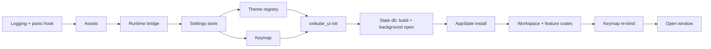

# Oxikube architecture

Oxikube is a native Kubernetes desktop client written in Rust on GPUI (Zed's UI framework).
It is organised as a hexagonal (ports & adapters) workspace so that the domain and the
use-cases never know about kube-rs, GPUI, SQLite, Argo CD or ACP. Adapters implement ports;
the binary wires them together.

## Layers and dependency direction

```
domain  ←  ports  ←  app  ←  (ui, bins)
             ↑
          adapters        (implement ports; never depend on app or ui)
platform                  (settings / keymap / theme / runtime / extension host; → domain, ports)
bins/oxikube              (wires adapters into app, mounts ui)
```

| Layer (`crates/<layer>/`) | May depend on (internal) | Must not depend on (external) |
|---|---|---|
| `domain` | nothing | gpui*, kube*, k8s-openapi, tokio, reqwest, rusqlite, wasmtime |
| `ports` | domain | gpui*, kube*, k8s-openapi, reqwest, rusqlite, wasmtime |
| `app` | domain, ports | gpui*, kube*, k8s-openapi, reqwest, rusqlite, wasmtime, agent-client-protocol, rmcp |
| `adapters` | domain, ports | gpui* |
| `platform` | domain, ports, platform | kube*, k8s-openapi, gpui-component |
| `ui` | domain, ports, app, platform, ui | kube*, k8s-openapi; `gpui-component` only inside `oxikube_ui` |
| `testing` | domain, ports | gpui-component |
| `bins`, `xtask` | anything | – |

`cargo xtask lint-deps` parses `cargo metadata` and fails CI on any violation. Dev-dependencies
are exempt so tests can use `oxikube_testkit` freely.

Why so strict: multiple agent teams work in parallel. The layer rules are what let a team
replace an adapter (kube-rs → something else, gpui-component → in-house) or add an integration
(Argo CD, Flux) without touching the core, and let the domain/app layers be tested with fakes
in milliseconds.

## Crate map

See `docs/PLAN.md` ("Workspace layout") for the one-line responsibility of every crate, and each
crate's `README.md` for its allowed dependencies. Highlights:

- `oxikube_domain` — ids, `ResourceKind`, the thin `Resource { meta, json }` model, view-models,
  `Quantity`, `Age`, session state and `NamespaceSelection`, `Command` / `Capability` vocabulary,
  safety types (`Risk`, `ConfirmTier`, `Initiator`), `AuditRecord`, telemetry-free records
  (`LogLine`, `Event`, `MetricsSample`, `ContextBlock`), the error taxonomy and the pure
  secret scrubber `redact` (`redact(&str) -> Cow<str>`, `Redacted<T>`, the pattern catalogue).
  Terms are defined in `docs/CONTEXT.md`.
- `oxikube_ports` — every async, object-safe trait (`ResourcePort`, `LogPort`, `ExecPort`,
  `StatePort`, `IntegrationPort`, `ToolPort`, `AgentPort`, …) with the transport types they
  exchange (`Delta`, `Table`, `ToolDef`, …). One module per port; each names its adapter.
- `oxikube_testkit` — a `Fake*` for every port, fixtures and builders, `TestPorts` (the seeded fakes
  `AppState::test` is built from), and the GPUI test harness (`gpui_test::TestApp` / `TestWindow`,
  `ScreenshotApp` with golden compare; `docs/testing-gpui.md`).
- `oxikube_app` — services: `ClusterSessionManager`, `ResourceStore`, `CommandBus`,
  `MutationGuard`, `LogService`, `PortForwardManager`, `IntegrationRegistry`, `ToolRegistry`,
  `ContextRegistry`, `AgentSessionManager`. No gpui, no kube. Module `session` (E06-S01):
  `ClusterSessionManager` connects a context through `ClusterConnectorPort`, holds the returned
  `ClusterPorts` bundle per session, drives `ClusterSessionState` (auth failures to
  `AuthRequired`, transient ones retried with backoff on the `ClockPort`, health reports for
  `Ready` ↔ `Degraded` → `Error`) and broadcasts `SessionUpdate`s; it spawns nothing (callers
  drive `connect` with `spawn_kube`, dropping it cancels the attempt). Per-cluster settings
  (E06-S08): the binary pushes a `ClusterPrefsTable` (`oxikube_ports::cluster_prefs`, resolved by
  `oxikube_settings::ClusterSettings` from `clusters.<id>`) into `set_prefs_table`; new sessions
  start from it and open ones follow it live (read-only, colour, display name; exec policy on the
  next connect), with a `SessionChange` per field for the clusters that changed.
- `oxikube_kube` — the kube-rs adapter (connection, discovery, reflectors, Table API feed,
  mutations, subresources, kubectl-equivalent algorithms, logs, exec, port-forward, metrics,
  events).
- `oxikube_state_sqlite` — the `StatePort` adapter (ADR 0010): rusqlite (bundled) on a dedicated
  thread, embedded ordered migrations, one `kv` table for the kv store and typed tables, the
  append-only audit log, corrupt-file fallback (`state.db.corrupt-<timestamp>`).
- `oxikube_ui` — the only crate that imports `gpui-component`; exposes tokens and curated
  components to every view.
- `oxikube_workspace` — Zed-style Item / Panel / Pane / Dock shell with persistence. Module
  `window` (E05-S03): the main window (per-platform `WindowOptions`, app id, `Root`, title bar) and
  the application menu. Module `workspace` (E05-S04): the `Workspace` entity on gpui-component's
  `DockArea` (via `oxikube_ui::dock`): centre panes of `Item`s (`open_item`, split, move, close,
  reopen-closed, drag-drop tabs, zoom) and side `Panel`s in left/bottom/right docks
  (`toggle_panel`, `toggle_dock`); `item`, `panel`, `pane` (`PaneGroup`/`Pane` snapshots), `dock`,
  `closed`, `actions` (`workspace::*` actions and bindings), `test_support` (feature
  `test-support`: `TestItem`, `TestPanel`, `TestStatusItem`, `TestModal`). Module `session` (E05-S12): `window::New`
  (several windows, one `Workspace` each, shared globals), UI zoom (`view::ZoomIn`/`ZoomOut`/`ZoomReset`,
  the `ui_scale` setting), the effective reduce-motion flag (`reduce_motion` setting over the OS
  preference, read by views through `oxikube_ui::motion`), and the quit guard (`app::Quit`:
  features register providers of running operations; `confirm_quit` setting). Overlay surfaces
  (E05-S10), owned by the `Workspace` and drawn over the docks: `status_bar` (`StatusBar`, left/right
  `StatusItem` registry ordered by priority), `modal` (`ModalLayer`: one `ModalView` at a time,
  Escape / outside-click dismissal, Tab trapped inside, focus restored on close; `DialogModal`
  for confirmations), `toast` (`ToastLayer`: queue with a visible cap, key deduplication,
  auto-dismiss, actions), `motion` (the 150 ms animation cap, off under the app's reduce-motion flag).
  Module `persistence`
  (E05-S05): `SerializedWorkspace` (versioned `DockAreaState` + item descriptors + window place),
  `LayoutStore` over `StatePort`, `LayoutPersistence` (async restore, 500 ms debounced save, flush
  on quit) and `restore_window_bounds` (fit saved bounds to today's displays).

## Cross-layer wiring (ports + injection)

Adapters never depend on other adapters, on `oxikube_app` or on UI crates. Platform crates never
depend on each other's consumers. When a component needs a capability that lives in another
layer, **define a narrow port in `oxikube_ports` and inject the implementation from
`bins/oxikube`**. Examples that the plan relies on:

| Needs | Port (in `oxikube_ports`) | Implemented by | Consumed by |
|---|---|---|---|
| MCP server exposing app tools | `ToolPort` (registry handle) | `oxikube_app::ToolRegistry` | `oxikube_mcp` |
| ACP `terminal/*` passthrough | `TerminalHostPort` | `oxikube_terminal` | `oxikube_acp` |
| Argo backends reading the cluster | `ResourcePort`, `PortForwardPort`, `ExecPort` | `oxikube_kube` | `oxikube_argocd` |
| Extensions contributing themes/commands/MCP servers | `ThemeSinkPort`, `CommandSinkPort`, `ContextServerSinkPort` | `oxikube_theme`, `oxikube_app`, `oxikube_mcp` | `oxikube_extension_host` |
| App reading user settings (aliases, budgets, per-cluster read-only / colour / name) | plain values pushed in at init / on change (`ClusterPrefsTable` for `clusters.<id>`, via `bins/oxikube::cluster_prefs`) | `oxikube_settings` (via bins) | `oxikube_app` |
| Per-cluster ports for a connected context | `ClusterConnectorPort` (returns `ClusterPorts` + `AccessReviewPort`; health via the `HealthReporter` callback) | `oxikube_kube` (wired by `bins/oxikube`) | `oxikube_app::session` |
| Terminal byte streams | `TerminalBackend` (in `oxikube_ports::exec`) | `oxikube_terminal`, `oxikube_kube`, `oxikube_argocd` | `oxikube_terminal` element |

If a story's crate list implies a forbidden edge, follow this table and say so in the PR; do not
weaken `cargo xtask lint-deps`.

## Key runtime rules

1. **No network or blocking work on the UI thread.** Kubernetes work runs on the shared Tokio
   runtime via `oxikube_runtime::spawn_kube` (abort-on-drop); results are posted back as GPUI
   tasks and `cx.notify()` calls are coalesced to frame cadence.
2. **Every mutation goes through `MutationGuard`** (read-only mode → confirmation tier →
   server dry-run → execute → audit). UI, keymap actions, command palette and MCP tools all
   dispatch `Command`s through the `CommandBus`; nothing calls a mutating port directly.
3. **Every user-facing action is a `Command`** with metadata (title, scope, mutating, confirm
   tier, capabilities) and registers an MCP tool stub, so agents get the same surface as users.
4. **Secrets never touch disk** except through `SecretStorePort` (OS keychain). Logs, audit
   records and crash reports are redacted.
5. **GPUI pins move together.** `gpui-pre-*` and `gpui-component`/`gpui-base`/`gpui-kit-assets`
   are exact-pinned and bumped in one PR; `cargo xtask check-gpui-pin` enforces alignment.
7. **It must feel as smooth as Zed.** `docs/PERFORMANCE.md` holds the numeric budgets
   (frame p95 ≤ 8 ms under churn, input ≤ 1 frame, cold start ≤ 400 ms, idle CPU < 1 %) and the
   rules that keep us inside them; ADR 0013 makes them release-gating.
6. **Zed code is copied, never depended on.** Zed's app crates are GPL-3.0-or-later like us, so
   selected modules (settings store, keymap, theme loader, picker, terminal element) may be
   vendored with a GPL header and an entry in `THIRD_PARTY_NOTICES.md`.

## App start-up and init order

`bins/oxikube` owns the order in which each crate's `init(cx)` runs (Zed's `main.rs` pattern); the
stage table with the reasons is in the module docs of `oxikube::startup` (`bins/oxikube/src/startup`).
In short:



- Logging comes first (`oxikube_logging::init`: daily rolling files in `logs/` of the app data directory (`<OS data dir>/oxikube`, or
  `$OXIKUBE_DATA_DIR`), seven kept, a non-blocking writer, redaction on every event; `log.filter` setting hot reloaded; a valid
  `RUST_LOG` wins for the run) together with the panic hook, which writes a redacted crash report to
  `crashes/` there and then calls the previous hook. Nothing is uploaded.
- `AppState` (a GPUI global) holds the ports bundle (`Arc<dyn StatePort>`, later `SecretStorePort`) and
  typed accessors over the settings, theme, keymap and runtime globals. Adapters are constructed in
  `bins/oxikube` only and handed over as port trait objects; `oxikube_app` never imports them. The
  SQLite state database opens on the background executor behind a `StatePort` that awaits the open,
  so the first frame never waits for the disk.
- Settings, theme and keymap load synchronously and stay small (they read config files only); every
  stage runs in an `init` tracing span and is recorded in the `StartupReport` global for the
  start-up budget (`docs/PERFORMANCE.md`, E05-S13).
- Running `startup::init` twice is rejected (`StartupError::AlreadyInitialised`), and
  `AppState::install` refuses to install out of order.
- Start-up ends at the main window's first interactive frame (E05-S13; budget 400 ms, ADR 0013):
  the window opens behind the startup placeholder (default layout, "Restoring layout…") while the
  saved layout is read through the async `StatePort`, the menu bar follows the first frame, and
  `oxikube::startup::first_frame` logs the time with every stage's cost and the count of network
  sockets (none may be open). Heavy services (extension host, discovery, Prometheus detection,
  agent registry, update checker, kubeconfig parsing) are `oxikube_runtime::LazyService`s started on
  first use (`oxikube::startup::deferred`), never by an `init`.

## Error taxonomy and mapping guidelines

Every port returns `oxikube_domain::OxiError` (alias `OxiResult<T>`): a struct
`{ kind: ErrorKind, message, source, retryable }`, not an enum of variants. Branch with
`err.kind()` and `err.is_retryable()`; build errors with constructors such as
`OxiError::auth(msg, retryable)` or `OxiError::not_found(msg)`. `retryable` is explicit data
(an `Auth` error is retryable after an exec-plugin refresh, not after a revoked token);
`Network` and `Timeout` default to retryable, every other kind to not retryable, and
`with_retryable` overrides. `Display` is `"<kind>: <message>"`; the source is reachable via
`std::error::Error::source`. Errors are not `Clone`; share them with `Arc<OxiError>`.

Domain types never redact on their own and the domain has no I/O dependencies, so **adapters
redact tokens and Secret data before building an error** (with `oxikube_domain::redact::redact`;
`oxikube_logging` applies the same function to every log line) and map their native errors with
these rules:

| Condition | `ErrorKind` | `retryable` |
|---|---|---|
| HTTP 401, expired or rejected credentials | `Auth` | true only if a credential refresh (exec plugin, OIDC) can fix it |
| HTTP 403 | `Forbidden` | false |
| HTTP 404 | `NotFound` | false |
| HTTP 409 (conflict, stale `resourceVersion`, already exists) | `Conflict` | false (re-read first) |
| HTTP 400, 422, failed client-side validation | `Validation` | false |
| HTTP 429, 503, 504, connection reset or refused, TLS handshake failure | `Network` | true (the default retry policy covers 429, 503, 504) |
| Server certificate rejected in the TLS handshake (untrusted issuer, expired, wrong name) | `Network` | false (retrying cannot fix it; the health probe fails at once) |
| Client or request deadline elapsed | `Timeout` | true |
| Missing API group or version, aggregated API that ignores a feature | `Unsupported` | false |
| Panics turned into errors, invariant violations, other bugs | `Internal` | false |
| The per-cluster watch budget refuses a new feed (feed or object cap; `oxikube_kube::budget`) | `BudgetExceeded` | false (free room first: close views, narrow the namespace selection) |

A rejected write can carry more than a kind. `oxikube_domain::error_details` defines
`ConflictDetails` (why a 409: `FieldOwnership` with the clashing fields and the field managers
that own them, `StaleVersion`, `AlreadyExists`, `Other`) and `ValidationDetails` (the field
paths a 422 rejected). An adapter attaches one as the error's source and callers read it with
`OxiError::conflict_details()` / `validation_details()`; `oxikube_kube::mutate` (E04-S05) does
this for every write. In the same module a 500 or 502 is marked retryable (the server failed
the request) while keeping the `Internal` kind.
`oxikube_kube::subresource` (E04-S06) keeps `Network` and `retryable` for an eviction that a
PodDisruptionBudget refuses (HTTP 429) and attaches an `EvictionBlocked` marker with the budget's
explanation (`eviction_blocked(&err)`), which a drain waits on; no new `ErrorKind`.
`oxikube_kube::algorithms` (E04-S07) adds only `Validation` (input it refuses: a CronJob without a
template, a drain a pod blocks), `Conflict` (a paused Deployment, a drain that left pods) and the
port's own errors.

`From` helpers are reserved for adapters, but by the orphan rule an adapter crate cannot
implement `From<kube::Error> for OxiError` (both types are foreign to it). Adapters instead
expose a free function or an extension trait, for example
`fn oxi_from_kube(e: kube::Error) -> OxiError` in `oxikube_kube`, matching on kube-rs
`Error::Api(ErrorResponse { code, .. })` for the HTTP status.

## Data flow for a resource table

```
kube API ──watch──▶ oxikube_kube::{feed (reflector / metadata), table (Table API)} ──Delta batches──▶
oxikube_app::ResourceStore (cache, sort, filter, index) ──subscribe──▶
oxikube_resources_ui::ResourceTable (uniform_list rows via oxikube_ui::Table) ──▶ GPUI
```

Core kinds use typed/metadata reflectors plus our own column definitions; CRDs and unknown kinds
use the server-side Table API (kubectl-identical columns incl. `additionalPrinterColumns`).
The Table feed (`oxikube_kube::table`) watches where the server honours the Table `Accept`
header and re-lists on a refresh interval otherwise; a server that ignores the header gets a
plain-JSON fallback flagged `TableSource::Objects`, so the `ColumnProvider` substitutes its
generic NAME / NAMESPACE / AGE columns.

Events (`oxikube_kube::events`) are the exception to the reflector store: `core/v1` and
`events.k8s.io/v1` are watched together, merged by `metadata.uid` into domain `Event`s and kept in
a fixed-size ring (oldest `last_seen` evicted, evictions reported as `Deleted` deltas and counted),
so a noisy cluster cannot grow memory. A per-object feed filters by the involved object's UID.

Resource feeds (reflector, metadata-only, Table) are opened through their cluster's watch budget
(`oxikube_kube::budget::FeedRegistry`, E04-S13): equal requests share one feed and count
subscribers, a feed with no subscriber is torn down after a grace period (30 s; a re-subscribe
within it reuses the feed), a namespace set is one namespaced feed per namespace, and the
feed and object caps evict idle feeds, then degrade a full feed to metadata-only, then refuse
with `BudgetExceeded`. Its counters reach the app as the `oxikube_ports::FeedStats` snapshot.

## Integrations

Optional integrations (Argo CD first; Flux later) implement `IntegrationPort`: detect → sidebar
section, commands, MCP tools, `@`-mention context providers, settings section. Their code lives in
`crates/adapters/oxikube_<name>` and `crates/ui/oxikube_<name>_ui`, never sprinkled through core.

## Agents

Oxikube hosts external agents over ACP (`oxikube_acp`, `oxikube_agent_ui`) and exposes its own
cluster tools to them over MCP (`oxikube_mcp` serving `oxikube_app::ToolRegistry`). Agents can
also drive the UI through `app.*` tools that dispatch `Command`s. Agent-proposed manifests open
as editor diffs and apply only through `MutationGuard`.

## Decision records

See `docs/adr/`. ADRs are the contract; change an ADR before changing an architectural rule.
