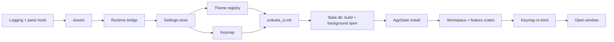

# Oxikube architecture

Oxikube is a native Kubernetes desktop client written in Rust on GPUI (Zed's UI framework).
It is organised as a hexagonal (ports & adapters) workspace so that the domain and the
use-cases never know about kube-rs, GPUI, SQLite, Argo CD or ACP. Adapters implement ports;
the binary wires them together.

## Layers and dependency direction

```
domain  ←  ports  ←  app  ←  (ui, bins)
             ↑
          adapters        (implement ports; never depend on app or ui)
platform                  (settings / keymap / theme / runtime / extension host; → domain, ports)
bins/oxikube              (wires adapters into app, mounts ui)
```

| Layer (`crates/<layer>/`) | May depend on (internal) | Must not depend on (external) |
|---|---|---|
| `domain` | nothing | gpui*, kube*, k8s-openapi, tokio, reqwest, rusqlite, wasmtime |
| `ports` | domain | gpui*, kube*, k8s-openapi, reqwest, rusqlite, wasmtime |
| `app` | domain, ports | gpui*, kube*, k8s-openapi, reqwest, rusqlite, wasmtime, agent-client-protocol, rmcp |
| `adapters` | domain, ports | gpui* |
| `platform` | domain, ports, platform | kube*, k8s-openapi, gpui-component |
| `ui` | domain, ports, app, platform, ui | kube*, k8s-openapi; `gpui-component` only inside `oxikube_ui` |
| `testing` | domain, ports | gpui-component |
| `bins`, `xtask` | anything | – |

`cargo xtask lint-deps` parses `cargo metadata` and fails CI on any violation. Dev-dependencies
are exempt so tests can use `oxikube_testkit` freely.

Why so strict: multiple agent teams work in parallel. The layer rules are what let a team
replace an adapter (kube-rs → something else, gpui-component → in-house) or add an integration
(Argo CD, Flux) without touching the core, and let the domain/app layers be tested with fakes
in milliseconds.

## Crate map

See `docs/PLAN.md` ("Workspace layout") for the one-line responsibility of every crate, and each
crate's `README.md` for its allowed dependencies. Highlights:

- `oxikube_domain` — ids, `ResourceKind`, the thin `Resource { meta, json }` model, view-models,
  `Quantity`, `Age`, session state and `NamespaceSelection`, `Command` / `Capability` vocabulary,
  safety types (`Risk`, `ConfirmTier`, `Initiator`), `AuditRecord`, telemetry-free records
  (`LogLine`, `Event`, `MetricsSample`, `ContextBlock`), the error taxonomy and the pure
  secret scrubber `redact` (`redact(&str) -> Cow<str>`, `Redacted<T>`, the pattern catalogue).
  Terms are defined in `docs/CONTEXT.md`.
- `oxikube_ports` — every async, object-safe trait (`ResourcePort`, `LogPort`, `ExecPort`,
  `StatePort`, `IntegrationPort`, `ToolPort`, `AgentPort`, …) with the transport types they
  exchange (`Delta`, `Table`, `ToolDef`, …). One module per port; each names its adapter.
- `oxikube_testkit` — a `Fake*` for every port, fixtures and builders, `TestPorts` (the seeded fakes
  `AppState::test` is built from), and the GPUI test harness (`gpui_test::TestApp` / `TestWindow`,
  `ScreenshotApp` with golden compare; `docs/testing-gpui.md`).
- `oxikube_app` — services: `ClusterSessionManager`, `ResourceStore`, `CommandBus`,
  `MutationGuard`, `LogService`, `PortForwardManager`, `IntegrationRegistry`, `ToolRegistry`,
  `ContextRegistry`, `AgentSessionManager`. No gpui, no kube. Module `sidebar` (E06-S10):
  `review_access` (the rules reviews the cluster sidebar hides sections by; fails open) and
  `discover_custom_resources`; module `integrations`: the `IntegrationRegistry` stub. Module `session` (E06-S01):
  `ClusterSessionManager` connects a context through `ClusterConnectorPort`, holds the returned
  `ClusterPorts` bundle per session, drives `ClusterSessionState` (auth failures to
  `AuthRequired`, transient ones retried with backoff on the `ClockPort`, health reports for
  `Ready` ↔ `Degraded` → `Error`) and broadcasts `SessionUpdate`s; it spawns nothing (callers
  drive `connect` with `spawn_kube`, dropping it cancels the attempt). Per-cluster settings
  (E06-S08): the binary pushes a `ClusterPrefsTable` (`oxikube_ports::cluster_prefs`, resolved by
  `oxikube_settings::ClusterSettings` from `clusters.<id>`) into `set_prefs_table`; new sessions
  start from it and open ones follow it live (read-only, colour, display name; exec policy on the
  next connect), with a `SessionChange` per field for the clusters that changed.
  Module `catalog` (E06-S03):
  `ClusterCatalog` joins the `ClusterSourcePort` contexts (name, kubeconfig cluster and user,
  source file, `problem` when the context names a cluster or user the kubeconfig lacks) with the
  user's favourites and last-used times in the `cluster_catalog` state table; reading it is local,
  never a network call. `ClusterCommands` runs `cluster::Connect`, `cluster::Reconnect` (the
  retry), `cluster::CancelConnect` (only while an attempt is in flight), `cluster::Disconnect` and
  `cluster::ToggleFavourite` (reads, so no `MutationGuard`); the `CommandBus` (E06-S02) registers it.
  A `ClusterSession` also carries the API server URL of its catalog entry (`server()`).
  Module `sources` (E06-S05): `KubeconfigSourcesService` manages the user's kubeconfig sources
  (`add` a file or folder, `add` pasted text, `remove`, `reload`, `rows` with each source's status)
  over a `SourceListStore` (settings in the app), the `ClusterSourcePort` (`set_user_sources`,
  `source_statuses`, `validate_kubeconfig`) and the `FsPort` (`write_private`, `remove`); a pasted
  kubeconfig is stored `0600` as `<config dir>/kubeconfigs/<name>.yaml` (ADR 0015), only such files
  are ever deleted, and the `kubeconfig::*` handlers register with `register_commands`.
  Module `session::namespaces` (E06-S07): `NamespaceService` sets a session's `NamespaceSelection`
  (one `NamespaceChanged` per change, 150 ms debounce on the `ClockPort`), remembers selection,
  favourites and typed names per cluster in `StatePort` (kv `cluster/<id>/namespaces`), lists
  namespaces through `ResourceReader` (a `403` falls back to the typed names), drops stale
  selected names, maps `0`-`9` to All / the first nine favourites, computes a `ScopeDelta` for
  the `ResourceStore`, and runs the `namespace::Select` / `namespace::ToggleFavourite` commands.
  Module `store` (E07-S01): `ResourceStore`, the per-session cache behind every table, sidebar count
  and overview tile. Entries are keyed by (gvk, `FeedScope`: the cluster or one namespace); the
  table-driven `FeedPolicy` picks the port call (reflector or metadata-only `ResourceReader::watch`
  for core kinds, `TableFeedPort::table_feed` for CRDs and unknown kinds, ADR 0006); a `FeedBudget`
  hook admits, degrades or refuses new feeds (evicting idle ones first). `subscribe(StoreQuery)`
  returns a `Subscription` stream of `StoreDelta`s: a snapshot first, then coalesced `RowOp`s with
  positions in the subscriber's own sorted, filtered index (no re-sort per event), plus the
  `FeedState`. Feeds run on an injected `Spawner` (the Tokio bridge in the binary) under
  abort-on-drop guards; the last subscriber's drop starts a grace timer on the `ClockPort`, after
  which the feed is aborted. `Subscription::rescope` follows a namespace change with the
  `ScopeDelta`, keeping the feeds that stay. `ResourceStores` keeps one store per connected session.
  Counts (E07-S11, `store::counts`): `ResourceStore::counts(targets, selection)` answers each kind with a `CountState`
  from the caches' running health tallies (O(1), no feed started; a kind nobody watches is `NotWatched`), `CountsLease`
  holds the feeds a view needs through `subscribe` with a filter that matches nothing (no row index), and `health_of`
  (`oxikube_domain::view`) is the one healthy rule. A forbidden kind is `NoAccess`, a budget refusal `OverBudget`.
  Module `columns` (E07-S02): `ColumnProvider`, the one question a table asks of a kind (`columns(kind,
  caps)` and `cell(object, column, now)`), with two implementations (ADR 0006). `CoreColumns` is a
  table-driven catalogue of ~40 core kinds (computed `Ready` / `Status` / `Restarts` from the domain
  view-models, JSON-pointer columns for the rest, CPU/memory as `Cell::Pending` hooks that a
  `MetricsSource` fills in E13); `TableColumns` maps one Table feed's `columnDefinitions` (priority >
  0 is the `wide` flag) and rows, recovering typed sort keys from the server's text and substituting
  generic Name / Namespace / Age for a `TableSource::Objects` feed. A `Cell` carries display text, a
  typed `CellSort` (number, quantity, age, time, text) and a `Tone`; colours stay in the theme.
  The store sorts by any column through `SortField::Cell(CellSortKey)`: each object ranks by its
  cell's typed sort key, read once per object version from the view's provider (E07-S03).
  Module `actions` (E07-S08): row actions. `RowActionRegistry` says which bus commands are row actions and for which
  kinds (`KindFilter`; E12 registers scale, restart, cordon with `register` and touches nothing else); `RowActions::from_bus`
  joins it with the commands the `CommandBus` really has once, and `actions_for(kind, capabilities)` / `resolve(kind,
  ActionContext, selected)` filter that snapshot (an action the session lacks the capability for is absent, one blocked by
  read-only mode is `Disabled(ReadOnly)`; several selected objects keep the bulk actions). `register_commands` installs the
  `resource::Delete` handler (server dry run, then delete with the chosen propagation, behind the guard's `Mutation`), and
  `DeleteFlow` plans (`DeletePlan`: tier, risk, phrase to type) and runs a delete of one object or a selection, one guarded
  `resource::Delete` per object with per-object `ItemStatus` results and one audit record each. The guard's tier is target
  aware: `Command::effective_risk` raises `resource::Delete` of a Namespace, PersistentVolume, Node or a foreground
  (cascading) delete to type-the-name (`policy::confirm_tier_for`); an ordinary object takes a simple confirm.
  Module `store::filter` (E07-S04) is the `/` filter's grammar and predicates: `parse` turns
  `foo`, `!foo`, `-l k=v` and `-f fuzzy` into a `FilterExpr` (pattern compiled once per edit), and
  `FilterExpr::parts` splits it into a `StoreFilter` (name regex or substring, inverse, fuzzy:
  applied by the store to its cache) and a label selector. A selector is applied by the server:
  `Subscription::set_selector` re-keys the subscription's feeds (`FeedKey` carries the selector)
  without touching its scope, so it composes with the namespace selection. A filter that narrows
  the previous one (one more character) is applied to the rows the subscription already holds, off
  the UI thread (`SortedIndex::narrow`); anything else re-seeds from the cache. A fuzzy filter
  ranks (`SortField::Relevance`, ties on the object key); `StoreDelta::total` is the cache size
  before the filter, for `123 of 4,812`.
  Module `session::restore` (E06-S11): `SessionRestorer` reopens the last session. `prepare` reads
  the saved tabs (`ClusterTabsStore`, moved here from the workspace so the app layer can read what
  the tabs write), matches them against the catalog, opens each cluster as a `Disconnected`
  session in tab order with its remembered namespace selection, and forgets the clusters no
  kubeconfig defines any more (`RestorePlan::dropped`); `connect` connects the displayed cluster
  and, with `RestoreConnect::All`, the rest two at a time, each under its own deadline
  (`ClusterSessionManager::connect_with_deadline`) and with exec-plugin prompts one at a time.
  Module `guard`
  (E06-S02, E06-S09): besides the mutation pipeline, `guard::posture` holds the safety-posture commands
  (`cluster::ToggleReadOnly`, `cluster::SetColour`, `cluster::ApplyPreset`; confirm when lifting
  read-only on a production-flagged cluster, audited, persisted through the `PrefsWriter` the binary
  implements over `ClusterSettings::update_cluster`), and every `Mutation` writer re-checks the
  read-only flag before each request.
- `oxikube_resources_ui` — module `actions` (E07-S08): `ResourceActions` (the row actions of the bus and the delete flow, shared by every table through `ResourceTableDeps::actions`), the actions appended to a row's context menu and `ResourceTable::action_entries` (the palette's list, the same), the `delete` / `ctrl-d` key (`resource_table::DeleteSelected`), and `DeleteDialog`, a workspace modal: propagation choice, type-the-name, one confirmation for a selection, a virtualised per-object results list.
  module `detail` (E07-S05): `DetailView`, the generic detail of one object, one entity with two
  mounting modes: the content of `DetailDrawer` (a `Panel` in the cluster tab's right dock, opened by `resource::Open`) and,
  after `resource::PinDetail`, a workspace `Item` that moves between panes with its tab, scroll and expanded values intact.
  It follows the object as a one-row `ResourceStore` subscription on the table's own feed, reads the full object once (`spawn_kube`)
  for metadata-only and Table feeds (Secret values removed inside that read), and draws header, labels/annotations (copy through
  `resource::CopyLabel`), owner links (`resource::Open`), finalizers, conditions, the `status` summary and the Events tab
  (the namespace's `Event` feed, started on first show) in virtualised lists. Module `overview_lite` (E07-S11): `WorkloadsOverview`, the first screen of a connected cluster tab
  (a workspace `Item`): one `oxikube_ui::tile::StatTile` per `Tile` of the `TileRegistry` (Deployments, StatefulSets,
  DaemonSets, ReplicaSets, Jobs, CronJobs, Pods) with total and healthy from a `CountsLease`, read once a second and redrawn
  coalesced only on change; a click sends `resource::OpenList`. Module `navigate`: the `resource::OpenList` handler and the
  `KindViews` registry the generic table registers its opener in. The sidebar (`oxikube_workspace::sidebar::badges`) shows count
  badges from the same store: it keeps a lease only on the kinds the store counts eagerly (pods, nodes, namespaces,
  deployments) and reads every other badge off whatever feed is already open. Module `crds` (E07-S07): CRD browsing as plain
  Rust (`CrdInfo`, `served_versions`, `SchemaTree`, the CRD list's row actions) plus the views over it: the CRD row's `crd::OpenResources`
  (Enter; `ResourceViews` reads the CRD, takes the storage version if served, asks discovery and opens the table), the table's
  version switcher and "Basic columns" note (`table::crd`), and the Schema tab of a CRD's detail (`detail::schema_tab`: a lazy,
  bounded, collapsible `openAPIV3Schema` tree).
- `oxikube_catalog_ui` — the cluster catalog UI. Module `sources` (E06-S05): `SourcesView`, the
  kubeconfig sources screen (a workspace `Item`): one row per entry of `kubeconfig.sources` with its
  status (found with N contexts, or the error inline next to that one source), add file / add folder
  through the platform picker (async), a paste dialog with a credentials warning (hosted by the
  workspace modal layer), remove with a confirmation that says whether a file is deleted, and
  reload all; a `SourcesBackend` sends the `kubeconfig::*` commands, `SettingsSourceList` keeps the
  list in `settings.json` and `follow` pushes every change (hot reload) to the cluster source.
  Module `namespaces` (E06-S07): the
  `NamespaceSelector` dropdown for the cluster tab toolbar (All, multi-select, favourites with
  their digits, local search, virtualised list, the restricted-cluster fallback), a view over
  `NamespaceService`; it emits `NamespaceSelectorEvent` for the host's toasts. Module `catalog`
  (E06-S03): `CatalogView`, the home screen and a workspace
  `Item`: a virtualised (`uniform_list`) list of every kubeconfig context with cluster, user,
  source file, status badge from the session update stream, last-used and favourite star, a fuzzy
  search (`nucleo-matcher`) in a field that has focus on open, Enter or click to connect, an empty
  state that explains how to add kubeconfigs, and invalid contexts kept with an error badge.
  `model` is plain Rust (order: favourites, last used, name; with a query: match score), `dispatch`
  sends the cluster commands through a `CommandDispatcher` (the bus once it lands), keys live in the
  `Catalog` sections of the default keymaps. Module `hotbar` (E06-S04): `Hotbar`, the strip at the
  window's left edge with every connected and favourite cluster (colour dot, initials, state dot,
  tooltip, right-click menu, drag to reorder, order kept in the `hotbar` state table); the
  displayed cluster comes from `ClusterTabs`, favourites from `ClusterCatalog` and its
  `favourite_changes` stream. Clicks send `cluster::Select` / `cluster::Connect`; the favourite
  toggle is `cluster::ToggleFavourite`. Module `connect` (E06-S06): the connect lifecycle of a cluster
  tab. `ConnectView` follows one session and draws its state (`Connecting`: spinner, server, context,
  Cancel; `AuthRequired`: the plugin's message, the cluster's exec policy and how to sign in, Open
  terminal, Retry; `Error`: summary, expandable and copyable details, Retry, Edit kubeconfig
  sources; `Disconnected`: Connect), `DegradedBanner` is the strip above a degraded cluster's
  content, and `ConnectViewModel::of(state, info)` is the pure state-to-content mapping with every
  text redacted. `connect::install` / `tab_setup` hand both to a `ClusterTab` (`ConnectUi`); Retry,
  Cancel and Connect send `cluster::Reconnect`, `cluster::CancelConnect` and `cluster::Connect`
  through the `CommandDispatcher`. The terminal (E09) and kubeconfig sources (E06-S05) are host
  hooks on `ConnectDeps`: the terminal button is drawn disabled until a terminal exists, the
  sources link is hidden until the sources page exists.
- `oxikube_kube` — the kube-rs adapter (connection, discovery, reflectors, Table API feed,
  mutations, subresources, kubectl-equivalent algorithms, logs, exec, port-forward, metrics,
  events).
- `oxikube_state_sqlite` — the `StatePort` adapter (ADR 0010): rusqlite (bundled) on a dedicated
  thread, embedded ordered migrations, one `kv` table for the kv store and typed tables, the
  append-only audit log, corrupt-file fallback (`state.db.corrupt-<timestamp>`).
- `oxikube_ui` — the only crate that imports `gpui-component`; exposes tokens and curated
  components to every view.
- `oxikube_workspace` — Zed-style Item / Panel / Pane / Dock shell with persistence. Module
  `window` (E05-S03): the main window (per-platform `WindowOptions`, app id, `Root`, title bar) and
  the application menu. Module `workspace` (E05-S04): the `Workspace` entity on gpui-component's
  `DockArea` (via `oxikube_ui::dock`): centre panes of `Item`s (`open_item`, split, move, close,
  reopen-closed, drag-drop tabs, zoom) and side `Panel`s in left/bottom/right docks
  (`toggle_panel`, `toggle_dock`); `item`, `panel`, `pane` (`PaneGroup`/`Pane` snapshots), `dock`,
  `closed`, `actions` (`workspace::*` actions and bindings), `test_support` (feature
  `test-support`: `TestItem`, `TestPanel`, `TestStatusItem`, `TestModal`). Module `cluster_tab`
  (E06-S04): `ClusterTab` is an `Item` that hosts a `Workspace` of its own, embedded in the window's
  (own docks for the sidebar, own pane group, own layout saved under `cluster:<id>`; the status
  bar, modal and toast layers are the window's); `ClusterTabs` keeps one tab per session that is
  not `Disconnected`, switches (`cmd-1..9`, `cluster::NextTab`/`PreviousTab`/`Select`/`SwitchTab`),
  closes (`cluster::CloseTab`: confirms while the cluster's operations run, then
  `cluster::Disconnect`) and saves the open list in the `cluster_tabs` state table; the tab
  commands register on the bus with `register_commands`. A tab shows the `ConnectUi` its owner
  sets (E06-S06: the connect view's body in place of the content while the session is not
  connected, its banner above the content while degraded). With `session.restore` on,
  `ClusterTabs::restore_session` (E06-S11) waits for the first frame and the layout restore, runs the
  `SessionRestorer` on `spawn_kube`, shows the restored clusters as placeholder tabs (a `Disconnected`
  session whose tab stays until it connects), and connects a placeholder when its tab is first
  shown; the vanished clusters are named in a toast. `Item::intercepts_close` /
  `close_requested` let an item ask before its tab closes; `Workspace::set_strip` places the
  hotbar.
  Module `sidebar` (E06-S10): `SidebarPanel` is the cluster's left-dock panel (added to each tab by
  `sidebar::tab_setup`): the eleven Lens-style sections (Cluster, Nodes, Workloads, Config, Network,
  Storage, Namespaces, Events, Helm, Access Control, Custom Resources) come from `SidebarRegistry`
  registration (`init(cx)` of the feature crate), draw as one virtualised flat list with collapsible
  groups and count placeholders, and are hidden for kinds the user cannot `list`
  (`oxikube_app::sidebar::review_access`: `SelfSubjectRulesReview` per selected namespace through
  `AccessReviewPort::rules`, run after `Ready`, fail open with a warning); integrations' sections
  (`IntegrationRegistry`) follow the core ones; open and closed groups are saved per cluster in the
  `cluster_sidebar` state table. Module `session` (E05-S12): `window::New`
  (several windows, one `Workspace` each, shared globals), UI zoom (`view::ZoomIn`/`ZoomOut`/`ZoomReset`,
  the `ui_scale` setting), the effective reduce-motion flag (`reduce_motion` setting over the OS
  preference, read by views through `oxikube_ui::motion`), and the quit guard (`app::Quit`:
  features register providers of running operations; `confirm_quit` setting). Overlay surfaces
  (E05-S10), owned by the `Workspace` and drawn over the docks: `status_bar` (`StatusBar`, left/right
  `StatusItem` registry ordered by priority), `modal` (`ModalLayer`: one `ModalView` at a time,
  Escape / outside-click dismissal, Tab trapped inside, focus restored on close; `DialogModal`
  for confirmations), `toast` (`ToastLayer`: queue with a visible cap, key deduplication,
  auto-dismiss, actions), `motion` (the 150 ms animation cap, off under the app's reduce-motion flag).
  Module `cluster` (E06-S09): `ClusterMark` / `ClusterBadge` (colour dot + read-only lock drawn on a
  cluster tab via `TabContent::cluster`, a hotbar entry and the status bar), `ClusterStatusItem`,
  `cluster_menu` (read-only toggle and presets as commands) and `ClusterCommandRunner` (dispatch on the
  `CommandBus`, toast / confirmation dialog / denial toast).
  Module `persistence`
  (E05-S05): `SerializedWorkspace` (versioned `DockAreaState` + item descriptors + window place),
  `LayoutStore` over `StatePort`, `LayoutPersistence` (async restore, 500 ms debounced save, flush
  on quit) and `restore_window_bounds` (fit saved bounds to today's displays).

## Cross-layer wiring (ports + injection)

Adapters never depend on other adapters, on `oxikube_app` or on UI crates. Platform crates never
depend on each other's consumers. When a component needs a capability that lives in another
layer, **define a narrow port in `oxikube_ports` and inject the implementation from
`bins/oxikube`**. Examples that the plan relies on:

| Needs | Port (in `oxikube_ports`) | Implemented by | Consumed by |
|---|---|---|---|
| MCP server exposing app tools | `ToolPort` (registry handle) | `oxikube_app::ToolRegistry` | `oxikube_mcp` |
| ACP `terminal/*` passthrough | `TerminalHostPort` | `oxikube_terminal` | `oxikube_acp` |
| Argo backends reading the cluster | `ResourcePort`, `PortForwardPort`, `ExecPort` | `oxikube_kube` | `oxikube_argocd` |
| Extensions contributing themes/commands/MCP servers | `ThemeSinkPort`, `CommandSinkPort`, `ContextServerSinkPort` | `oxikube_theme`, `oxikube_app`, `oxikube_mcp` | `oxikube_extension_host` |
| App reading user settings (aliases, budgets, per-cluster read-only / colour / name) | plain values pushed in at init / on change (`ClusterPrefsTable` for `clusters.<id>`, via `bins/oxikube::cluster_prefs`) | `oxikube_settings` (via bins) | `oxikube_app` |
| App writing per-cluster read-only / colour back to `settings.json` | `oxikube_app::PrefsWriter` (a trait of the app crate, not a port: it carries no cluster I/O) | `bins/oxikube::cluster_prefs::SettingsPrefsWriter` over `ClusterSettings::update_cluster` | `oxikube_app::guard::posture` |
| App editing the user's kubeconfig source list (`kubeconfig.sources`) | `SourceListStore` (a trait in `oxikube_app::sources`, async `load` / `save`) | `oxikube_catalog_ui::sources::SettingsSourceList` over `oxikube_settings::update_user_settings` | `oxikube_app::sources::KubeconfigSourcesService` |
| Local files by path (pasted kubeconfigs: owner-only write, delete) | `FsPort` | `oxikube_runtime::StdFs` (tests: `FakeFsPort`) | `oxikube_app::sources` |
| Per-cluster ports for a connected context | `ClusterConnectorPort` (returns `ClusterPorts` + `AccessReviewPort`; health via the `HealthReporter` callback) | `oxikube_kube` (wired by `bins/oxikube`) | `oxikube_app::session` |
| Terminal byte streams | `TerminalBackend` (in `oxikube_ports::exec`) | `oxikube_terminal`, `oxikube_kube`, `oxikube_argocd` | `oxikube_terminal` element |

If a story's crate list implies a forbidden edge, follow this table and say so in the PR; do not
weaken `cargo xtask lint-deps`.

## Key runtime rules

1. **No network or blocking work on the UI thread.** Kubernetes work runs on the shared Tokio
   runtime via `oxikube_runtime::spawn_kube` (abort-on-drop); results are posted back as GPUI
   tasks and `cx.notify()` calls are coalesced to frame cadence.
2. **Every mutation goes through `MutationGuard`** (read-only mode → confirmation tier →
   server dry-run → execute → audit). UI, keymap actions, command palette and MCP tools all
   dispatch `Command`s through the `CommandBus`; nothing calls a mutating port directly.
3. **Every user-facing action is a `Command`** with metadata (title, scope, mutating, confirm
   tier, capabilities) and registers an MCP tool stub, so agents get the same surface as users.
4. **Secrets never touch disk** except through `SecretStorePort` (OS keychain). Logs, audit
   records and crash reports are redacted.
5. **GPUI pins move together.** `gpui-pre-*` and `gpui-component`/`gpui-base`/`gpui-kit-assets`
   are exact-pinned and bumped in one PR; `cargo xtask check-gpui-pin` enforces alignment.
7. **It must feel as smooth as Zed.** `docs/PERFORMANCE.md` holds the numeric budgets
   (frame p95 ≤ 8 ms under churn, input ≤ 1 frame, cold start ≤ 400 ms, idle CPU < 1 %) and the
   rules that keep us inside them; ADR 0013 makes them release-gating.
6. **Zed code is copied, never depended on.** Zed's app crates are GPL-3.0-or-later like us, so
   selected modules (settings store, keymap, theme loader, picker, terminal element) may be
   vendored with a GPL header and an entry in `THIRD_PARTY_NOTICES.md`.

## The running app's wiring (E07-S00)

`bins/oxikube` is where the views built against fakes meet the real adapters:

- `kube_ports`: the cluster adapters. `LazyKubeSources` is the `ClusterSourcePort` over
  `oxikube_kube::sources::KubeconfigSources`, built on its first port call (on `spawn_kube`, after
  the first frame) from the `kubeconfig.sources` setting; `SourcesConnector` is the
  `ClusterConnectorPort` over `oxikube_kube::KubeConnector`, handing it the catalog's current
  kubeconfig before each connect (`KubeConnector::replace_loaded`); `SystemClock` is the
  `ClockPort`. They join the state db in `AppPorts` (`AppPorts::clusters`).
- `app_state::ClusterServices`: the session manager, catalog, cluster commands, namespace service
  and integration registry over those ports, held by `AppState`.
- `mount`: `mount_main_window` runs inside the main window's construction
  (`oxikube_workspace::window::open_main_window_mounted`): the cluster tabs with their setup
  (sidebar, connect views, namespace selector in the tab toolbar, `ClusterTab::set_toolbar`), the
  command bus (`mount::bus::build_registry`: cluster, namespace, kubeconfig, posture, tab and
  `view::Open` commands; its `MutationGuard`; stored with `AppState::set_command_bus`), the catalog
  home as the first tab, the hotbar strip, the active cluster's status item, the kubeconfig
  sources (settings list, hot reload, the sources screen behind `view::Open`) and session restore.
  Views dispatch through `mount::bus::BusDispatcher`, which runs each command on the bus through
  the window's `ClusterCommandRunner` (toasts, confirmations, denials).

## App start-up and init order

`bins/oxikube` owns the order in which each crate's `init(cx)` runs (Zed's `main.rs` pattern); the
stage table with the reasons is in the module docs of `oxikube::startup` (`bins/oxikube/src/startup`).
In short:



- Logging comes first (`oxikube_logging::init`: daily rolling files in `logs/` of the app data directory (`<OS data dir>/oxikube`, or
  `$OXIKUBE_DATA_DIR`), seven kept, a non-blocking writer, redaction on every event; `log.filter` setting hot reloaded; a valid
  `RUST_LOG` wins for the run) together with the panic hook, which writes a redacted crash report to
  `crashes/` there and then calls the previous hook. Nothing is uploaded.
- `AppState` (a GPUI global) holds the ports bundle (`Arc<dyn StatePort>`, later `SecretStorePort`) and
  typed accessors over the settings, theme, keymap and runtime globals. Adapters are constructed in
  `bins/oxikube` only and handed over as port trait objects; `oxikube_app` never imports them. The
  SQLite state database opens on the background executor behind a `StatePort` that awaits the open,
  so the first frame never waits for the disk.
- Settings, theme and keymap load synchronously and stay small (they read config files only); every
  stage runs in an `init` tracing span and is recorded in the `StartupReport` global for the
  start-up budget (`docs/PERFORMANCE.md`, E05-S13).
- Running `startup::init` twice is rejected (`StartupError::AlreadyInitialised`), and
  `AppState::install` refuses to install out of order.
- Start-up ends at the main window's first interactive frame (E05-S13; budget 400 ms, ADR 0013):
  the window opens behind the startup placeholder (default layout, "Restoring layout…") while the
  saved layout is read through the async `StatePort`, the menu bar follows the first frame, and
  `oxikube::startup::first_frame` logs the time with every stage's cost and the count of network
  sockets (none may be open). Heavy services (extension host, discovery, Prometheus detection,
  agent registry, update checker, kubeconfig parsing) are `oxikube_runtime::LazyService`s started on
  first use (`oxikube::startup::deferred`), never by an `init`.

## Error taxonomy and mapping guidelines

Every port returns `oxikube_domain::OxiError` (alias `OxiResult<T>`): a struct
`{ kind: ErrorKind, message, source, retryable }`, not an enum of variants. Branch with
`err.kind()` and `err.is_retryable()`; build errors with constructors such as
`OxiError::auth(msg, retryable)` or `OxiError::not_found(msg)`. `retryable` is explicit data
(an `Auth` error is retryable after an exec-plugin refresh, not after a revoked token);
`Network` and `Timeout` default to retryable, every other kind to not retryable, and
`with_retryable` overrides. `Display` is `"<kind>: <message>"`; the source is reachable via
`std::error::Error::source`. Errors are not `Clone`; share them with `Arc<OxiError>`.

Domain types never redact on their own and the domain has no I/O dependencies, so **adapters
redact tokens and Secret data before building an error** (with `oxikube_domain::redact::redact`;
`oxikube_logging` applies the same function to every log line) and map their native errors with
these rules:

| Condition | `ErrorKind` | `retryable` |
|---|---|---|
| HTTP 401, expired or rejected credentials | `Auth` | true only if a credential refresh (exec plugin, OIDC) can fix it |
| HTTP 403 | `Forbidden` | false |
| HTTP 404 | `NotFound` | false |
| HTTP 409 (conflict, stale `resourceVersion`, already exists) | `Conflict` | false (re-read first) |
| HTTP 400, 422, failed client-side validation | `Validation` | false |
| HTTP 429, 503, 504, connection reset or refused, TLS handshake failure | `Network` | true (the default retry policy covers 429, 503, 504) |
| Server certificate rejected in the TLS handshake (untrusted issuer, expired, wrong name) | `Network` | false (retrying cannot fix it; the health probe fails at once) |
| Client or request deadline elapsed | `Timeout` | true |
| Missing API group or version, aggregated API that ignores a feature | `Unsupported` | false |
| Panics turned into errors, invariant violations, other bugs | `Internal` | false |
| The per-cluster watch budget refuses a new feed (feed or object cap; `oxikube_kube::budget`) | `BudgetExceeded` | false (free room first: close views, narrow the namespace selection) |

A rejected write can carry more than a kind. `oxikube_domain::error_details` defines
`ConflictDetails` (why a 409: `FieldOwnership` with the clashing fields and the field managers
that own them, `StaleVersion`, `AlreadyExists`, `Other`) and `ValidationDetails` (the field
paths a 422 rejected). An adapter attaches one as the error's source and callers read it with
`OxiError::conflict_details()` / `validation_details()`; `oxikube_kube::mutate` (E04-S05) does
this for every write. In the same module a 500 or 502 is marked retryable (the server failed
the request) while keeping the `Internal` kind.
`oxikube_kube::subresource` (E04-S06) keeps `Network` and `retryable` for an eviction that a
PodDisruptionBudget refuses (HTTP 429) and attaches an `EvictionBlocked` marker with the budget's
explanation (`eviction_blocked(&err)`), which a drain waits on; no new `ErrorKind`.
`oxikube_kube::algorithms` (E04-S07) adds only `Validation` (input it refuses: a CronJob without a
template, a drain a pod blocks), `Conflict` (a paused Deployment, a drain that left pods) and the
port's own errors.

`From` helpers are reserved for adapters, but by the orphan rule an adapter crate cannot
implement `From<kube::Error> for OxiError` (both types are foreign to it). Adapters instead
expose a free function or an extension trait, for example
`fn oxi_from_kube(e: kube::Error) -> OxiError` in `oxikube_kube`, matching on kube-rs
`Error::Api(ErrorResponse { code, .. })` for the HTTP status.

## Data flow for a resource table

```
kube API ──watch──▶ oxikube_kube::{feed (reflector / metadata), table (Table API)} ──Delta batches──▶
oxikube_app::ResourceStore (cache, sort, filter, index) ──subscribe──▶
oxikube_resources_ui::ResourceTable (uniform_list rows via oxikube_ui::Table) ──▶ GPUI
```

The table (E07-S03, `oxikube_resources_ui::table`) is a workspace item in the cluster's tab,
opened by `resource::OpenList` (from the cluster sidebar, a Workloads overview tile, the palette
or an agent): the command's handler (`oxikube_resources_ui::navigate`, E07-S11) hands the request
to the window, and `ResourceViews` (`oxikube_resources_ui::views`), registered as a kind view in
`navigate::KindViews`, resolves the kind through discovery and opens the table. It holds the store `Subscription` and applies each coalesced `StoreDelta` in one update, redrawing
through `notify_coalesced`; it never sorts itself (the header asks the store for a
`SortField::Cell` order). Its `RowsDelegate` implements `oxikube_ui::TableDelegate`, the only code
that meets gpui-component's table. Selection is kept by object identity, so deltas that move rows
keep it; column order, visibility, widths and sort persist per kind in the `StatePort`
(`table.columns.<group>/<Kind>`).

Opening a row (`resource::Open`: Enter or double-click) shows the detail drawer
(`oxikube_resources_ui::detail`, E07-S05) in the cluster tab's right dock. The detail subscribes to
that one object on the feed the table already holds, so it starts no extra watch; "Pin as tab"
(`resource::PinDetail`) hands the same entity to the workspace as an `Item`.

The filter bar (E07-S04, `oxikube_resources_ui::filter`) sits in the table's toolbar. `/` is a key
action that dispatches the `table::FocusFilter` command; the bus hands it back to `ResourceViews`,
which focuses the bar, so the key, the palette and an agent run one behaviour. The bar parses each
edit (to show the first error and keep the last good rows), applies the first keystroke at once,
collapses the rest to one application per ~frame, and waits a quarter second before a label
selector re-keys the feeds. While it has the focus the table's key context says `Editing`, so bare
keys are text; `escape` clears and returns to the rows, `enter` returns without clearing. With
`resource_table.persist_filter` on (default off) the filter text is saved per kind under
`table.filter.<group>/<Kind>` and restored when the table opens.

Core kinds use typed/metadata reflectors plus our own column definitions; CRDs and unknown kinds
use the server-side Table API (kubectl-identical columns incl. `additionalPrinterColumns`).
The Table feed (`oxikube_kube::table`) watches where the server honours the Table `Accept`
header and re-lists on a refresh interval otherwise; a server that ignores the header gets a
plain-JSON fallback flagged `TableSource::Objects`, so the `ColumnProvider` substitutes its
generic NAME / NAMESPACE / AGE columns; the table then shows a "Basic columns" note instead of
looking quietly poorer than `kubectl get` (E07-S07).

CRD browsing (E07-S07, `oxikube_resources_ui::crds`): the sidebar's Custom Resources section lists the
non-built-in API groups from discovery, collapsed, each with how many kinds it has, after a "Definitions" entry
(`crd::OpenList`) that opens the CRD list (a reflector feed with Group / Version / Scope / Short Names columns). A CRD row
opens the table of its custom resources (`crd::OpenResources`), on the Table feed, at the storage version when it is
served (else the newest served one); a kind with several served versions gets a switcher that opens each version as
its own tab (`resource::OpenList`). Namespaced kinds follow the namespace selection and cluster-scoped ones ignore it
(`WatchScope::derive`). Expanding the sidebar starts no feed: a custom kind's badge reads the store's count only while
a table (or anything else) has its feed open, because counting is a cache read, never a subscription
(the watch budget stays for tables). The CRD's detail drawer has a Schema tab (`openAPIV3Schema` of the selected version:
type as `kubectl explain` writes it, required, enum, default, description; only open nodes are walked, depth and rows are bounded).

States and diagnostics (E07-S10, `oxikube_resources_ui::table::states`): one pure
`TableState::derive(feed_state, row_count, filter)` tells loading, empty, filtered-empty,
forbidden, unauthorized (a `401` or expired credential is `FeedState::Unauthorized`, mapped from the
error kind, never the message) and error apart; with rows the same derivation only marks them stale
(a badge) instead of clearing them. Retry is the command `resource::RetryFeed` -> `ResourceTable::retry_feed` ->
`Subscription::retry`, which reopens the feeds that are not `Ready` (backoff stays in the store's
driver). The API server's `Warning:` headers are read off every response by `oxikube_kube::warnings`
(a tower layer on the pooled client, redacted), published through `WarningPort` (a field of
`ClusterPorts`), de-duplicated per session by `ResourceStore::warnings` (code + text) and shown as one
toast by `ResourceViews`.

Events (`oxikube_kube::events`) are the exception to the reflector store: `core/v1` and
`events.k8s.io/v1` are watched together, merged by `metadata.uid` into domain `Event`s and kept in
a fixed-size ring (oldest `last_seen` evicted, evictions reported as `Deleted` deltas and counted),
so a noisy cluster cannot grow memory. A per-object feed filters by the involved object's UID.

Resource feeds (reflector, metadata-only, Table) are opened through their cluster's watch budget
(`oxikube_kube::budget::FeedRegistry`, E04-S13): equal requests share one feed and count
subscribers, a feed with no subscriber is torn down after a grace period (30 s; a re-subscribe
within it reuses the feed), a namespace set is one namespaced feed per namespace, and the
feed and object caps evict idle feeds, then degrade a full feed to metadata-only, then refuse
with `BudgetExceeded`. Its counters reach the app as the `oxikube_ports::FeedStats` snapshot.

## Integrations

Optional integrations (Argo CD first; Flux later) implement `IntegrationPort`: detect → sidebar
section, commands, MCP tools, `@`-mention context providers, settings section. Their code lives in
`crates/adapters/oxikube_<name>` and `crates/ui/oxikube_<name>_ui`, never sprinkled through core.

## Agents

Oxikube hosts external agents over ACP (`oxikube_acp`, `oxikube_agent_ui`) and exposes its own
cluster tools to them over MCP (`oxikube_mcp` serving `oxikube_app::ToolRegistry`). Agents can
also drive the UI through `app.*` tools that dispatch `Command`s. Agent-proposed manifests open
as editor diffs and apply only through `MutationGuard`.

## Decision records

See `docs/adr/`. ADRs are the contract; change an ADR before changing an architectural rule.
