# Dependency matrix and execution order

Generated from `docs/PLAN.md` by the planning scripts on 2026-10-03. The same edges are recorded natively on GitHub as **Blocked by / Blocking** issue relationships, and every story issue carries its own neighbourhood diagram. Regenerate this file whenever story dependencies change.

| Metric | Value |
|---|---|
| Epics / stories | 29 / 364 |
| Story-level dependency edges (explicit) | 550 |
| Epic-level dependency edges (hard / stub-ok) | 89 / 4 |
| Execution waves | 39 (wave 0 = done in bootstrap) |
| Critical path | 39 stories, 83 size-units (S=1, M=2, L=3) |
| Cycles / unresolved references | 0 / 0 |

## How to read this

- **Explicit edge**: a story's own *Depends* column. These are the edges recorded as GitHub *Blocked by* relationships.
- **Epic edge**: an epic's *Depends on*. Solid = hard. Dotted = the dependent epic can start against stubs or `oxikube_testkit` fakes.
- **Inherited ordering**: a story with no explicit dependency is scheduled after its epic's hard dependencies. This only affects the wave number, and the story can start earlier against fakes (see the contributor skill).
- **Wave**: the longest chain of unfinished dependencies before a story. Everything in wave *n* can run in parallel once waves < *n* are done. The Project has a `Wave` field, so sort or group by it.
- **Critical path**: the longest size-weighted chain. Slipping any story on it slips v1. These stories are red in the diagrams.

## Epic dependency graph

Transitively reduced: if A→B→C, the direct A→C edge is omitted here but still present in the matrix.

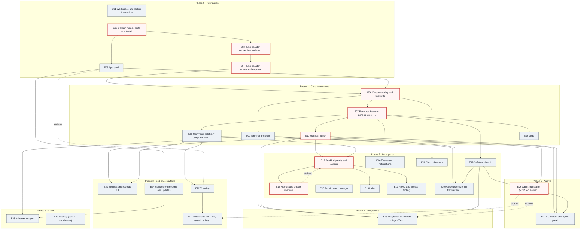

## Epic dependency matrix

Rows depend on columns. **●** = hard epic dependency, **○** = stub-ok dependency, a number = how many story-level edges go from the row epic's stories to the column epic, **·** = none.

| ↓ depends on → | E01 | E02 | E03 | E04 | E05 | E06 | E07 | E08 | E09 | E10 | E11 | E12 | E13 | E14 | E15 | E16 | E17 | E18 | E19 | E20 | E21 | E22 | E23 | E24 | E25 | E26 | E27 | E28 | E29 |
|---|---|---|---|---|---|---|---|---|---|---|---|---|---|---|---|---|---|---|---|---|---|---|---|---|---|---|---|---|---|
| **E01** | — | · | · | · | 1 | · | · | · | · | · | · | · | · | · | · | · | · | · | · | · | · | · | · | · | · | · | · | · | · |
| **E02** | ● | — | · | · | · | · | · | · | · | · | · | · | · | · | · | · | · | · | · | · | · | · | · | · | · | · | · | · | · |
| **E03** | ● | ● | — | · | · | · | · | · | · | · | · | · | · | · | · | · | · | · | · | · | · | · | · | · | · | · | · | · | · |
| **E04** | · | ● | ● | — | · | · | · | · | · | · | · | · | · | · | · | · | · | · | · | · | · | · | · | · | · | · | · | · | · |
| **E05** | ●1 | ● | · | · | — | · | · | · | · | · | · | · | · | · | · | · | · | · | · | · | · | · | · | · | · | · | · | · | · |
| **E06** | · | · | ● | ● | ●1 | — | · | · | · | · | · | · | · | · | · | · | · | · | · | · | · | · | · | · | · | · | · | · | · |
| **E07** | · | · | · | ● | ● | ●1 | — | · | · | · | · | · | · | · | · | · | · | · | · | · | · | · | · | · | · | · | · | · | · |
| **E08** | · | · | · | ● | ● | · | ● | — | 1 | · | · | · | · | · | · | · | · | · | · | · | · | · | · | · | · | · | · | · | · |
| **E09** | · | 1 | ● | ●1 | ●1 | ● | · | · | — | · | · | · | · | · | · | · | · | · | · | · | · | · | · | · | · | · | · | · | · |
| **E10** | · | · | · | ●2 | ●1 | · | ●1 | · | · | — | · | · | · | · | · | · | · | · | · | · | · | · | · | · | · | · | · | · | · |
| **E11** | · | · | · | · | ●3 | ● | ●1 | · | · | · | — | · | · | · | · | · | · | · | · | · | · | · | · | · | · | · | · | · | · |
| **E12** | · | · | · | ●1 | · | 1 | ●1 | · | · | ●1 | ● | — | ○ | · | · | · | · | · | · | · | · | · | · | · | · | · | · | · | · |
| **E13** | · | 2 | · | ●1 | 1 | 1 | ● | · | · | · | · | ●1 | — | · | · | · | · | · | · | · | · | · | · | · | · | · | · | · | · |
| **E14** | · | 1 | · | ●1 | ●1 | · | ●1 | · | · | · | · | · | · | — | · | · | · | · | · | · | · | · | · | · | · | · | · | · | · |
| **E15** | · | · | · | ●1 | ● | ●1 | · | · | · | · | · | ●1 | · | 1 | — | · | · | · | · | · | · | · | · | · | · | · | · | · | · |
| **E16** | · | 1 | · | ●1 | · | · | ●1 | · | · | ●1 | · | ● | · | · | · | — | · | · | · | · | · | · | · | · | · | · | · | · | · |
| **E17** | · | 1 | · | ●1 | · | · | ● | · | · | 1 | · | ●2 | · | · | · | · | — | · | · | · | · | · | · | · | · | · | · | · | · |
| **E18** | · | 1 | ● | · | ● | ●1 | · | · | · | · | · | · | · | · | · | · | · | — | · | · | · | · | · | · | · | · | · | · | · |
| **E19** | · | ●1 | · | ● | ●1 | ●1 | ●1 | · | · | 1 | 1 | · | · | · | · | · | · | · | — | · | · | · | · | · | · | · | · | · | · |
| **E20** | · | 1 | · | ● | · | · | ●1 | · | ●1 | ●1 | · | · | · | · | · | · | · | · | ●2 | — | · | · | · | · | · | · | · | · | · |
| **E21** | · | · | · | · | ●3 | 1 | · | · | · | ● | ●2 | · | · | · | · | · | · | · | · | · | — | · | · | · | · | · | · | · | · |
| **E22** | · | · | · | · | ○1 | · | · | · | 1 | 1 | ●1 | · | · | · | · | · | · | · | · | · | · | — | · | · | · | · | · | · | · |
| **E23** | · | · | · | · | ●1 | · | · | · | · | · | ●1 | · | · | · | · | · | · | · | · | · | · | ●1 | — | · | · | ○ | · | · | · |
| **E24** | ●1 | · | · | · | ●2 | · | · | · | · | · | · | · | · | · | · | · | · | · | 1 | · | · | · | · | — | · | · | · | · | · |
| **E25** | · | · | · | ●1 | · | ●1 | ●2 | 1 | ●1 | ●1 | · | · | · | · | 1 | · | · | · | ●3 | · | · | · | · | · | — | ○1 | · | · | · |
| **E26** | · | · | · | ● | · | · | ●1 | ●1 | · | · | ●1 | · | 1 | · | · | · | · | · | ●4 | · | · | · | · | · | 1 | — | · | · | · |
| **E27** | · | · | · | · | ●1 | · | · | · | ●1 | ●1 | ● | · | · | · | · | · | · | · | ●1 | · | · | · | · | · | · | ●5 | — | · | · |
| **E28** | · | · | · | · | ●1 | · | · | · | ●1 | · | · | · | · | · | · | · | · | · | · | · | · | · | · | ●1 | · | · | · | — | · |
| **E29** | · | · | · | · | 1 | 1 | 2 | · | · | · | 1 | 1 | 1 | · | · | · | · | · | · | · | 1 | · | 1 | 1 | 1 | · | · | 1 | — |
| *depended on by* | 4 | 11 | 4 | 15 | 19 | 11 | 13 | 2 | 6 | 9 | 8 | 5 | 2 | 1 | 1 | 0 | 0 | 0 | 5 | 0 | 1 | 1 | 1 | 2 | 2 | 2 | 0 | 1 | 0 |

## Epics by phase and wave

| Epic | Title | Phase | Hard deps | Stub-ok deps | Unblocks epics | Waves | Stories |
|---|---|---|---|---|---|---|---|
| [E01](#e01) [#1](https://github.com/karan-vk/Oxikube/issues/1) | Workspace & tooling foundation | 0 Foundation | — | — | E02, E03, E05, E24 | 0–12 | 14 |
| [E02](#e02) [#3](https://github.com/karan-vk/Oxikube/issues/3) | Domain model, ports & testkit | 0 Foundation | E01 | — | E03, E04, E05, E19 | 1–5 | 13 |
| [E03](#e03) [#4](https://github.com/karan-vk/Oxikube/issues/4) | Kube adapter: connection, auth & discovery | 0 Foundation | E01, E02 | — | E04, E06, E09, E18 | 6–10 | 10 |
| [E04](#e04) [#5](https://github.com/karan-vk/Oxikube/issues/5) | Kube adapter: resource data plane | 0 Foundation | E02, E03 | — | E06, E07, E08, E09, E10, E12, E13, E14, E15, E16, E17, E19, E20, E25, E26 | 11–15 | 14 |
| [E05](#e05) [#6](https://github.com/karan-vk/Oxikube/issues/6) | App shell | 0 Foundation | E01, E02 | — | E06, E07, E08, E09, E10, E11, E14, E15, E18, E19, E21, E22, E23, E24, E27, E28 | 6–13 | 13 |
| [E06](#e06) [#8](https://github.com/karan-vk/Oxikube/issues/8) | Cluster catalog & sessions | 1 Core Kubernetes | E03, E04, E05 | — | E07, E09, E11, E15, E18, E19, E25 | 16–19 | 12 |
| [E07](#e07) [#9](https://github.com/karan-vk/Oxikube/issues/9) | Resource browser: generic table + detail | 1 Core Kubernetes | E04, E05, E06 | — | E08, E10, E11, E12, E13, E14, E16, E17, E19, E20, E25, E26 | 20–25 | 12 |
| [E08](#e08) [#11](https://github.com/karan-vk/Oxikube/issues/11) | Logs | 1 Core Kubernetes | E04, E05, E07 | — | E26 | 17–30 | 11 |
| [E09](#e09) [#12](https://github.com/karan-vk/Oxikube/issues/12) | Terminal & exec | 1 Core Kubernetes | E03, E04, E05, E06 | — | E20, E25, E27, E28 | 6–19 | 13 |
| [E10](#e10) [#13](https://github.com/karan-vk/Oxikube/issues/13) | Manifest editor | 1 Core Kubernetes | E04, E05, E07 | — | E12, E16, E20, E21, E25, E27 | 16–32 | 13 |
| [E11](#e11) [#14](https://github.com/karan-vk/Oxikube/issues/14) | Command palette, ':' jump & keymaps | 1 Core Kubernetes | E05, E06, E07 | — | E12, E21, E22, E23, E26, E27 | 14–28 | 12 |
| [E12](#e12) [#15](https://github.com/karan-vk/Oxikube/issues/15) | Per-kind panels & actions | 2 Lens parity | E04, E07, E10, E11 | E13 | E13, E15, E16, E17 | 26–34 | 20 |
| [E13](#e13) [#16](https://github.com/karan-vk/Oxikube/issues/16) | Metrics & cluster overview | 2 Lens parity | E04, E07, E12 | — | E12 | 6–37 | 13 |
| [E14](#e14) [#17](https://github.com/karan-vk/Oxikube/issues/17) | Events & notifications | 2 Lens parity | E04, E05, E07 | — | — | 6–27 | 10 |
| [E15](#e15) [#18](https://github.com/karan-vk/Oxikube/issues/18) | Port-forward manager | 2 Lens parity | E04, E05, E06, E12 | — | — | 16–36 | 9 |
| [E16](#e16) [#19](https://github.com/karan-vk/Oxikube/issues/19) | Helm | 2 Lens parity | E04, E07, E10, E12 | — | — | 6–35 | 12 |
| [E17](#e17) [#20](https://github.com/karan-vk/Oxikube/issues/20) | RBAC & access tooling | 2 Lens parity | E04, E07, E12 | — | — | 6–37 | 10 |
| [E18](#e18) [#21](https://github.com/karan-vk/Oxikube/issues/21) | Cloud discovery | 2 Lens parity | E03, E05, E06 | — | — | 6–22 | 8 |
| [E19](#e19) [#22](https://github.com/karan-vk/Oxikube/issues/22) | Safety & audit | 2 Lens parity | E02, E04, E05, E06, E07 | — | E20, E25, E26, E27 | 6–30 | 11 |
| [E20](#e20) [#23](https://github.com/karan-vk/Oxikube/issues/23) | Apply/kustomize, file transfer & cross-cluster copy/diff | 2 Lens parity | E04, E07, E09, E10, E19 | — | — | 6–32 | 10 |
| [E21](#e21) [#24](https://github.com/karan-vk/Oxikube/issues/24) | Settings & keymap UI | 3 Zed-style platform | E05, E10, E11 | — | — | 14–31 | 10 |
| [E22](#e22) [#25](https://github.com/karan-vk/Oxikube/issues/25) | Theming | 3 Zed-style platform | E11 | E05 | E23 | 14–33 | 12 |
| [E23](#e23) [#26](https://github.com/karan-vk/Oxikube/issues/26) | Extensions (WIT API, wasmtime host, install, UI, samples) | 3 Zed-style platform | E05, E11, E22 | E26 | — | 14–38 | 11 |
| [E24](#e24) [#27](https://github.com/karan-vk/Oxikube/issues/27) | Release engineering & updates | 3 Zed-style platform | E01, E05 | — | E28 | 8–15 | 11 |
| [E25](#e25) [#28](https://github.com/karan-vk/Oxikube/issues/28) | Integration framework + Argo CD + Rollouts | 4 Integrations | E04, E06, E07, E09, E10, E19 | E26 | — | 20–38 | 30 |
| [E26](#e26) [#29](https://github.com/karan-vk/Oxikube/issues/29) | Agent foundation (MCP tool server, context providers, command exposure) | 5 Agents | E04, E07, E08, E11, E19 | — | E23, E25, E27 | 7–39 | 12 |
| [E27](#e27) [#30](https://github.com/karan-vk/Oxikube/issues/30) | ACP client & agent panel | 5 Agents | E05, E09, E10, E11, E19, E26 | — | — | 8–33 | 20 |
| [E28](#e28) [#31](https://github.com/karan-vk/Oxikube/issues/31) | Windows support | 6 Later | E05, E09, E24 | — | — | 14–21 | 8 |
| [E29](#e29) [#32](https://github.com/karan-vk/Oxikube/issues/32) | Backlog (post-v1 candidates) | 6 Later | — | — | — | 14–39 | 10 |

## Critical path

E02-S01 [#46](https://github.com/karan-vk/Oxikube/issues/46) → E02-S06 [#51](https://github.com/karan-vk/Oxikube/issues/51) → E02-S10 [#55](https://github.com/karan-vk/Oxikube/issues/55) → E02-S11 [#56](https://github.com/karan-vk/Oxikube/issues/56) → E02-S13 [#58](https://github.com/karan-vk/Oxikube/issues/58) → E03-S01 [#59](https://github.com/karan-vk/Oxikube/issues/59) → E03-S03 [#61](https://github.com/karan-vk/Oxikube/issues/61) → E03-S04 [#62](https://github.com/karan-vk/Oxikube/issues/62) → E03-S05 [#63](https://github.com/karan-vk/Oxikube/issues/63) → E03-S09 [#67](https://github.com/karan-vk/Oxikube/issues/67) → E04-S01 [#69](https://github.com/karan-vk/Oxikube/issues/69) → E04-S02 [#70](https://github.com/karan-vk/Oxikube/issues/70) → E04-S03 [#71](https://github.com/karan-vk/Oxikube/issues/71) → E04-S13 [#81](https://github.com/karan-vk/Oxikube/issues/81) → E04-S14 [#82](https://github.com/karan-vk/Oxikube/issues/82) → E06-S01 [#95](https://github.com/karan-vk/Oxikube/issues/95) → E06-S03 [#97](https://github.com/karan-vk/Oxikube/issues/97) → E06-S04 [#98](https://github.com/karan-vk/Oxikube/issues/98) → E06-S06 [#100](https://github.com/karan-vk/Oxikube/issues/100) → E07-S01 [#107](https://github.com/karan-vk/Oxikube/issues/107) → E07-S02 [#108](https://github.com/karan-vk/Oxikube/issues/108) → E07-S03 [#109](https://github.com/karan-vk/Oxikube/issues/109) → E07-S05 [#111](https://github.com/karan-vk/Oxikube/issues/111) → E07-S07 [#113](https://github.com/karan-vk/Oxikube/issues/113) → E07-S12 [#118](https://github.com/karan-vk/Oxikube/issues/118) → E10-S02 [#144](https://github.com/karan-vk/Oxikube/issues/144) → E10-S03 [#145](https://github.com/karan-vk/Oxikube/issues/145) → E10-S04 [#146](https://github.com/karan-vk/Oxikube/issues/146) → E10-S07 [#149](https://github.com/karan-vk/Oxikube/issues/149) → E10-S08 [#150](https://github.com/karan-vk/Oxikube/issues/150) → E10-S09 [#151](https://github.com/karan-vk/Oxikube/issues/151) → E10-S13 [#155](https://github.com/karan-vk/Oxikube/issues/155) → E12-S11 [#178](https://github.com/karan-vk/Oxikube/issues/178) → E12-S20 [#187](https://github.com/karan-vk/Oxikube/issues/187) → E13-S03 [#190](https://github.com/karan-vk/Oxikube/issues/190) → E13-S09 [#196](https://github.com/karan-vk/Oxikube/issues/196) → E13-S13 [#200](https://github.com/karan-vk/Oxikube/issues/200) → E26-S04 [#350](https://github.com/karan-vk/Oxikube/issues/350) → E26-S05 [#351](https://github.com/karan-vk/Oxikube/issues/351)


## Start here (wave 1)

These stories have every dependency satisfied by the bootstrap and are marked **Ready** on the Project.

| Story | Issue | Title | Size | Epic |
|---|---|---|---|---|
| E01-S09 | [#41](https://github.com/karan-vk/Oxikube/issues/41) | `xtask kind-up/kind-down` + integration workflow | M | E01 |
| E01-S11 | [#43](https://github.com/karan-vk/Oxikube/issues/43) | Screenshot harness | M | E01 |
| E01-S12 | [#44](https://github.com/karan-vk/Oxikube/issues/44) | Developer ergonomics | S | E01 |
| E02-S01 | [#46](https://github.com/karan-vk/Oxikube/issues/46) | Identity & kind types | S | E02 |
| E02-S03 | [#48](https://github.com/karan-vk/Oxikube/issues/48) | Quantity & age | M | E02 |
| E02-S12 | [#57](https://github.com/karan-vk/Oxikube/issues/57) | Error taxonomy | S | E02 |

## Execution waves

<details><summary>All waves (click to expand)</summary>

| Wave | Stories |
|---|---|
| 0 | E01-S01 [#33](https://github.com/karan-vk/Oxikube/issues/33), E01-S02 [#34](https://github.com/karan-vk/Oxikube/issues/34), E01-S03 [#35](https://github.com/karan-vk/Oxikube/issues/35), E01-S04 [#36](https://github.com/karan-vk/Oxikube/issues/36), E01-S05 [#37](https://github.com/karan-vk/Oxikube/issues/37), E01-S06 [#38](https://github.com/karan-vk/Oxikube/issues/38), E01-S07 [#39](https://github.com/karan-vk/Oxikube/issues/39), E01-S08 [#40](https://github.com/karan-vk/Oxikube/issues/40) |
| 1 | E01-S09 [#41](https://github.com/karan-vk/Oxikube/issues/41), E01-S11 [#43](https://github.com/karan-vk/Oxikube/issues/43), E01-S12 [#44](https://github.com/karan-vk/Oxikube/issues/44), E02-S01 [#46](https://github.com/karan-vk/Oxikube/issues/46), E02-S03 [#48](https://github.com/karan-vk/Oxikube/issues/48), E02-S12 [#57](https://github.com/karan-vk/Oxikube/issues/57) |
| 2 | E01-S10 [#42](https://github.com/karan-vk/Oxikube/issues/42), E01-S13 [#45](https://github.com/karan-vk/Oxikube/issues/45), E02-S02 [#47](https://github.com/karan-vk/Oxikube/issues/47), E02-S05 [#50](https://github.com/karan-vk/Oxikube/issues/50), E02-S06 [#51](https://github.com/karan-vk/Oxikube/issues/51), E02-S07 [#52](https://github.com/karan-vk/Oxikube/issues/52) |
| 3 | E02-S04 [#49](https://github.com/karan-vk/Oxikube/issues/49), E02-S08 [#53](https://github.com/karan-vk/Oxikube/issues/53), E02-S09 [#54](https://github.com/karan-vk/Oxikube/issues/54), E02-S10 [#55](https://github.com/karan-vk/Oxikube/issues/55) |
| 4 | E02-S11 [#56](https://github.com/karan-vk/Oxikube/issues/56) |
| 5 | E02-S13 [#58](https://github.com/karan-vk/Oxikube/issues/58) |
| 6 | E03-S01 [#59](https://github.com/karan-vk/Oxikube/issues/59), E05-S01 [#83](https://github.com/karan-vk/Oxikube/issues/83), E05-S02 [#84](https://github.com/karan-vk/Oxikube/issues/84), E05-S06 [#88](https://github.com/karan-vk/Oxikube/issues/88), E09-S01 [#130](https://github.com/karan-vk/Oxikube/issues/130), E13-S04 [#191](https://github.com/karan-vk/Oxikube/issues/191), E14-S06 [#206](https://github.com/karan-vk/Oxikube/issues/206), E16-S01 [#220](https://github.com/karan-vk/Oxikube/issues/220), E17-S01 [#232](https://github.com/karan-vk/Oxikube/issues/232), E18-S01 [#242](https://github.com/karan-vk/Oxikube/issues/242), E19-S01 [#250](https://github.com/karan-vk/Oxikube/issues/250), E20-S01 [#261](https://github.com/karan-vk/Oxikube/issues/261) |
| 7 | E03-S02 [#60](https://github.com/karan-vk/Oxikube/issues/60), E03-S03 [#61](https://github.com/karan-vk/Oxikube/issues/61), E03-S10 [#68](https://github.com/karan-vk/Oxikube/issues/68), E05-S03 [#85](https://github.com/karan-vk/Oxikube/issues/85), E05-S07 [#89](https://github.com/karan-vk/Oxikube/issues/89), E05-S08 [#90](https://github.com/karan-vk/Oxikube/issues/90), E09-S02 [#131](https://github.com/karan-vk/Oxikube/issues/131), E09-S04 [#133](https://github.com/karan-vk/Oxikube/issues/133), E16-S04 [#223](https://github.com/karan-vk/Oxikube/issues/223), E17-S07 [#238](https://github.com/karan-vk/Oxikube/issues/238), E18-S02 [#243](https://github.com/karan-vk/Oxikube/issues/243), E18-S03 [#244](https://github.com/karan-vk/Oxikube/issues/244), E18-S04 [#245](https://github.com/karan-vk/Oxikube/issues/245), E19-S02 [#251](https://github.com/karan-vk/Oxikube/issues/251), E19-S08 [#257](https://github.com/karan-vk/Oxikube/issues/257), E19-S10 [#259](https://github.com/karan-vk/Oxikube/issues/259), E20-S02 [#262](https://github.com/karan-vk/Oxikube/issues/262), E26-S01 [#347](https://github.com/karan-vk/Oxikube/issues/347) |
| 8 | E03-S04 [#62](https://github.com/karan-vk/Oxikube/issues/62), E03-S06 [#64](https://github.com/karan-vk/Oxikube/issues/64), E03-S07 [#65](https://github.com/karan-vk/Oxikube/issues/65), E03-S08 [#66](https://github.com/karan-vk/Oxikube/issues/66), E05-S04 [#86](https://github.com/karan-vk/Oxikube/issues/86), E09-S05 [#134](https://github.com/karan-vk/Oxikube/issues/134), E16-S07 [#226](https://github.com/karan-vk/Oxikube/issues/226), E16-S11 [#230](https://github.com/karan-vk/Oxikube/issues/230), E19-S03 [#252](https://github.com/karan-vk/Oxikube/issues/252), E19-S06 [#255](https://github.com/karan-vk/Oxikube/issues/255), E20-S03 [#263](https://github.com/karan-vk/Oxikube/issues/263), E24-S08 [#313](https://github.com/karan-vk/Oxikube/issues/313), E26-S02 [#348](https://github.com/karan-vk/Oxikube/issues/348), E26-S07 [#353](https://github.com/karan-vk/Oxikube/issues/353), E27-S01 [#359](https://github.com/karan-vk/Oxikube/issues/359) |
| 9 | E03-S05 [#63](https://github.com/karan-vk/Oxikube/issues/63), E05-S05 [#87](https://github.com/karan-vk/Oxikube/issues/87), E05-S10 [#92](https://github.com/karan-vk/Oxikube/issues/92), E05-S12 [#94](https://github.com/karan-vk/Oxikube/issues/94), E09-S06 [#135](https://github.com/karan-vk/Oxikube/issues/135), E16-S08 [#227](https://github.com/karan-vk/Oxikube/issues/227), E20-S04 [#264](https://github.com/karan-vk/Oxikube/issues/264), E24-S09 [#314](https://github.com/karan-vk/Oxikube/issues/314), E26-S08 [#354](https://github.com/karan-vk/Oxikube/issues/354), E26-S09 [#355](https://github.com/karan-vk/Oxikube/issues/355), E26-S10 [#356](https://github.com/karan-vk/Oxikube/issues/356), E26-S12 [#358](https://github.com/karan-vk/Oxikube/issues/358), E27-S02 [#360](https://github.com/karan-vk/Oxikube/issues/360) |
| 10 | E03-S09 [#67](https://github.com/karan-vk/Oxikube/issues/67), E05-S09 [#91](https://github.com/karan-vk/Oxikube/issues/91), E20-S05 [#267](https://github.com/karan-vk/Oxikube/issues/267), E27-S03 [#361](https://github.com/karan-vk/Oxikube/issues/361) |
| 11 | E04-S01 [#69](https://github.com/karan-vk/Oxikube/issues/69), E05-S11 [#93](https://github.com/karan-vk/Oxikube/issues/93), E27-S04 [#362](https://github.com/karan-vk/Oxikube/issues/362), E27-S10 [#368](https://github.com/karan-vk/Oxikube/issues/368) |
| 12 | E01-S14 [#265](https://github.com/karan-vk/Oxikube/issues/265), E04-S02 [#70](https://github.com/karan-vk/Oxikube/issues/70), E04-S04 [#72](https://github.com/karan-vk/Oxikube/issues/72), E04-S05 [#73](https://github.com/karan-vk/Oxikube/issues/73), E04-S08 [#76](https://github.com/karan-vk/Oxikube/issues/76), E04-S10 [#78](https://github.com/karan-vk/Oxikube/issues/78), E04-S11 [#79](https://github.com/karan-vk/Oxikube/issues/79), E27-S06 [#364](https://github.com/karan-vk/Oxikube/issues/364), E27-S09 [#367](https://github.com/karan-vk/Oxikube/issues/367), E27-S11 [#369](https://github.com/karan-vk/Oxikube/issues/369), E27-S18 [#376](https://github.com/karan-vk/Oxikube/issues/376) |
| 13 | E04-S03 [#71](https://github.com/karan-vk/Oxikube/issues/71), E04-S06 [#74](https://github.com/karan-vk/Oxikube/issues/74), E04-S12 [#80](https://github.com/karan-vk/Oxikube/issues/80), E05-S13 [#266](https://github.com/karan-vk/Oxikube/issues/266), E24-S01 [#306](https://github.com/karan-vk/Oxikube/issues/306), E27-S12 [#370](https://github.com/karan-vk/Oxikube/issues/370) |
| 14 | E04-S07 [#75](https://github.com/karan-vk/Oxikube/issues/75), E04-S09 [#77](https://github.com/karan-vk/Oxikube/issues/77), E04-S13 [#81](https://github.com/karan-vk/Oxikube/issues/81), E09-S07 [#136](https://github.com/karan-vk/Oxikube/issues/136), E11-S01 [#156](https://github.com/karan-vk/Oxikube/issues/156), E11-S02 [#157](https://github.com/karan-vk/Oxikube/issues/157), E11-S07 [#162](https://github.com/karan-vk/Oxikube/issues/162), E13-S07 [#194](https://github.com/karan-vk/Oxikube/issues/194), E21-S01 [#273](https://github.com/karan-vk/Oxikube/issues/273), E21-S02 [#274](https://github.com/karan-vk/Oxikube/issues/274), E21-S04 [#276](https://github.com/karan-vk/Oxikube/issues/276), E22-S01 [#283](https://github.com/karan-vk/Oxikube/issues/283), E23-S01 [#295](https://github.com/karan-vk/Oxikube/issues/295), E24-S02 [#307](https://github.com/karan-vk/Oxikube/issues/307), E24-S04 [#309](https://github.com/karan-vk/Oxikube/issues/309), E24-S05 [#310](https://github.com/karan-vk/Oxikube/issues/310), E24-S07 [#312](https://github.com/karan-vk/Oxikube/issues/312), E24-S10 [#315](https://github.com/karan-vk/Oxikube/issues/315), E27-S14 [#372](https://github.com/karan-vk/Oxikube/issues/372), E28-S01 [#379](https://github.com/karan-vk/Oxikube/issues/379), E29-S04 [#390](https://github.com/karan-vk/Oxikube/issues/390) |
| 15 | E04-S14 [#82](https://github.com/karan-vk/Oxikube/issues/82), E09-S11 [#140](https://github.com/karan-vk/Oxikube/issues/140), E09-S12 [#141](https://github.com/karan-vk/Oxikube/issues/141), E11-S03 [#158](https://github.com/karan-vk/Oxikube/issues/158), E11-S08 [#163](https://github.com/karan-vk/Oxikube/issues/163), E11-S09 [#164](https://github.com/karan-vk/Oxikube/issues/164), E11-S10 [#165](https://github.com/karan-vk/Oxikube/issues/165), E21-S05 [#277](https://github.com/karan-vk/Oxikube/issues/277), E22-S02 [#284](https://github.com/karan-vk/Oxikube/issues/284), E23-S03 [#297](https://github.com/karan-vk/Oxikube/issues/297), E23-S10 [#304](https://github.com/karan-vk/Oxikube/issues/304), E24-S03 [#308](https://github.com/karan-vk/Oxikube/issues/308), E24-S06 [#311](https://github.com/karan-vk/Oxikube/issues/311), E24-S11 [#316](https://github.com/karan-vk/Oxikube/issues/316), E27-S15 [#373](https://github.com/karan-vk/Oxikube/issues/373), E27-S16 [#374](https://github.com/karan-vk/Oxikube/issues/374), E28-S02 [#380](https://github.com/karan-vk/Oxikube/issues/380), E28-S03 [#381](https://github.com/karan-vk/Oxikube/issues/381), E28-S05 [#383](https://github.com/karan-vk/Oxikube/issues/383), E28-S06 [#384](https://github.com/karan-vk/Oxikube/issues/384) |
| 16 | E06-S01 [#95](https://github.com/karan-vk/Oxikube/issues/95), E09-S03 [#132](https://github.com/karan-vk/Oxikube/issues/132), E10-S01 [#143](https://github.com/karan-vk/Oxikube/issues/143), E11-S11 [#166](https://github.com/karan-vk/Oxikube/issues/166), E13-S01 [#188](https://github.com/karan-vk/Oxikube/issues/188), E14-S01 [#201](https://github.com/karan-vk/Oxikube/issues/201), E15-S01 [#211](https://github.com/karan-vk/Oxikube/issues/211), E16-S02 [#221](https://github.com/karan-vk/Oxikube/issues/221), E17-S02 [#233](https://github.com/karan-vk/Oxikube/issues/233), E21-S10 [#282](https://github.com/karan-vk/Oxikube/issues/282), E22-S03 [#285](https://github.com/karan-vk/Oxikube/issues/285), E22-S04 [#286](https://github.com/karan-vk/Oxikube/issues/286), E22-S06 [#288](https://github.com/karan-vk/Oxikube/issues/288), E23-S05 [#299](https://github.com/karan-vk/Oxikube/issues/299), E27-S19 [#377](https://github.com/karan-vk/Oxikube/issues/377), E27-S20 [#378](https://github.com/karan-vk/Oxikube/issues/378), E28-S07 [#385](https://github.com/karan-vk/Oxikube/issues/385) |
| 17 | E06-S02 [#96](https://github.com/karan-vk/Oxikube/issues/96), E06-S03 [#97](https://github.com/karan-vk/Oxikube/issues/97), E06-S07 [#101](https://github.com/karan-vk/Oxikube/issues/101), E06-S08 [#102](https://github.com/karan-vk/Oxikube/issues/102), E08-S08 [#126](https://github.com/karan-vk/Oxikube/issues/126), E09-S08 [#137](https://github.com/karan-vk/Oxikube/issues/137), E13-S02 [#189](https://github.com/karan-vk/Oxikube/issues/189), E14-S02 [#202](https://github.com/karan-vk/Oxikube/issues/202), E15-S02 [#212](https://github.com/karan-vk/Oxikube/issues/212), E16-S03 [#222](https://github.com/karan-vk/Oxikube/issues/222), E17-S08 [#239](https://github.com/karan-vk/Oxikube/issues/239), E20-S06 [#268](https://github.com/karan-vk/Oxikube/issues/268), E22-S05 [#287](https://github.com/karan-vk/Oxikube/issues/287), E22-S07 [#289](https://github.com/karan-vk/Oxikube/issues/289), E22-S09 [#291](https://github.com/karan-vk/Oxikube/issues/291), E22-S11 [#293](https://github.com/karan-vk/Oxikube/issues/293), E22-S12 [#294](https://github.com/karan-vk/Oxikube/issues/294) |
| 18 | E06-S04 [#98](https://github.com/karan-vk/Oxikube/issues/98), E06-S05 [#99](https://github.com/karan-vk/Oxikube/issues/99), E06-S09 [#103](https://github.com/karan-vk/Oxikube/issues/103), E06-S12 [#106](https://github.com/karan-vk/Oxikube/issues/106), E09-S09 [#138](https://github.com/karan-vk/Oxikube/issues/138), E09-S10 [#139](https://github.com/karan-vk/Oxikube/issues/139), E13-S11 [#198](https://github.com/karan-vk/Oxikube/issues/198), E14-S04 [#204](https://github.com/karan-vk/Oxikube/issues/204), E14-S05 [#205](https://github.com/karan-vk/Oxikube/issues/205), E14-S08 [#208](https://github.com/karan-vk/Oxikube/issues/208) |
| 19 | E06-S06 [#100](https://github.com/karan-vk/Oxikube/issues/100), E06-S10 [#104](https://github.com/karan-vk/Oxikube/issues/104), E06-S11 [#105](https://github.com/karan-vk/Oxikube/issues/105), E09-S13 [#142](https://github.com/karan-vk/Oxikube/issues/142), E14-S07 [#207](https://github.com/karan-vk/Oxikube/issues/207), E14-S09 [#209](https://github.com/karan-vk/Oxikube/issues/209) |
| 20 | E07-S01 [#107](https://github.com/karan-vk/Oxikube/issues/107), E13-S05 [#192](https://github.com/karan-vk/Oxikube/issues/192), E18-S05 [#246](https://github.com/karan-vk/Oxikube/issues/246), E19-S04 [#253](https://github.com/karan-vk/Oxikube/issues/253), E21-S06 [#278](https://github.com/karan-vk/Oxikube/issues/278), E25-S01 [#317](https://github.com/karan-vk/Oxikube/issues/317), E27-S08 [#366](https://github.com/karan-vk/Oxikube/issues/366), E28-S04 [#382](https://github.com/karan-vk/Oxikube/issues/382) |
| 21 | E07-S02 [#108](https://github.com/karan-vk/Oxikube/issues/108), E07-S11 [#117](https://github.com/karan-vk/Oxikube/issues/117), E13-S06 [#193](https://github.com/karan-vk/Oxikube/issues/193), E18-S06 [#247](https://github.com/karan-vk/Oxikube/issues/247), E18-S07 [#248](https://github.com/karan-vk/Oxikube/issues/248), E19-S05 [#254](https://github.com/karan-vk/Oxikube/issues/254), E26-S03 [#349](https://github.com/karan-vk/Oxikube/issues/349), E27-S13 [#371](https://github.com/karan-vk/Oxikube/issues/371), E28-S08 [#386](https://github.com/karan-vk/Oxikube/issues/386), E29-S01 [#387](https://github.com/karan-vk/Oxikube/issues/387) |
| 22 | E07-S03 [#109](https://github.com/karan-vk/Oxikube/issues/109), E13-S08 [#195](https://github.com/karan-vk/Oxikube/issues/195), E18-S08 [#249](https://github.com/karan-vk/Oxikube/issues/249), E29-S06 [#392](https://github.com/karan-vk/Oxikube/issues/392) |
| 23 | E07-S04 [#110](https://github.com/karan-vk/Oxikube/issues/110), E07-S05 [#111](https://github.com/karan-vk/Oxikube/issues/111), E07-S08 [#114](https://github.com/karan-vk/Oxikube/issues/114), E07-S09 [#115](https://github.com/karan-vk/Oxikube/issues/115), E07-S10 [#116](https://github.com/karan-vk/Oxikube/issues/116) |
| 24 | E07-S06 [#112](https://github.com/karan-vk/Oxikube/issues/112), E07-S07 [#113](https://github.com/karan-vk/Oxikube/issues/113) |
| 25 | E07-S12 [#118](https://github.com/karan-vk/Oxikube/issues/118) |
| 26 | E08-S01 [#119](https://github.com/karan-vk/Oxikube/issues/119), E10-S02 [#144](https://github.com/karan-vk/Oxikube/issues/144), E11-S04 [#159](https://github.com/karan-vk/Oxikube/issues/159), E12-S01 [#168](https://github.com/karan-vk/Oxikube/issues/168), E14-S03 [#203](https://github.com/karan-vk/Oxikube/issues/203), E16-S05 [#224](https://github.com/karan-vk/Oxikube/issues/224), E19-S09 [#258](https://github.com/karan-vk/Oxikube/issues/258), E20-S07 [#269](https://github.com/karan-vk/Oxikube/issues/269), E29-S03 [#389](https://github.com/karan-vk/Oxikube/issues/389), E29-S08 [#394](https://github.com/karan-vk/Oxikube/issues/394) |
| 27 | E08-S02 [#120](https://github.com/karan-vk/Oxikube/issues/120), E10-S03 [#145](https://github.com/karan-vk/Oxikube/issues/145), E11-S05 [#160](https://github.com/karan-vk/Oxikube/issues/160), E12-S02 [#169](https://github.com/karan-vk/Oxikube/issues/169), E12-S04 [#171](https://github.com/karan-vk/Oxikube/issues/171), E12-S08 [#175](https://github.com/karan-vk/Oxikube/issues/175), E12-S09 [#176](https://github.com/karan-vk/Oxikube/issues/176), E12-S12 [#179](https://github.com/karan-vk/Oxikube/issues/179), E12-S13 [#180](https://github.com/karan-vk/Oxikube/issues/180), E12-S14 [#181](https://github.com/karan-vk/Oxikube/issues/181), E12-S15 [#182](https://github.com/karan-vk/Oxikube/issues/182), E12-S16 [#183](https://github.com/karan-vk/Oxikube/issues/183), E12-S17 [#184](https://github.com/karan-vk/Oxikube/issues/184), E14-S10 [#210](https://github.com/karan-vk/Oxikube/issues/210), E16-S06 [#225](https://github.com/karan-vk/Oxikube/issues/225) |
| 28 | E08-S03 [#121](https://github.com/karan-vk/Oxikube/issues/121), E08-S04 [#122](https://github.com/karan-vk/Oxikube/issues/122), E08-S05 [#123](https://github.com/karan-vk/Oxikube/issues/123), E08-S06 [#124](https://github.com/karan-vk/Oxikube/issues/124), E08-S10 [#128](https://github.com/karan-vk/Oxikube/issues/128), E10-S04 [#146](https://github.com/karan-vk/Oxikube/issues/146), E11-S06 [#161](https://github.com/karan-vk/Oxikube/issues/161), E11-S12 [#167](https://github.com/karan-vk/Oxikube/issues/167), E12-S03 [#170](https://github.com/karan-vk/Oxikube/issues/170), E12-S05 [#172](https://github.com/karan-vk/Oxikube/issues/172), E12-S06 [#173](https://github.com/karan-vk/Oxikube/issues/173), E12-S07 [#174](https://github.com/karan-vk/Oxikube/issues/174), E12-S10 [#177](https://github.com/karan-vk/Oxikube/issues/177), E15-S03 [#213](https://github.com/karan-vk/Oxikube/issues/213) |
| 29 | E08-S07 [#125](https://github.com/karan-vk/Oxikube/issues/125), E08-S09 [#127](https://github.com/karan-vk/Oxikube/issues/127), E10-S05 [#147](https://github.com/karan-vk/Oxikube/issues/147), E10-S06 [#148](https://github.com/karan-vk/Oxikube/issues/148), E10-S07 [#149](https://github.com/karan-vk/Oxikube/issues/149), E10-S10 [#152](https://github.com/karan-vk/Oxikube/issues/152), E10-S11 [#153](https://github.com/karan-vk/Oxikube/issues/153), E10-S12 [#154](https://github.com/karan-vk/Oxikube/issues/154), E12-S19 [#186](https://github.com/karan-vk/Oxikube/issues/186), E15-S05 [#215](https://github.com/karan-vk/Oxikube/issues/215), E15-S06 [#216](https://github.com/karan-vk/Oxikube/issues/216), E19-S11 [#260](https://github.com/karan-vk/Oxikube/issues/260), E21-S03 [#275](https://github.com/karan-vk/Oxikube/issues/275), E21-S07 [#279](https://github.com/karan-vk/Oxikube/issues/279), E22-S08 [#290](https://github.com/karan-vk/Oxikube/issues/290), E26-S06 [#352](https://github.com/karan-vk/Oxikube/issues/352), E29-S07 [#393](https://github.com/karan-vk/Oxikube/issues/393) |
| 30 | E08-S11 [#129](https://github.com/karan-vk/Oxikube/issues/129), E10-S08 [#150](https://github.com/karan-vk/Oxikube/issues/150), E15-S08 [#218](https://github.com/karan-vk/Oxikube/issues/218), E15-S09 [#219](https://github.com/karan-vk/Oxikube/issues/219), E19-S07 [#256](https://github.com/karan-vk/Oxikube/issues/256), E20-S09 [#271](https://github.com/karan-vk/Oxikube/issues/271), E21-S08 [#280](https://github.com/karan-vk/Oxikube/issues/280) |
| 31 | E10-S09 [#151](https://github.com/karan-vk/Oxikube/issues/151), E20-S08 [#270](https://github.com/karan-vk/Oxikube/issues/270), E21-S09 [#281](https://github.com/karan-vk/Oxikube/issues/281), E27-S05 [#363](https://github.com/karan-vk/Oxikube/issues/363) |
| 32 | E10-S13 [#155](https://github.com/karan-vk/Oxikube/issues/155), E20-S10 [#272](https://github.com/karan-vk/Oxikube/issues/272), E27-S17 [#375](https://github.com/karan-vk/Oxikube/issues/375), E29-S09 [#395](https://github.com/karan-vk/Oxikube/issues/395) |
| 33 | E12-S11 [#178](https://github.com/karan-vk/Oxikube/issues/178), E16-S09 [#228](https://github.com/karan-vk/Oxikube/issues/228), E17-S05 [#236](https://github.com/karan-vk/Oxikube/issues/236), E22-S10 [#292](https://github.com/karan-vk/Oxikube/issues/292), E25-S02 [#318](https://github.com/karan-vk/Oxikube/issues/318), E25-S03 [#319](https://github.com/karan-vk/Oxikube/issues/319), E25-S04 [#320](https://github.com/karan-vk/Oxikube/issues/320), E25-S05 [#321](https://github.com/karan-vk/Oxikube/issues/321), E27-S07 [#365](https://github.com/karan-vk/Oxikube/issues/365) |
| 34 | E12-S18 [#185](https://github.com/karan-vk/Oxikube/issues/185), E12-S20 [#187](https://github.com/karan-vk/Oxikube/issues/187), E16-S10 [#229](https://github.com/karan-vk/Oxikube/issues/229), E17-S06 [#237](https://github.com/karan-vk/Oxikube/issues/237), E23-S02 [#296](https://github.com/karan-vk/Oxikube/issues/296), E25-S06 [#322](https://github.com/karan-vk/Oxikube/issues/322), E25-S26 [#342](https://github.com/karan-vk/Oxikube/issues/342) |
| 35 | E13-S03 [#190](https://github.com/karan-vk/Oxikube/issues/190), E15-S04 [#214](https://github.com/karan-vk/Oxikube/issues/214), E16-S12 [#231](https://github.com/karan-vk/Oxikube/issues/231), E17-S03 [#234](https://github.com/karan-vk/Oxikube/issues/234), E17-S04 [#235](https://github.com/karan-vk/Oxikube/issues/235), E23-S04 [#298](https://github.com/karan-vk/Oxikube/issues/298), E25-S07 [#323](https://github.com/karan-vk/Oxikube/issues/323), E25-S11 [#327](https://github.com/karan-vk/Oxikube/issues/327), E25-S27 [#343](https://github.com/karan-vk/Oxikube/issues/343), E29-S05 [#391](https://github.com/karan-vk/Oxikube/issues/391) |
| 36 | E13-S09 [#196](https://github.com/karan-vk/Oxikube/issues/196), E13-S10 [#197](https://github.com/karan-vk/Oxikube/issues/197), E13-S12 [#199](https://github.com/karan-vk/Oxikube/issues/199), E15-S07 [#217](https://github.com/karan-vk/Oxikube/issues/217), E17-S09 [#240](https://github.com/karan-vk/Oxikube/issues/240), E23-S06 [#300](https://github.com/karan-vk/Oxikube/issues/300), E23-S11 [#305](https://github.com/karan-vk/Oxikube/issues/305), E25-S08 [#324](https://github.com/karan-vk/Oxikube/issues/324), E25-S10 [#326](https://github.com/karan-vk/Oxikube/issues/326), E25-S12 [#328](https://github.com/karan-vk/Oxikube/issues/328), E25-S13 [#329](https://github.com/karan-vk/Oxikube/issues/329), E25-S19 [#335](https://github.com/karan-vk/Oxikube/issues/335), E25-S28 [#344](https://github.com/karan-vk/Oxikube/issues/344), E25-S29 [#345](https://github.com/karan-vk/Oxikube/issues/345) |
| 37 | E13-S13 [#200](https://github.com/karan-vk/Oxikube/issues/200), E17-S10 [#241](https://github.com/karan-vk/Oxikube/issues/241), E23-S07 [#301](https://github.com/karan-vk/Oxikube/issues/301), E23-S09 [#303](https://github.com/karan-vk/Oxikube/issues/303), E25-S09 [#325](https://github.com/karan-vk/Oxikube/issues/325), E25-S14 [#330](https://github.com/karan-vk/Oxikube/issues/330), E25-S15 [#331](https://github.com/karan-vk/Oxikube/issues/331), E25-S16 [#332](https://github.com/karan-vk/Oxikube/issues/332), E25-S17 [#333](https://github.com/karan-vk/Oxikube/issues/333), E25-S18 [#334](https://github.com/karan-vk/Oxikube/issues/334), E25-S30 [#346](https://github.com/karan-vk/Oxikube/issues/346) |
| 38 | E23-S08 [#302](https://github.com/karan-vk/Oxikube/issues/302), E25-S20 [#336](https://github.com/karan-vk/Oxikube/issues/336), E25-S21 [#337](https://github.com/karan-vk/Oxikube/issues/337), E25-S22 [#338](https://github.com/karan-vk/Oxikube/issues/338), E25-S23 [#339](https://github.com/karan-vk/Oxikube/issues/339), E25-S24 [#340](https://github.com/karan-vk/Oxikube/issues/340), E25-S25 [#341](https://github.com/karan-vk/Oxikube/issues/341), E26-S04 [#350](https://github.com/karan-vk/Oxikube/issues/350), E29-S10 [#396](https://github.com/karan-vk/Oxikube/issues/396) |
| 39 | E26-S05 [#351](https://github.com/karan-vk/Oxikube/issues/351), E26-S11 [#357](https://github.com/karan-vk/Oxikube/issues/357), E29-S02 [#388](https://github.com/karan-vk/Oxikube/issues/388) |

</details>

## Per-epic story graphs

Solid arrows are dependencies inside the epic, dotted arrows come from other epics (purple nodes), green nodes were done in bootstrap, and red nodes are on the critical path.

### E01

**Workspace & tooling foundation** · [#1](https://github.com/karan-vk/Oxikube/issues/1) · Phase 0 · hard deps: none · stub-ok: none

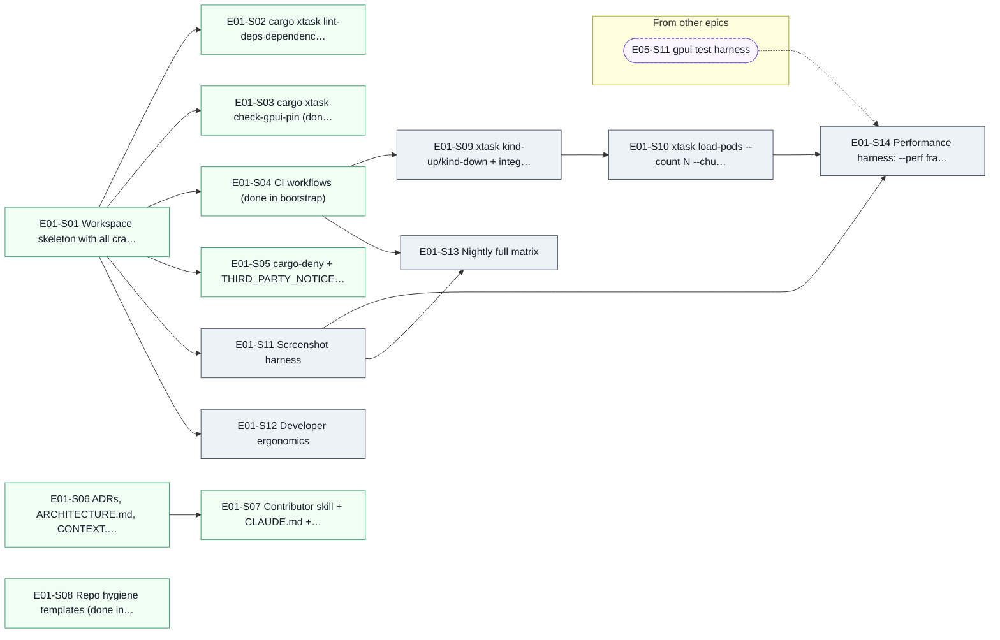

| Story | Issue | Title | Size | Wave | Blocked by | Unblocks |
|---|---|---|---|---|---|---|
| E01-S01 | [#33](https://github.com/karan-vk/Oxikube/issues/33) | Workspace skeleton with all crates (done in bootstrap) | M | 0 | — | E01-S02, E01-S03, E01-S04, E01-S05, E01-S11, E01-S12 |
| E01-S02 | [#34](https://github.com/karan-vk/Oxikube/issues/34) | `cargo xtask lint-deps` dependency-direction lint (done in bootstrap) | M | 0 | E01-S01 | — |
| E01-S03 | [#35](https://github.com/karan-vk/Oxikube/issues/35) | `cargo xtask check-gpui-pin` (done in bootstrap) | S | 0 | E01-S01 | — |
| E01-S04 | [#36](https://github.com/karan-vk/Oxikube/issues/36) | CI workflows (done in bootstrap) | M | 0 | E01-S01 | E01-S09, E01-S13 |
| E01-S05 | [#37](https://github.com/karan-vk/Oxikube/issues/37) | cargo-deny + THIRD_PARTY_NOTICES (done in bootstrap) | S | 0 | E01-S01 | — |
| E01-S06 | [#38](https://github.com/karan-vk/Oxikube/issues/38) | ADRs, ARCHITECTURE.md, CONTEXT.md (done in bootstrap) | M | 0 | — | E01-S07 |
| E01-S07 | [#39](https://github.com/karan-vk/Oxikube/issues/39) | Contributor skill + CLAUDE.md + AGENTS.md (done in bootstrap) | M | 0 | E01-S06 | — |
| E01-S08 | [#40](https://github.com/karan-vk/Oxikube/issues/40) | Repo hygiene templates (done in bootstrap) | S | 0 | — | — |
| E01-S09 | [#41](https://github.com/karan-vk/Oxikube/issues/41) | `xtask kind-up/kind-down` + integration workflow | M | 1 | E01-S04 | E01-S10 |
| E01-S10 | [#42](https://github.com/karan-vk/Oxikube/issues/42) | `xtask load-pods --count N --churn` | S | 2 | E01-S09 | E01-S14 |
| E01-S11 | [#43](https://github.com/karan-vk/Oxikube/issues/43) | Screenshot harness | M | 1 | E01-S01 | E01-S13, E01-S14 |
| E01-S12 | [#44](https://github.com/karan-vk/Oxikube/issues/44) | Developer ergonomics | S | 1 | E01-S01 | — |
| E01-S14 | [#265](https://github.com/karan-vk/Oxikube/issues/265) | Performance harness: `--perf` frame/feed/notify instrumentation, `xtask perf <scenario>`, baseline + nightly regression gate | M | 12 | E01-S10, E01-S11, E05-S11 | E05-S13 |
| E01-S13 | [#45](https://github.com/karan-vk/Oxikube/issues/45) | Nightly full matrix | S | 2 | E01-S04, E01-S11 | — |

### E02

**Domain model, ports & testkit** · [#3](https://github.com/karan-vk/Oxikube/issues/3) · Phase 0 · hard deps: E01 · stub-ok: none

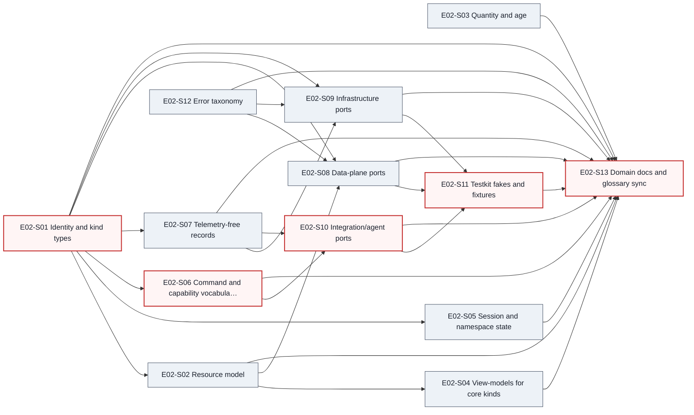

| Story | Issue | Title | Size | Wave | Blocked by | Unblocks |
|---|---|---|---|---|---|---|
| E02-S01 ⚠️ | [#46](https://github.com/karan-vk/Oxikube/issues/46) | Identity & kind types | S | 1 | — | E02-S02, E02-S05, E02-S06, E02-S07, E02-S08, E02-S09, E02-S13 |
| E02-S02 | [#47](https://github.com/karan-vk/Oxikube/issues/47) | Resource model | M | 2 | E02-S01 | E02-S04, E02-S08, E02-S13 |
| E02-S03 | [#48](https://github.com/karan-vk/Oxikube/issues/48) | Quantity & age | M | 1 | — | E02-S13 |
| E02-S04 | [#49](https://github.com/karan-vk/Oxikube/issues/49) | View-models for core kinds | L | 3 | E02-S02 | E02-S13 |
| E02-S05 | [#50](https://github.com/karan-vk/Oxikube/issues/50) | Session & namespace state | S | 2 | E02-S01 | E02-S13 |
| E02-S06 ⚠️ | [#51](https://github.com/karan-vk/Oxikube/issues/51) | Command & capability vocabulary | M | 2 | E02-S01 | E02-S10, E02-S13 |
| E02-S07 | [#52](https://github.com/karan-vk/Oxikube/issues/52) | Telemetry-free records | S | 2 | E02-S01 | E02-S09, E02-S10, E02-S13 |
| E02-S08 | [#53](https://github.com/karan-vk/Oxikube/issues/53) | Data-plane ports | M | 3 | E02-S01, E02-S02, E02-S12 | E02-S11, E02-S13 |
| E02-S09 | [#54](https://github.com/karan-vk/Oxikube/issues/54) | Infrastructure ports | M | 3 | E02-S01, E02-S07, E02-S12 | E02-S11, E02-S13 |
| E02-S10 ⚠️ | [#55](https://github.com/karan-vk/Oxikube/issues/55) | Integration/agent ports | M | 3 | E02-S06, E02-S07 | E02-S11, E02-S13 |
| E02-S11 ⚠️ | [#56](https://github.com/karan-vk/Oxikube/issues/56) | Testkit fakes & fixtures | L | 4 | E02-S08, E02-S09, E02-S10 | E02-S13 |
| E02-S12 | [#57](https://github.com/karan-vk/Oxikube/issues/57) | Error taxonomy | S | 1 | — | E02-S08, E02-S09, E02-S13 |
| E02-S13 ⚠️ | [#58](https://github.com/karan-vk/Oxikube/issues/58) | Domain docs & glossary sync | S | 5 | E02-S01, E02-S02, E02-S03, E02-S04, E02-S05, E02-S06, E02-S07, E02-S08, E02-S09, E02-S10, E02-S11, E02-S12 | — |

### E03

**Kube adapter: connection, auth & discovery** · [#4](https://github.com/karan-vk/Oxikube/issues/4) · Phase 0 · hard deps: E01, E02 · stub-ok: none

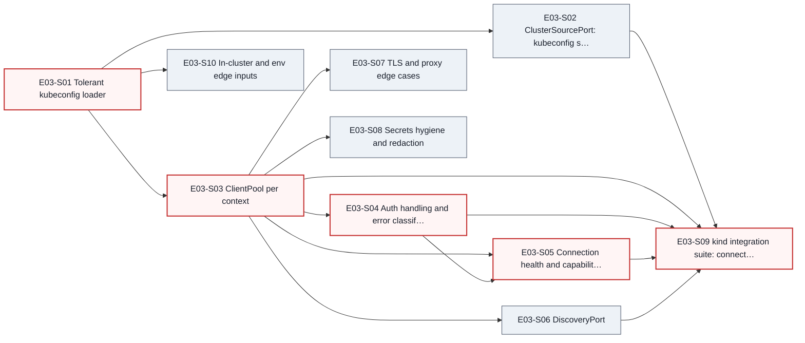

| Story | Issue | Title | Size | Wave | Blocked by | Unblocks |
|---|---|---|---|---|---|---|
| E03-S01 ⚠️ | [#59](https://github.com/karan-vk/Oxikube/issues/59) | Tolerant kubeconfig loader | S | 6 | — | E03-S02, E03-S03, E03-S10 |
| E03-S02 | [#60](https://github.com/karan-vk/Oxikube/issues/60) | ClusterSourcePort: kubeconfig sources + hot reload | M | 7 | E03-S01 | E03-S09 |
| E03-S03 ⚠️ | [#61](https://github.com/karan-vk/Oxikube/issues/61) | ClientPool per context | M | 7 | E03-S01 | E03-S04, E03-S05, E03-S06, E03-S07, E03-S08, E03-S09 |
| E03-S04 ⚠️ | [#62](https://github.com/karan-vk/Oxikube/issues/62) | Auth handling & error classification | M | 8 | E03-S03 | E03-S05, E03-S09 |
| E03-S05 ⚠️ | [#63](https://github.com/karan-vk/Oxikube/issues/63) | Connection health & capabilities probe | M | 9 | E03-S03, E03-S04 | E03-S09 |
| E03-S06 | [#64](https://github.com/karan-vk/Oxikube/issues/64) | DiscoveryPort | M | 8 | E03-S03 | E03-S09 |
| E03-S07 | [#65](https://github.com/karan-vk/Oxikube/issues/65) | TLS & proxy edge cases | S | 8 | E03-S03 | — |
| E03-S08 | [#66](https://github.com/karan-vk/Oxikube/issues/66) | Secrets hygiene & redaction | S | 8 | E03-S03 | — |
| E03-S09 ⚠️ | [#67](https://github.com/karan-vk/Oxikube/issues/67) | kind integration suite: connect/discover/RBAC | M | 10 | E03-S02, E03-S03, E03-S04, E03-S05, E03-S06 | — |
| E03-S10 | [#68](https://github.com/karan-vk/Oxikube/issues/68) | In-cluster & env edge inputs | S | 7 | E03-S01 | — |

### E04

**Kube adapter: resource data plane** · [#5](https://github.com/karan-vk/Oxikube/issues/5) · Phase 0 · hard deps: E02, E03 · stub-ok: none

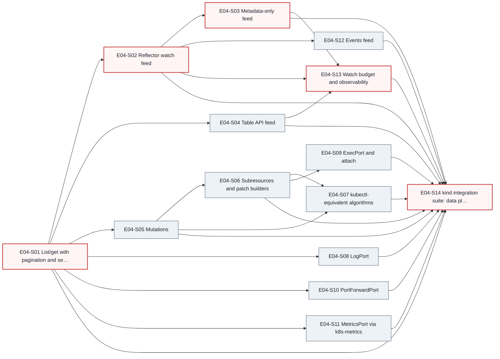

| Story | Issue | Title | Size | Wave | Blocked by | Unblocks |
|---|---|---|---|---|---|---|
| E04-S01 ⚠️ | [#69](https://github.com/karan-vk/Oxikube/issues/69) | List/get with pagination & selectors | M | 11 | — | E04-S02, E04-S04, E04-S05, E04-S08, E04-S10, E04-S11, E04-S14 |
| E04-S02 ⚠️ | [#70](https://github.com/karan-vk/Oxikube/issues/70) | Reflector watch feed | L | 12 | E04-S01 | E04-S03, E04-S12, E04-S13, E04-S14 |
| E04-S03 ⚠️ | [#71](https://github.com/karan-vk/Oxikube/issues/71) | Metadata-only feed | S | 13 | E04-S02 | E04-S13, E04-S14 |
| E04-S04 | [#72](https://github.com/karan-vk/Oxikube/issues/72) | Table API feed | L | 12 | E04-S01 | E04-S13, E04-S14 |
| E04-S05 | [#73](https://github.com/karan-vk/Oxikube/issues/73) | Mutations | M | 12 | E04-S01 | E04-S06, E04-S07, E04-S14 |
| E04-S06 | [#74](https://github.com/karan-vk/Oxikube/issues/74) | Subresources & patch builders | M | 13 | E04-S05 | E04-S07, E04-S09, E04-S14 |
| E04-S07 | [#75](https://github.com/karan-vk/Oxikube/issues/75) | kubectl-equivalent algorithms | M | 14 | E04-S05, E04-S06 | E04-S14 |
| E04-S08 | [#76](https://github.com/karan-vk/Oxikube/issues/76) | LogPort | M | 12 | E04-S01 | E04-S14 |
| E04-S09 | [#77](https://github.com/karan-vk/Oxikube/issues/77) | ExecPort & attach | M | 14 | E04-S06 | E04-S14 |
| E04-S10 | [#78](https://github.com/karan-vk/Oxikube/issues/78) | PortForwardPort | M | 12 | E04-S01 | E04-S14 |
| E04-S11 | [#79](https://github.com/karan-vk/Oxikube/issues/79) | MetricsPort via k8s-metrics | S | 12 | E04-S01 | E04-S14 |
| E04-S12 | [#80](https://github.com/karan-vk/Oxikube/issues/80) | Events feed | S | 13 | E04-S02 | E04-S14 |
| E04-S13 ⚠️ | [#81](https://github.com/karan-vk/Oxikube/issues/81) | Watch budget & observability | M | 14 | E04-S02, E04-S03, E04-S04 | E04-S14 |
| E04-S14 ⚠️ | [#82](https://github.com/karan-vk/Oxikube/issues/82) | kind integration suite: data plane | M | 15 | E04-S01, E04-S02, E04-S03, E04-S04, E04-S05, E04-S06, E04-S07, E04-S08, E04-S09, E04-S10, E04-S11, E04-S12, E04-S13 | — |

### E05

**App shell** · [#6](https://github.com/karan-vk/Oxikube/issues/6) · Phase 0 · hard deps: E01, E02 · stub-ok: none

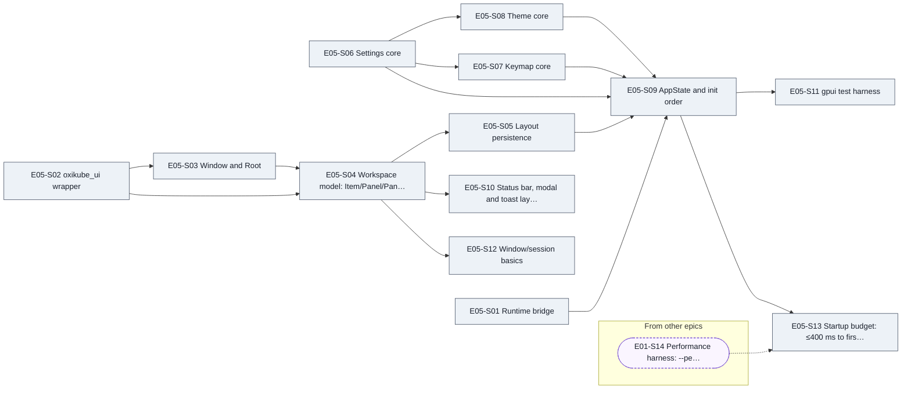

| Story | Issue | Title | Size | Wave | Blocked by | Unblocks |
|---|---|---|---|---|---|---|
| E05-S01 | [#83](https://github.com/karan-vk/Oxikube/issues/83) | Runtime bridge | M | 6 | — | E05-S09 |
| E05-S02 | [#84](https://github.com/karan-vk/Oxikube/issues/84) | `oxikube_ui` wrapper | M | 6 | — | E05-S03, E05-S04 |
| E05-S03 | [#85](https://github.com/karan-vk/Oxikube/issues/85) | Window & Root | M | 7 | E05-S02 | E05-S04 |
| E05-S04 | [#86](https://github.com/karan-vk/Oxikube/issues/86) | Workspace model: Item/Panel/Pane/Dock | L | 8 | E05-S02, E05-S03 | E05-S05, E05-S10, E05-S12, E06-S04 |
| E05-S05 | [#87](https://github.com/karan-vk/Oxikube/issues/87) | Layout persistence | M | 9 | E05-S04 | E05-S09 |
| E05-S06 | [#88](https://github.com/karan-vk/Oxikube/issues/88) | Settings core | L | 6 | — | E05-S07, E05-S08, E05-S09 |
| E05-S07 | [#89](https://github.com/karan-vk/Oxikube/issues/89) | Keymap core | M | 7 | E05-S06 | E05-S09 |
| E05-S08 | [#90](https://github.com/karan-vk/Oxikube/issues/90) | Theme core | M | 7 | E05-S06 | E05-S09 |
| E05-S09 | [#91](https://github.com/karan-vk/Oxikube/issues/91) | AppState & init order | S | 10 | E05-S01, E05-S05, E05-S06, E05-S07, E05-S08 | E05-S11, E05-S13 |
| E05-S10 | [#92](https://github.com/karan-vk/Oxikube/issues/92) | Status bar, modal & toast layers | S | 9 | E05-S04 | — |
| E05-S11 | [#93](https://github.com/karan-vk/Oxikube/issues/93) | gpui test harness | M | 11 | E05-S09 | E01-S14 |
| E05-S13 | [#266](https://github.com/karan-vk/Oxikube/issues/266) | Startup budget: ≤400 ms to first interactive frame, lazy init | M | 13 | E01-S14, E05-S09 | — |
| E05-S12 | [#94](https://github.com/karan-vk/Oxikube/issues/94) | Window/session basics | S | 9 | E05-S04 | — |

### E06

**Cluster catalog & sessions** · [#8](https://github.com/karan-vk/Oxikube/issues/8) · Phase 1 · hard deps: E03, E04, E05 · stub-ok: none

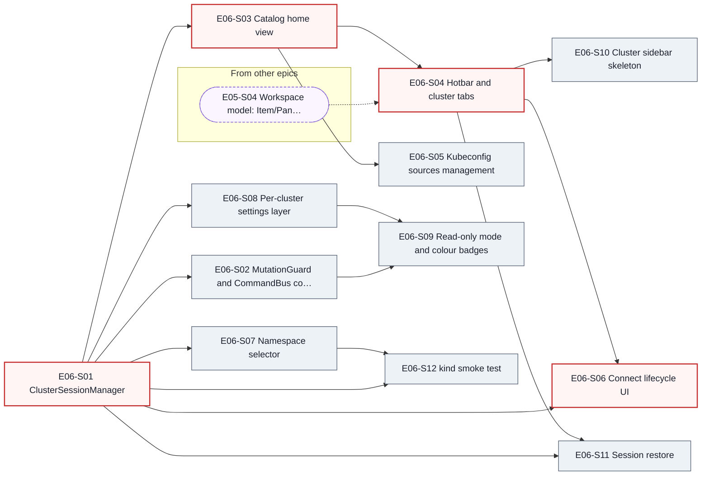

| Story | Issue | Title | Size | Wave | Blocked by | Unblocks |
|---|---|---|---|---|---|---|
| E06-S01 ⚠️ | [#95](https://github.com/karan-vk/Oxikube/issues/95) | ClusterSessionManager | L | 16 | — | E06-S02, E06-S03, E06-S06, E06-S07, E06-S08, E06-S11, E06-S12 |
| E06-S02 | [#96](https://github.com/karan-vk/Oxikube/issues/96) | MutationGuard & CommandBus core | M | 17 | E06-S01 | E06-S09, E07-S08 |
| E06-S03 ⚠️ | [#97](https://github.com/karan-vk/Oxikube/issues/97) | Catalog home view | M | 17 | E06-S01 | E06-S04, E06-S05 |
| E06-S04 ⚠️ | [#98](https://github.com/karan-vk/Oxikube/issues/98) | Hotbar & cluster tabs | M | 18 | E05-S04, E06-S03 | E06-S06, E06-S10, E06-S11 |
| E06-S05 | [#99](https://github.com/karan-vk/Oxikube/issues/99) | Kubeconfig sources management | M | 18 | E06-S03 | — |
| E06-S06 ⚠️ | [#100](https://github.com/karan-vk/Oxikube/issues/100) | Connect lifecycle UI | M | 19 | E06-S01, E06-S04 | — |
| E06-S07 | [#101](https://github.com/karan-vk/Oxikube/issues/101) | Namespace selector | M | 17 | E06-S01 | E06-S12 |
| E06-S08 | [#102](https://github.com/karan-vk/Oxikube/issues/102) | Per-cluster settings layer | M | 17 | E06-S01 | E06-S09 |
| E06-S09 | [#103](https://github.com/karan-vk/Oxikube/issues/103) | Read-only mode & colour badges | S | 18 | E06-S02, E06-S08 | — |
| E06-S10 | [#104](https://github.com/karan-vk/Oxikube/issues/104) | Cluster sidebar skeleton | M | 19 | E06-S04 | — |
| E06-S11 | [#105](https://github.com/karan-vk/Oxikube/issues/105) | Session restore | S | 19 | E06-S01, E06-S04 | — |
| E06-S12 | [#106](https://github.com/karan-vk/Oxikube/issues/106) | kind smoke test | S | 18 | E06-S01, E06-S07 | — |

### E07

**Resource browser: generic table + detail** · [#9](https://github.com/karan-vk/Oxikube/issues/9) · Phase 1 · hard deps: E04, E05, E06 · stub-ok: none

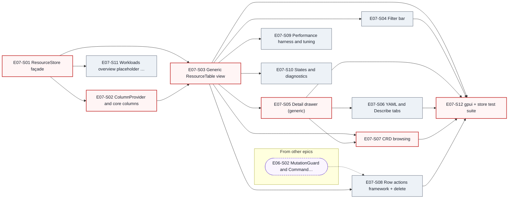

| Story | Issue | Title | Size | Wave | Blocked by | Unblocks |
|---|---|---|---|---|---|---|
| E07-S01 ⚠️ | [#107](https://github.com/karan-vk/Oxikube/issues/107) | ResourceStore façade | L | 20 | — | E07-S02, E07-S03, E07-S11 |
| E07-S02 ⚠️ | [#108](https://github.com/karan-vk/Oxikube/issues/108) | ColumnProvider & core columns | L | 21 | E07-S01 | E07-S03 |
| E07-S03 ⚠️ | [#109](https://github.com/karan-vk/Oxikube/issues/109) | Generic ResourceTable view | L | 22 | E07-S01, E07-S02 | E07-S04, E07-S05, E07-S07, E07-S08, E07-S09, E07-S10, E07-S12 |
| E07-S04 | [#110](https://github.com/karan-vk/Oxikube/issues/110) | Filter bar | M | 23 | E07-S03 | E07-S12 |
| E07-S05 ⚠️ | [#111](https://github.com/karan-vk/Oxikube/issues/111) | Detail drawer (generic) | M | 23 | E07-S03 | E07-S06, E07-S07, E07-S12 |
| E07-S06 | [#112](https://github.com/karan-vk/Oxikube/issues/112) | YAML & Describe tabs | M | 24 | E07-S05 | E07-S12 |
| E07-S07 ⚠️ | [#113](https://github.com/karan-vk/Oxikube/issues/113) | CRD browsing | M | 24 | E07-S03, E07-S05 | E07-S12 |
| E07-S08 | [#114](https://github.com/karan-vk/Oxikube/issues/114) | Row actions framework + delete | M | 23 | E06-S02, E07-S03 | E07-S12 |
| E07-S09 | [#115](https://github.com/karan-vk/Oxikube/issues/115) | Performance harness & tuning | M | 23 | E07-S03 | — |
| E07-S10 | [#116](https://github.com/karan-vk/Oxikube/issues/116) | States & diagnostics | S | 23 | E07-S03 | — |
| E07-S11 | [#117](https://github.com/karan-vk/Oxikube/issues/117) | Workloads overview placeholder & sidebar counts | S | 21 | E07-S01 | — |
| E07-S12 ⚠️ | [#118](https://github.com/karan-vk/Oxikube/issues/118) | gpui + store test suite | M | 25 | E07-S03, E07-S04, E07-S05, E07-S06, E07-S07, E07-S08 | — |

### E08

**Logs** · [#11](https://github.com/karan-vk/Oxikube/issues/11) · Phase 1 · hard deps: E04, E05, E07 · stub-ok: none

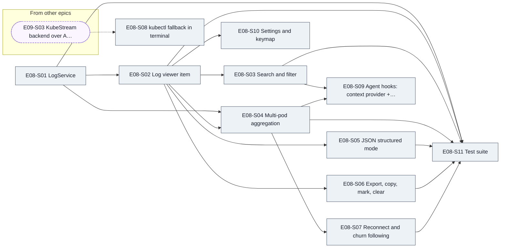

| Story | Issue | Title | Size | Wave | Blocked by | Unblocks |
|---|---|---|---|---|---|---|
| E08-S01 | [#119](https://github.com/karan-vk/Oxikube/issues/119) | LogService | M | 26 | — | E08-S02, E08-S04, E08-S11 |
| E08-S02 | [#120](https://github.com/karan-vk/Oxikube/issues/120) | Log viewer item | L | 27 | E08-S01 | E08-S03, E08-S04, E08-S05, E08-S06, E08-S10, E08-S11 |
| E08-S03 | [#121](https://github.com/karan-vk/Oxikube/issues/121) | Search & filter | M | 28 | E08-S02 | E08-S09, E08-S11 |
| E08-S04 | [#122](https://github.com/karan-vk/Oxikube/issues/122) | Multi-pod aggregation | M | 28 | E08-S01, E08-S02 | E08-S07, E08-S09, E08-S11 |
| E08-S05 | [#123](https://github.com/karan-vk/Oxikube/issues/123) | JSON structured mode | M | 28 | E08-S02 | E08-S11 |
| E08-S06 | [#124](https://github.com/karan-vk/Oxikube/issues/124) | Export, copy, mark, clear | S | 28 | E08-S02 | E08-S11 |
| E08-S07 | [#125](https://github.com/karan-vk/Oxikube/issues/125) | Reconnect & churn following | M | 29 | E08-S04 | E08-S11 |
| E08-S08 | [#126](https://github.com/karan-vk/Oxikube/issues/126) | kubectl fallback in terminal | S | 17 | E09-S03 | — |
| E08-S09 | [#127](https://github.com/karan-vk/Oxikube/issues/127) | Agent hooks: context provider + tool | M | 29 | E08-S03, E08-S04 | — |
| E08-S10 | [#128](https://github.com/karan-vk/Oxikube/issues/128) | Settings & keymap | S | 28 | E08-S02 | — |
| E08-S11 | [#129](https://github.com/karan-vk/Oxikube/issues/129) | Test suite | S | 30 | E08-S01, E08-S02, E08-S03, E08-S04, E08-S05, E08-S06, E08-S07 | — |

### E09

**Terminal & exec** · [#12](https://github.com/karan-vk/Oxikube/issues/12) · Phase 1 · hard deps: E03, E04, E05, E06 · stub-ok: none

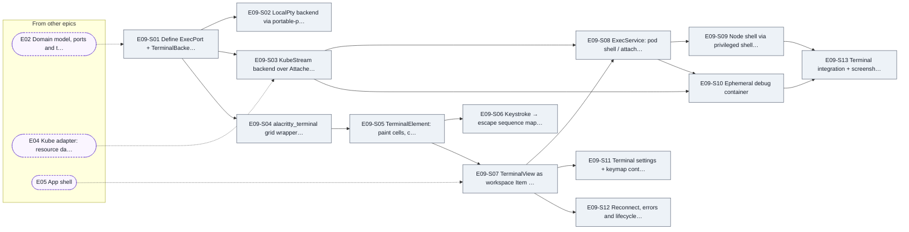

| Story | Issue | Title | Size | Wave | Blocked by | Unblocks |
|---|---|---|---|---|---|---|
| E09-S01 | [#130](https://github.com/karan-vk/Oxikube/issues/130) | Define `ExecPort` + `TerminalBackend` trait and fakes | S | 6 | E02 | E09-S02, E09-S03, E09-S04 |
| E09-S02 | [#131](https://github.com/karan-vk/Oxikube/issues/131) | `LocalPty` backend via portable-pty with cluster env injection | M | 7 | E09-S01 | — |
| E09-S03 | [#132](https://github.com/karan-vk/Oxikube/issues/132) | `KubeStream` backend over `AttachedProcess` | M | 16 | E04, E09-S01 | E08-S08, E09-S08, E09-S10, E20-S06 |
| E09-S04 | [#133](https://github.com/karan-vk/Oxikube/issues/133) | alacritty_terminal grid wrapper + event loop bridge | M | 7 | E09-S01 | E09-S05 |
| E09-S05 | [#134](https://github.com/karan-vk/Oxikube/issues/134) | `TerminalElement`: paint cells, cursor, selection, hyperlinks | L | 8 | E09-S04 | E09-S06, E09-S07 |
| E09-S06 | [#135](https://github.com/karan-vk/Oxikube/issues/135) | Keystroke → escape sequence mapping + IME | M | 9 | E09-S05 | — |
| E09-S07 | [#136](https://github.com/karan-vk/Oxikube/issues/136) | TerminalView as workspace Item + bottom dock panel | M | 14 | E05, E09-S05 | E09-S08, E09-S11, E09-S12 |
| E09-S08 | [#137](https://github.com/karan-vk/Oxikube/issues/137) | ExecService: pod shell / attach commands with container picker | M | 17 | E09-S03, E09-S07 | E09-S09, E09-S10 |
| E09-S09 | [#138](https://github.com/karan-vk/Oxikube/issues/138) | Node shell via privileged shell pod | M | 18 | E09-S08 | E09-S13 |
| E09-S10 | [#139](https://github.com/karan-vk/Oxikube/issues/139) | Ephemeral debug container | M | 18 | E09-S03, E09-S08 | E09-S13 |
| E09-S11 | [#140](https://github.com/karan-vk/Oxikube/issues/140) | Terminal settings + keymap context | S | 15 | E09-S07 | — |
| E09-S12 | [#141](https://github.com/karan-vk/Oxikube/issues/141) | Reconnect, errors and lifecycle hardening | S | 15 | E09-S07 | — |
| E09-S13 | [#142](https://github.com/karan-vk/Oxikube/issues/142) | Terminal integration + screenshot tests | M | 19 | E09-S09, E09-S10 | — |

### E10

**Manifest editor** · [#13](https://github.com/karan-vk/Oxikube/issues/13) · Phase 1 · hard deps: E04, E05, E07 · stub-ok: none

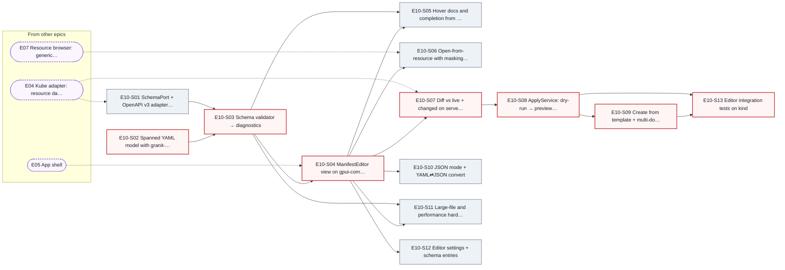

| Story | Issue | Title | Size | Wave | Blocked by | Unblocks |
|---|---|---|---|---|---|---|
| E10-S01 | [#143](https://github.com/karan-vk/Oxikube/issues/143) | `SchemaPort` + OpenAPI v3 adapter with cache | M | 16 | E04 | E10-S03 |
| E10-S02 ⚠️ | [#144](https://github.com/karan-vk/Oxikube/issues/144) | Spanned YAML model with granit-parser | M | 26 | — | E10-S03 |
| E10-S03 ⚠️ | [#145](https://github.com/karan-vk/Oxikube/issues/145) | Schema validator → diagnostics | M | 27 | E10-S01, E10-S02 | E10-S04, E10-S05, E10-S11 |
| E10-S04 ⚠️ | [#146](https://github.com/karan-vk/Oxikube/issues/146) | `ManifestEditor` view on gpui-component Editor | L | 28 | E05, E10-S03 | E10-S05, E10-S06, E10-S07, E10-S10, E10-S11, E10-S12 |
| E10-S05 | [#147](https://github.com/karan-vk/Oxikube/issues/147) | Hover docs and completion from schema | M | 29 | E10-S03, E10-S04 | — |
| E10-S06 | [#148](https://github.com/karan-vk/Oxikube/issues/148) | Open-from-resource with masking and managedFields toggle | S | 29 | E07, E10-S04 | — |
| E10-S07 ⚠️ | [#149](https://github.com/karan-vk/Oxikube/issues/149) | Diff vs live + "changed on server" banner | M | 29 | E04, E10-S04 | E10-S08, E19-S07, E20-S09 |
| E10-S08 ⚠️ | [#150](https://github.com/karan-vk/Oxikube/issues/150) | ApplyService: dry-run → preview → SSA → fallback | M | 30 | E10-S07 | E10-S09, E10-S13 |
| E10-S09 ⚠️ | [#151](https://github.com/karan-vk/Oxikube/issues/151) | Create from template + multi-document apply | M | 31 | E10-S08 | E10-S13 |
| E10-S10 | [#152](https://github.com/karan-vk/Oxikube/issues/152) | JSON mode + YAML⇄JSON convert | S | 29 | E10-S04 | — |
| E10-S11 | [#153](https://github.com/karan-vk/Oxikube/issues/153) | Large-file and performance hardening | M | 29 | E10-S03, E10-S04 | — |
| E10-S12 | [#154](https://github.com/karan-vk/Oxikube/issues/154) | Editor settings + schema entries | S | 29 | E10-S04 | — |
| E10-S13 ⚠️ | [#155](https://github.com/karan-vk/Oxikube/issues/155) | Editor integration tests on kind | M | 32 | E10-S08, E10-S09 | — |

### E11

**Command palette, ':' jump & keymaps** · [#14](https://github.com/karan-vk/Oxikube/issues/14) · Phase 1 · hard deps: E05, E06, E07 · stub-ok: none

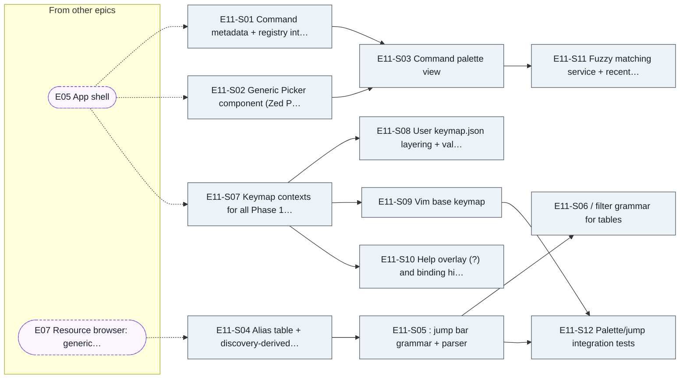

| Story | Issue | Title | Size | Wave | Blocked by | Unblocks |
|---|---|---|---|---|---|---|
| E11-S01 | [#156](https://github.com/karan-vk/Oxikube/issues/156) | Command metadata + registry introspection | S | 14 | E05 | E11-S03 |
| E11-S02 | [#157](https://github.com/karan-vk/Oxikube/issues/157) | Generic Picker component (Zed PickerDelegate pattern, vendored) | M | 14 | E05 | E11-S03 |
| E11-S03 | [#158](https://github.com/karan-vk/Oxikube/issues/158) | Command palette view | M | 15 | E11-S01, E11-S02 | E11-S11 |
| E11-S04 | [#159](https://github.com/karan-vk/Oxikube/issues/159) | Alias table + discovery-derived resource aliases | M | 26 | E07 | E11-S05 |
| E11-S05 | [#160](https://github.com/karan-vk/Oxikube/issues/160) | `:` jump bar grammar + parser | M | 27 | E11-S04 | E11-S06, E11-S12 |
| E11-S06 | [#161](https://github.com/karan-vk/Oxikube/issues/161) | `/` filter grammar for tables | S | 28 | E11-S05 | — |
| E11-S07 | [#162](https://github.com/karan-vk/Oxikube/issues/162) | Keymap contexts for all Phase 1 views + per-OS defaults | M | 14 | E05 | E11-S08, E11-S09, E11-S10 |
| E11-S08 | [#163](https://github.com/karan-vk/Oxikube/issues/163) | User keymap.json layering + validator + hot reload | M | 15 | E11-S07 | — |
| E11-S09 | [#164](https://github.com/karan-vk/Oxikube/issues/164) | Vim base keymap | M | 15 | E11-S07 | E11-S12 |
| E11-S10 | [#165](https://github.com/karan-vk/Oxikube/issues/165) | Help overlay (`?`) and binding hints | S | 15 | E11-S07 | — |
| E11-S11 | [#166](https://github.com/karan-vk/Oxikube/issues/166) | Fuzzy matching service + recents persistence | S | 16 | E11-S03 | — |
| E11-S12 | [#167](https://github.com/karan-vk/Oxikube/issues/167) | Palette/jump integration tests | S | 28 | E11-S05, E11-S09 | — |

### E12

**Per-kind panels & actions** · [#15](https://github.com/karan-vk/Oxikube/issues/15) · Phase 2 · hard deps: E04, E07, E10, E11 · stub-ok: E13

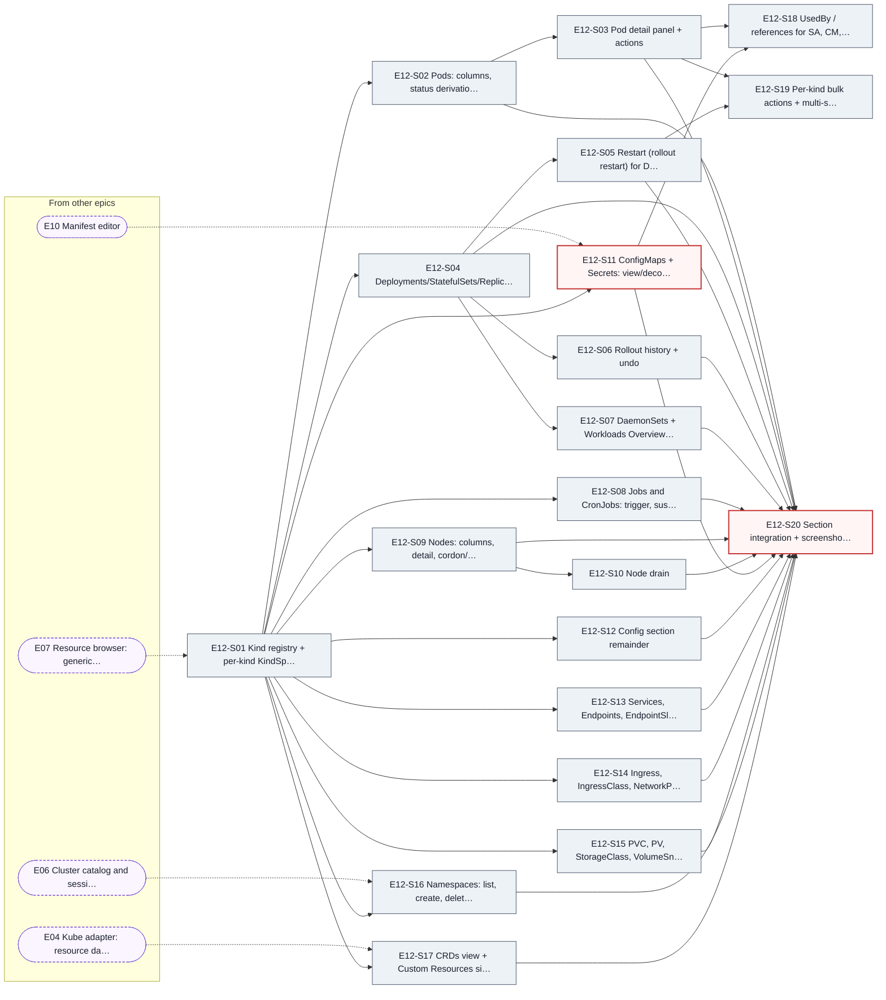

| Story | Issue | Title | Size | Wave | Blocked by | Unblocks |
|---|---|---|---|---|---|---|
| E12-S01 | [#168](https://github.com/karan-vk/Oxikube/issues/168) | Kind registry + per-kind `KindSpec` (columns, detail, actions, templates) | M | 26 | E07 | E12-S02, E12-S04, E12-S08, E12-S09, E12-S11, E12-S12, E12-S13, E12-S14, E12-S15, E12-S16, E12-S17 |
| E12-S02 | [#169](https://github.com/karan-vk/Oxikube/issues/169) | Pods: columns, status derivation, containers drill-down | L | 27 | E12-S01 | E12-S03, E12-S20 |
| E12-S03 | [#170](https://github.com/karan-vk/Oxikube/issues/170) | Pod detail panel + actions | M | 28 | E12-S02 | E12-S18, E12-S19, E12-S20 |
| E12-S04 | [#171](https://github.com/karan-vk/Oxikube/issues/171) | Deployments/StatefulSets/ReplicaSets/RCs: columns, detail, scale | M | 27 | E12-S01 | E12-S05, E12-S06, E12-S07, E12-S20 |
| E12-S05 | [#172](https://github.com/karan-vk/Oxikube/issues/172) | Restart (rollout restart) for Deploy/DS/STS + set image | M | 28 | E12-S04 | E12-S19, E12-S20 |
| E12-S06 | [#173](https://github.com/karan-vk/Oxikube/issues/173) | Rollout history + undo | M | 28 | E12-S04 | E12-S20 |
| E12-S07 | [#174](https://github.com/karan-vk/Oxikube/issues/174) | DaemonSets + Workloads Overview page | M | 28 | E12-S04 | E12-S20 |
| E12-S08 | [#175](https://github.com/karan-vk/Oxikube/issues/175) | Jobs & CronJobs: trigger, suspend/resume | M | 27 | E12-S01 | E12-S20 |
| E12-S09 | [#176](https://github.com/karan-vk/Oxikube/issues/176) | Nodes: columns, detail, cordon/uncordon | M | 27 | E12-S01 | E12-S10, E12-S20 |
| E12-S10 | [#177](https://github.com/karan-vk/Oxikube/issues/177) | Node drain | M | 28 | E12-S09 | E12-S20 |
| E12-S11 ⚠️ | [#178](https://github.com/karan-vk/Oxikube/issues/178) | ConfigMaps + Secrets: view/decode/edit with transparent base64 | M | 33 | E10, E12-S01 | E12-S18, E12-S20 |
| E12-S12 | [#179](https://github.com/karan-vk/Oxikube/issues/179) | Config section remainder | M | 27 | E12-S01 | E12-S20 |
| E12-S13 | [#180](https://github.com/karan-vk/Oxikube/issues/180) | Services, Endpoints, EndpointSlices | M | 27 | E12-S01 | E12-S20 |
| E12-S14 | [#181](https://github.com/karan-vk/Oxikube/issues/181) | Ingress, IngressClass, NetworkPolicy, Gateway API | M | 27 | E12-S01 | E12-S20 |
| E12-S15 | [#182](https://github.com/karan-vk/Oxikube/issues/182) | PVC, PV, StorageClass, VolumeSnapshots | M | 27 | E12-S01 | E12-S20 |
| E12-S16 | [#183](https://github.com/karan-vk/Oxikube/issues/183) | Namespaces: list, create, delete, favourites, use | M | 27 | E06, E12-S01 | E12-S20 |
| E12-S17 | [#184](https://github.com/karan-vk/Oxikube/issues/184) | CRDs view + Custom Resources sidebar groups | M | 27 | E04, E12-S01 | E12-S20 |
| E12-S18 | [#185](https://github.com/karan-vk/Oxikube/issues/185) | UsedBy / references for SA, CM, Secret, PVC, PriorityClass | S | 34 | E12-S03, E12-S11 | — |
| E12-S19 | [#186](https://github.com/karan-vk/Oxikube/issues/186) | Per-kind bulk actions + multi-select wiring | S | 29 | E12-S03, E12-S05 | — |
| E12-S20 ⚠️ | [#187](https://github.com/karan-vk/Oxikube/issues/187) | Section integration + screenshot test matrix | M | 34 | E12-S02, E12-S03, E12-S04, E12-S05, E12-S06, E12-S07, E12-S08, E12-S09, E12-S10, E12-S11, E12-S12, E12-S13, E12-S14, E12-S15, E12-S16, E12-S17 | — |

### E13

**Metrics & cluster overview** · [#16](https://github.com/karan-vk/Oxikube/issues/16) · Phase 2 · hard deps: E04, E07, E12 · stub-ok: none

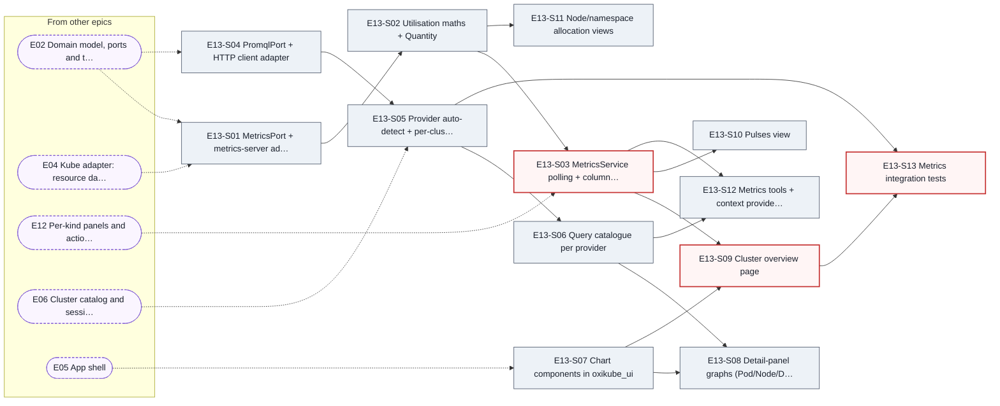

| Story | Issue | Title | Size | Wave | Blocked by | Unblocks |
|---|---|---|---|---|---|---|
| E13-S01 | [#188](https://github.com/karan-vk/Oxikube/issues/188) | `MetricsPort` + metrics-server adapter | M | 16 | E02, E04 | E13-S02 |
| E13-S02 | [#189](https://github.com/karan-vk/Oxikube/issues/189) | Utilisation maths + Quantity | M | 17 | E13-S01 | E13-S03, E13-S11 |
| E13-S03 ⚠️ | [#190](https://github.com/karan-vk/Oxikube/issues/190) | MetricsService polling + column provider | M | 35 | E12, E13-S02 | E13-S09, E13-S10, E13-S12 |
| E13-S04 | [#191](https://github.com/karan-vk/Oxikube/issues/191) | `PromqlPort` + HTTP client adapter | M | 6 | E02 | E13-S05 |
| E13-S05 | [#192](https://github.com/karan-vk/Oxikube/issues/192) | Provider auto-detect + per-cluster metrics settings | M | 20 | E06, E13-S04 | E13-S06, E13-S13 |
| E13-S06 | [#193](https://github.com/karan-vk/Oxikube/issues/193) | Query catalogue per provider | M | 21 | E13-S05 | E13-S08, E13-S12 |
| E13-S07 | [#194](https://github.com/karan-vk/Oxikube/issues/194) | Chart components in oxikube_ui | M | 14 | E05 | E13-S08, E13-S09 |
| E13-S08 | [#195](https://github.com/karan-vk/Oxikube/issues/195) | Detail-panel graphs (Pod/Node/Deployment/Namespace/PVC/Ingress) | M | 22 | E13-S06, E13-S07 | — |
| E13-S09 ⚠️ | [#196](https://github.com/karan-vk/Oxikube/issues/196) | Cluster overview page | L | 36 | E13-S03, E13-S07 | E13-S13 |
| E13-S10 | [#197](https://github.com/karan-vk/Oxikube/issues/197) | Pulses view | M | 36 | E13-S03 | — |
| E13-S11 | [#198](https://github.com/karan-vk/Oxikube/issues/198) | Node/namespace allocation views | S | 18 | E13-S02 | — |
| E13-S12 | [#199](https://github.com/karan-vk/Oxikube/issues/199) | Metrics tools + context providers | S | 36 | E13-S03, E13-S06 | — |
| E13-S13 ⚠️ | [#200](https://github.com/karan-vk/Oxikube/issues/200) | Metrics integration tests | M | 37 | E13-S05, E13-S09 | — |

### E14

**Events & notifications** · [#17](https://github.com/karan-vk/Oxikube/issues/17) · Phase 2 · hard deps: E04, E05, E07 · stub-ok: none

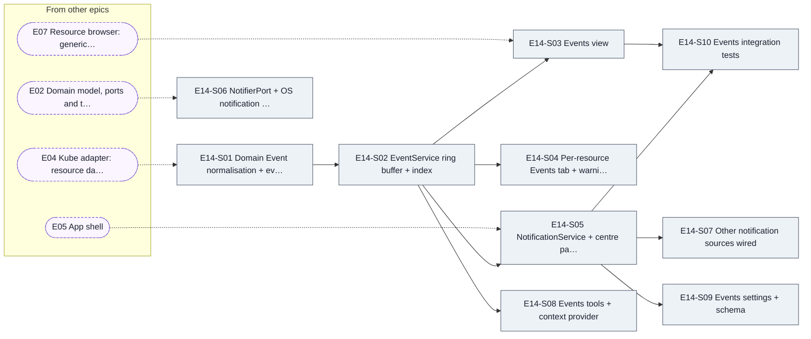

| Story | Issue | Title | Size | Wave | Blocked by | Unblocks |
|---|---|---|---|---|---|---|
| E14-S01 | [#201](https://github.com/karan-vk/Oxikube/issues/201) | Domain `Event` normalisation + events watcher | M | 16 | E04 | E14-S02 |
| E14-S02 | [#202](https://github.com/karan-vk/Oxikube/issues/202) | EventService ring buffer + index | M | 17 | E14-S01 | E14-S03, E14-S04, E14-S05, E14-S08 |
| E14-S03 | [#203](https://github.com/karan-vk/Oxikube/issues/203) | Events view | M | 26 | E07, E14-S02 | E14-S10 |
| E14-S04 | [#204](https://github.com/karan-vk/Oxikube/issues/204) | Per-resource Events tab + warning badges | S | 18 | E14-S02 | — |
| E14-S05 | [#205](https://github.com/karan-vk/Oxikube/issues/205) | NotificationService + centre panel | M | 18 | E05, E14-S02 | E14-S07, E14-S09, E14-S10 |
| E14-S06 | [#206](https://github.com/karan-vk/Oxikube/issues/206) | `NotifierPort` + OS notification adapter | S | 6 | E02 | — |
| E14-S07 | [#207](https://github.com/karan-vk/Oxikube/issues/207) | Other notification sources wired | S | 19 | E14-S05 | — |
| E14-S08 | [#208](https://github.com/karan-vk/Oxikube/issues/208) | Events tools + context provider | S | 18 | E14-S02 | — |
| E14-S09 | [#209](https://github.com/karan-vk/Oxikube/issues/209) | Events settings + schema | S | 19 | E14-S05 | — |
| E14-S10 | [#210](https://github.com/karan-vk/Oxikube/issues/210) | Events integration tests | S | 27 | E14-S03, E14-S05 | — |

### E15

**Port-forward manager** · [#18](https://github.com/karan-vk/Oxikube/issues/18) · Phase 2 · hard deps: E04, E05, E06, E12 · stub-ok: none

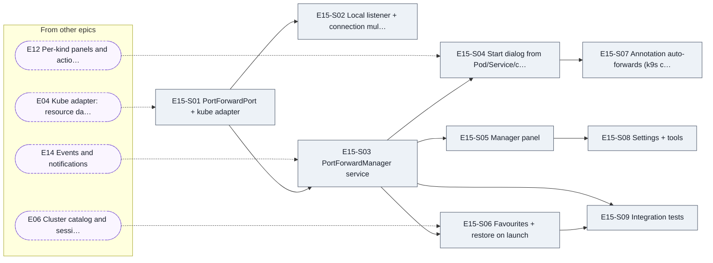

| Story | Issue | Title | Size | Wave | Blocked by | Unblocks |
|---|---|---|---|---|---|---|
| E15-S01 | [#211](https://github.com/karan-vk/Oxikube/issues/211) | `PortForwardPort` + kube adapter | M | 16 | E04 | E15-S02, E15-S03 |
| E15-S02 | [#212](https://github.com/karan-vk/Oxikube/issues/212) | Local listener + connection multiplexing | M | 17 | E15-S01 | — |
| E15-S03 | [#213](https://github.com/karan-vk/Oxikube/issues/213) | PortForwardManager service | M | 28 | E14, E15-S01 | E15-S04, E15-S05, E15-S06, E15-S09 |
| E15-S04 | [#214](https://github.com/karan-vk/Oxikube/issues/214) | Start dialog from Pod/Service/container ports | S | 35 | E12, E15-S03 | E15-S07 |
| E15-S05 | [#215](https://github.com/karan-vk/Oxikube/issues/215) | Manager panel | M | 29 | E15-S03 | E15-S08 |
| E15-S06 | [#216](https://github.com/karan-vk/Oxikube/issues/216) | Favourites + restore on launch | S | 29 | E06, E15-S03 | E15-S09 |
| E15-S07 | [#217](https://github.com/karan-vk/Oxikube/issues/217) | Annotation auto-forwards (k9s compat) | S | 36 | E15-S04 | — |
| E15-S08 | [#218](https://github.com/karan-vk/Oxikube/issues/218) | Settings + tools | S | 30 | E15-S05 | — |
| E15-S09 | [#219](https://github.com/karan-vk/Oxikube/issues/219) | Integration tests | S | 30 | E15-S03, E15-S06 | — |

### E16

**Helm** · [#19](https://github.com/karan-vk/Oxikube/issues/19) · Phase 2 · hard deps: E04, E07, E10, E12 · stub-ok: none

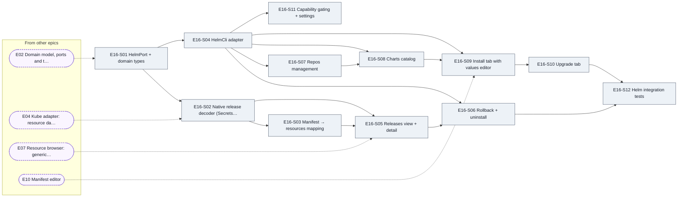

| Story | Issue | Title | Size | Wave | Blocked by | Unblocks |
|---|---|---|---|---|---|---|
| E16-S01 | [#220](https://github.com/karan-vk/Oxikube/issues/220) | `HelmPort` + domain types | S | 6 | E02 | E16-S02, E16-S04 |
| E16-S02 | [#221](https://github.com/karan-vk/Oxikube/issues/221) | Native release decoder (Secrets + ConfigMaps) | M | 16 | E04, E16-S01 | E16-S03, E16-S05 |
| E16-S03 | [#222](https://github.com/karan-vk/Oxikube/issues/222) | Manifest → resources mapping | S | 17 | E16-S02 | E16-S05 |
| E16-S04 | [#223](https://github.com/karan-vk/Oxikube/issues/223) | `HelmCli` adapter | M | 7 | E16-S01 | E16-S06, E16-S07, E16-S08, E16-S09, E16-S11 |
| E16-S05 | [#224](https://github.com/karan-vk/Oxikube/issues/224) | Releases view + detail | M | 26 | E07, E16-S02, E16-S03 | E16-S06 |
| E16-S06 | [#225](https://github.com/karan-vk/Oxikube/issues/225) | Rollback + uninstall | S | 27 | E16-S04, E16-S05 | E16-S12 |
| E16-S07 | [#226](https://github.com/karan-vk/Oxikube/issues/226) | Repos management | S | 8 | E16-S04 | E16-S08 |
| E16-S08 | [#227](https://github.com/karan-vk/Oxikube/issues/227) | Charts catalog | M | 9 | E16-S04, E16-S07 | E16-S09 |
| E16-S09 | [#228](https://github.com/karan-vk/Oxikube/issues/228) | Install tab with values editor | M | 33 | E10, E16-S04, E16-S08 | E16-S10 |
| E16-S10 | [#229](https://github.com/karan-vk/Oxikube/issues/229) | Upgrade tab | M | 34 | E16-S09 | E16-S12 |
| E16-S11 | [#230](https://github.com/karan-vk/Oxikube/issues/230) | Capability gating + settings | S | 8 | E16-S04 | — |
| E16-S12 | [#231](https://github.com/karan-vk/Oxikube/issues/231) | Helm integration tests | M | 35 | E16-S06, E16-S10 | — |

### E17

**RBAC & access tooling** · [#20](https://github.com/karan-vk/Oxikube/issues/20) · Phase 2 · hard deps: E04, E07, E12 · stub-ok: none

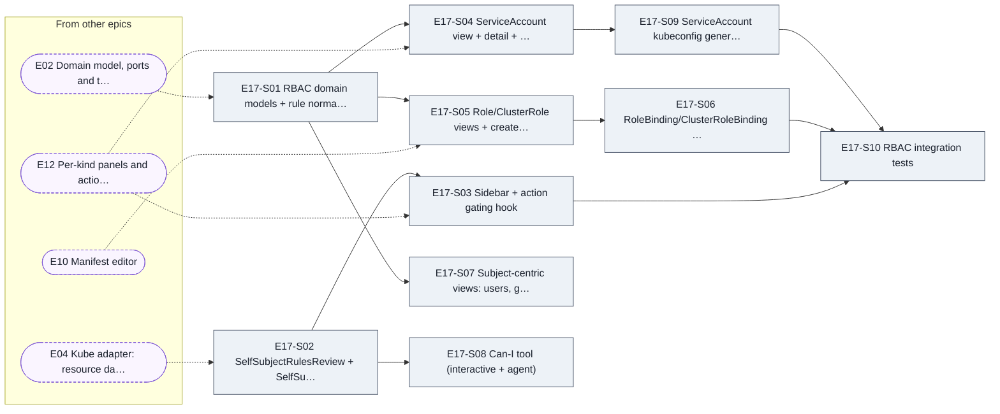

| Story | Issue | Title | Size | Wave | Blocked by | Unblocks |
|---|---|---|---|---|---|---|
| E17-S01 | [#232](https://github.com/karan-vk/Oxikube/issues/232) | RBAC domain models + rule normaliser | M | 6 | E02 | E17-S04, E17-S05, E17-S07 |
| E17-S02 | [#233](https://github.com/karan-vk/Oxikube/issues/233) | `SelfSubjectRulesReview` + `SelfSubjectAccessReview` adapter | M | 16 | E04 | E17-S03, E17-S08 |
| E17-S03 | [#234](https://github.com/karan-vk/Oxikube/issues/234) | Sidebar + action gating hook | S | 35 | E12, E17-S02 | E17-S10 |
| E17-S04 | [#235](https://github.com/karan-vk/Oxikube/issues/235) | ServiceAccount view + detail + used-by | S | 35 | E12, E17-S01 | E17-S09 |
| E17-S05 | [#236](https://github.com/karan-vk/Oxikube/issues/236) | Role/ClusterRole views + create/edit dialog | M | 33 | E10, E17-S01 | E17-S06 |
| E17-S06 | [#237](https://github.com/karan-vk/Oxikube/issues/237) | RoleBinding/ClusterRoleBinding views + dialog | M | 34 | E17-S05 | E17-S10 |
| E17-S07 | [#238](https://github.com/karan-vk/Oxikube/issues/238) | Subject-centric views: users, groups, policy matrix | M | 7 | E17-S01 | — |
| E17-S08 | [#239](https://github.com/karan-vk/Oxikube/issues/239) | Can-I tool (interactive + agent) | S | 17 | E17-S02 | — |
| E17-S09 | [#240](https://github.com/karan-vk/Oxikube/issues/240) | ServiceAccount kubeconfig generation | M | 36 | E17-S04 | E17-S10 |
| E17-S10 | [#241](https://github.com/karan-vk/Oxikube/issues/241) | RBAC integration tests | S | 37 | E17-S03, E17-S06, E17-S09 | — |

### E18

**Cloud discovery** · [#21](https://github.com/karan-vk/Oxikube/issues/21) · Phase 2 · hard deps: E03, E05, E06 · stub-ok: none

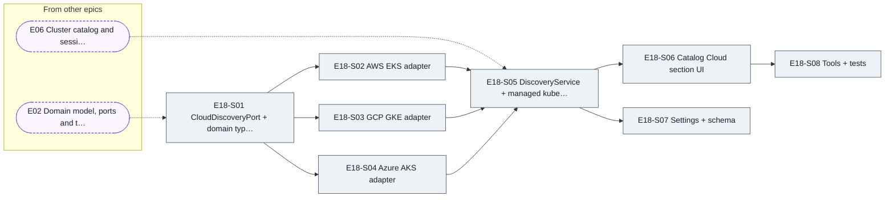

| Story | Issue | Title | Size | Wave | Blocked by | Unblocks |
|---|---|---|---|---|---|---|
| E18-S01 | [#242](https://github.com/karan-vk/Oxikube/issues/242) | `CloudDiscoveryPort` + domain types + process runner | S | 6 | E02 | E18-S02, E18-S03, E18-S04 |
| E18-S02 | [#243](https://github.com/karan-vk/Oxikube/issues/243) | AWS EKS adapter | M | 7 | E18-S01 | E18-S05 |
| E18-S03 | [#244](https://github.com/karan-vk/Oxikube/issues/244) | GCP GKE adapter | M | 7 | E18-S01 | E18-S05 |
| E18-S04 | [#245](https://github.com/karan-vk/Oxikube/issues/245) | Azure AKS adapter | M | 7 | E18-S01 | E18-S05 |
| E18-S05 | [#246](https://github.com/karan-vk/Oxikube/issues/246) | DiscoveryService + managed kubeconfig files | M | 20 | E06, E18-S02, E18-S03, E18-S04 | E18-S06, E18-S07 |
| E18-S06 | [#247](https://github.com/karan-vk/Oxikube/issues/247) | Catalog Cloud section UI | M | 21 | E18-S05 | E18-S08 |
| E18-S07 | [#248](https://github.com/karan-vk/Oxikube/issues/248) | Settings + schema | S | 21 | E18-S05 | — |
| E18-S08 | [#249](https://github.com/karan-vk/Oxikube/issues/249) | Tools + tests | S | 22 | E18-S06 | — |

### E19

**Safety & audit** · [#22](https://github.com/karan-vk/Oxikube/issues/22) · Phase 2 · hard deps: E02, E04, E05, E06, E07 · stub-ok: none

```mermaid
flowchart LR
  E19S01["E19-S01 Domain types: Risk, MutationInt…"]:::st
  E19S02["E19-S02 MutationGuard pipeline"]:::st
  E19S03["E19-S03 Mutation newtype + lint rule"]:::st
  E19S04["E19-S04 Per-cluster read-only mode pers…"]:::st
  E19S05["E19-S05 Colour-coded cluster tabs, badg…"]:::st
  E19S06["E19-S06 Confirmation dialogs (simple + …"]:::st
  E19S07["E19-S07 Dry-run preview integration"]:::st
  E19S08["E19-S08 Audit log storage + migrations"]:::st
  E19S09["E19-S09 Audit viewer tab + export"]:::st
  E19S10["E19-S10 Secret redaction policy"]:::st
  E19S11["E19-S11 Integration test: read-only swe…"]:::st
  E02 -.-> E19S01
  E19S01 --> E19S02
  E19S02 --> E19S03
  E06 -.-> E19S04
  E19S02 --> E19S04
  E05 -.-> E19S05
  E19S04 --> E19S05
  E19S02 --> E19S06
  E10S07 -.-> E19S07
  E19S02 --> E19S07
  E19S01 --> E19S08
  E07 -.-> E19S09
  E19S08 --> E19S09
  E19S01 --> E19S10
  E11 -.-> E19S11
  E19S03 --> E19S11
  E19S04 --> E19S11
  subgraph upstream["From other epics"]
    direction TB
    E02(["E02 Domain model, ports and t…"]):::ext
    E05(["E05 App shell"]):::ext
    E06(["E06 Cluster catalog and sessi…"]):::ext
    E07(["E07 Resource browser: generic…"]):::ext
    E10S07(["E10-S07 Diff vs live + changed on…"]):::ext
    E11(["E11 Command palette, ’:’ jump…"]):::ext
  end
  classDef st fill:#edf2f7,stroke:#4a5568,color:#1a202c
  classDef crit fill:#fff5f5,stroke:#c53030,stroke-width:2px,color:#1a202c
  classDef done fill:#f0fff4,stroke:#38a169,color:#1a202c
  classDef ext fill:#faf5ff,stroke:#805ad5,stroke-dasharray:4 3,color:#1a202c
```

| Story | Issue | Title | Size | Wave | Blocked by | Unblocks |
|---|---|---|---|---|---|---|
| E19-S01 | [#250](https://github.com/karan-vk/Oxikube/issues/250) | Domain types: Risk, MutationIntent, AuditRecord, Initiator | S | 6 | E02 | E19-S02, E19-S08, E19-S10, E26-S01 |
| E19-S02 | [#251](https://github.com/karan-vk/Oxikube/issues/251) | MutationGuard pipeline | M | 7 | E19-S01 | E19-S03, E19-S04, E19-S06, E19-S07, E20-S03, E26-S02 |
| E19-S03 | [#252](https://github.com/karan-vk/Oxikube/issues/252) | Mutation newtype + lint rule | S | 8 | E19-S02 | E19-S11 |
| E19-S04 | [#253](https://github.com/karan-vk/Oxikube/issues/253) | Per-cluster read-only mode persistence + command | S | 20 | E06, E19-S02 | E19-S05, E19-S11 |
| E19-S05 | [#254](https://github.com/karan-vk/Oxikube/issues/254) | Colour-coded cluster tabs, badges, status-bar guard indicator | M | 21 | E05, E19-S04 | — |
| E19-S06 | [#255](https://github.com/karan-vk/Oxikube/issues/255) | Confirmation dialogs (simple + type-the-name) | M | 8 | E19-S02 | — |
| E19-S07 | [#256](https://github.com/karan-vk/Oxikube/issues/256) | Dry-run preview integration | M | 30 | E10-S07, E19-S02 | — |
| E19-S08 | [#257](https://github.com/karan-vk/Oxikube/issues/257) | Audit log storage + migrations | S | 7 | E19-S01 | E19-S09 |
| E19-S09 | [#258](https://github.com/karan-vk/Oxikube/issues/258) | Audit viewer tab + export | M | 26 | E07, E19-S08 | — |
| E19-S10 | [#259](https://github.com/karan-vk/Oxikube/issues/259) | Secret redaction policy | S | 7 | E19-S01 | E24-S08, E26-S08 |
| E19-S11 | [#260](https://github.com/karan-vk/Oxikube/issues/260) | Integration test: read-only sweep over all commands | M | 29 | E11, E19-S03, E19-S04 | — |

### E20

**Apply/kustomize, file transfer & cross-cluster copy/diff** · [#23](https://github.com/karan-vk/Oxikube/issues/23) · Phase 2 · hard deps: E04, E07, E09, E10, E19 · stub-ok: none

```mermaid
flowchart LR
  E20S01["E20-S01 Multi-document manifest loader"]:::st
  E20S02["E20-S02 ApplyPlan ordering + sanitisati…"]:::st
  E20S03["E20-S03 ApplyService (SSA, dry-run firs…"]:::st
  E20S04["E20-S04 Kustomize adapter"]:::st
  E20S05["E20-S05 Apply directory/kustomize UI + …"]:::st
  E20S06["E20-S06 Exec tar streaming primitives"]:::st
  E20S07["E20-S07 Pod file browser item"]:::st
  E20S08["E20-S08 Copy resource to cluster/namesp…"]:::st
  E20S09["E20-S09 Cross-cluster/namespace resourc…"]:::st
  E20S10["E20-S10 Bulk apply/copy tests + fixtures"]:::st
  E02 -.-> E20S01
  E20S01 --> E20S02
  E19S02 -.-> E20S03
  E20S02 --> E20S03
  E20S03 --> E20S04
  E20S03 --> E20S05
  E20S04 --> E20S05
  E09S03 -.-> E20S06
  E07 -.-> E20S07
  E20S06 --> E20S07
  E19 -.-> E20S08
  E20S02 --> E20S08
  E10S07 -.-> E20S09
  E20S03 --> E20S10
  E20S08 --> E20S10
  subgraph upstream["From other epics"]
    direction TB
    E02(["E02 Domain model, ports and t…"]):::ext
    E07(["E07 Resource browser: generic…"]):::ext
    E09S03(["E09-S03 KubeStream backend over A…"]):::ext
    E10S07(["E10-S07 Diff vs live + changed on…"]):::ext
    E19(["E19 Safety and audit"]):::ext
    E19S02(["E19-S02 MutationGuard pipeline"]):::ext
  end
  classDef st fill:#edf2f7,stroke:#4a5568,color:#1a202c
  classDef crit fill:#fff5f5,stroke:#c53030,stroke-width:2px,color:#1a202c
  classDef done fill:#f0fff4,stroke:#38a169,color:#1a202c
  classDef ext fill:#faf5ff,stroke:#805ad5,stroke-dasharray:4 3,color:#1a202c
```

| Story | Issue | Title | Size | Wave | Blocked by | Unblocks |
|---|---|---|---|---|---|---|
| E20-S01 | [#261](https://github.com/karan-vk/Oxikube/issues/261) | Multi-document manifest loader | S | 6 | E02 | E20-S02 |
| E20-S02 | [#262](https://github.com/karan-vk/Oxikube/issues/262) | ApplyPlan ordering + sanitisation | S | 7 | E20-S01 | E20-S03, E20-S08 |
| E20-S03 | [#263](https://github.com/karan-vk/Oxikube/issues/263) | ApplyService (SSA, dry-run first) | M | 8 | E19-S02, E20-S02 | E20-S04, E20-S05, E20-S10 |
| E20-S04 | [#264](https://github.com/karan-vk/Oxikube/issues/264) | Kustomize adapter | S | 9 | E20-S03 | E20-S05 |
| E20-S05 | [#267](https://github.com/karan-vk/Oxikube/issues/267) | Apply directory/kustomize UI + result panel | M | 10 | E20-S03, E20-S04 | — |
| E20-S06 | [#268](https://github.com/karan-vk/Oxikube/issues/268) | Exec tar streaming primitives | M | 17 | E09-S03 | E20-S07 |
| E20-S07 | [#269](https://github.com/karan-vk/Oxikube/issues/269) | Pod file browser item | L | 26 | E07, E20-S06 | — |
| E20-S08 | [#270](https://github.com/karan-vk/Oxikube/issues/270) | Copy resource to cluster/namespace | M | 31 | E19, E20-S02 | E20-S10 |
| E20-S09 | [#271](https://github.com/karan-vk/Oxikube/issues/271) | Cross-cluster/namespace resource diff | M | 30 | E10-S07 | — |
| E20-S10 | [#272](https://github.com/karan-vk/Oxikube/issues/272) | Bulk apply/copy tests + fixtures | S | 32 | E20-S03, E20-S08 | — |

### E21

**Settings & keymap UI** · [#24](https://github.com/karan-vk/Oxikube/issues/24) · Phase 3 · hard deps: E05, E10, E11 · stub-ok: none

```mermaid
flowchart LR
  E21S01["E21-S01 Vendor comment-preserving JSON …"]:::st
  E21S02["E21-S02 Settings schema generation (sch…"]:::st
  E21S03["E21-S03 Keymap schema + validation"]:::st
  E21S04["E21-S04 Settings page shell + search + …"]:::st
  E21S05["E21-S05 Setting controls (bool/enum/num…"]:::st
  E21S06["E21-S06 Per-cluster override tab"]:::st
  E21S07["E21-S07 Keymap editor: list, search, co…"]:::st
  E21S08["E21-S08 Keymap editor: record keystroke…"]:::st
  E21S09["E21-S09 Base keymap + vim toggle"]:::st
  E21S10["E21-S10 Settings UI tests"]:::st
  E05 -.-> E21S01
  E05 -.-> E21S02
  E11 -.-> E21S03
  E21S02 --> E21S03
  E05 -.-> E21S04
  E21S01 --> E21S05
  E21S04 --> E21S05
  E06 -.-> E21S06
  E21S05 --> E21S06
  E11 -.-> E21S07
  E21S01 --> E21S08
  E21S07 --> E21S08
  E21S08 --> E21S09
  E21S05 --> E21S10
  subgraph upstream["From other epics"]
    direction TB
    E05(["E05 App shell"]):::ext
    E06(["E06 Cluster catalog and sessi…"]):::ext
    E11(["E11 Command palette, ’:’ jump…"]):::ext
  end
  classDef st fill:#edf2f7,stroke:#4a5568,color:#1a202c
  classDef crit fill:#fff5f5,stroke:#c53030,stroke-width:2px,color:#1a202c
  classDef done fill:#f0fff4,stroke:#38a169,color:#1a202c
  classDef ext fill:#faf5ff,stroke:#805ad5,stroke-dasharray:4 3,color:#1a202c
```

| Story | Issue | Title | Size | Wave | Blocked by | Unblocks |
|---|---|---|---|---|---|---|
| E21-S01 | [#273](https://github.com/karan-vk/Oxikube/issues/273) | Vendor comment-preserving JSON edit (Zed settings_json) | M | 14 | E05 | E21-S05, E21-S08 |
| E21-S02 | [#274](https://github.com/karan-vk/Oxikube/issues/274) | Settings schema generation (schemars) | S | 14 | E05 | E21-S03 |
| E21-S03 | [#275](https://github.com/karan-vk/Oxikube/issues/275) | Keymap schema + validation | S | 29 | E11, E21-S02 | — |
| E21-S04 | [#276](https://github.com/karan-vk/Oxikube/issues/276) | Settings page shell + search + navigation | M | 14 | E05 | E21-S05 |
| E21-S05 | [#277](https://github.com/karan-vk/Oxikube/issues/277) | Setting controls (bool/enum/number/string/list/colour/font) | M | 15 | E21-S01, E21-S04 | E21-S06, E21-S10 |
| E21-S06 | [#278](https://github.com/karan-vk/Oxikube/issues/278) | Per-cluster override tab | S | 20 | E06, E21-S05 | — |
| E21-S07 | [#279](https://github.com/karan-vk/Oxikube/issues/279) | Keymap editor: list, search, context grouping | M | 29 | E11 | E21-S08 |
| E21-S08 | [#280](https://github.com/karan-vk/Oxikube/issues/280) | Keymap editor: record keystroke, conflicts, write-back | M | 30 | E21-S01, E21-S07 | E21-S09 |
| E21-S09 | [#281](https://github.com/karan-vk/Oxikube/issues/281) | Base keymap + vim toggle | S | 31 | E21-S08 | — |
| E21-S10 | [#282](https://github.com/karan-vk/Oxikube/issues/282) | Settings UI tests | S | 16 | E21-S05 | — |

### E22

**Theming** · [#25](https://github.com/karan-vk/Oxikube/issues/25) · Phase 3 · hard deps: E11 · stub-ok: E05

```mermaid
flowchart LR
  E22S01["E22-S01 Theme domain types + token stru…"]:::st
  E22S02["E22-S02 Zed style importer with fallbac…"]:::st
  E22S03["E22-S03 oxikube status colour block + d…"]:::st
  E22S04["E22-S04 ThemeRegistry + ActiveTheme + g…"]:::st
  E22S05["E22-S05 Apply tokens to gpui-component …"]:::st
  E22S06["E22-S06 Bundled themes + assets"]:::st
  E22S07["E22-S07 System appearance + mode setting"]:::st
  E22S08["E22-S08 Theme picker with live preview"]:::st
  E22S09["E22-S09 User theme directory hot reload"]:::st
  E22S10["E22-S10 Terminal + editor palette mappi…"]:::st
  E22S11["E22-S11 Icon theme support (file/kind i…"]:::st
  E22S12["E22-S12 Theme import conformance test"]:::st
  E05 -.-> E22S01
  E22S01 --> E22S02
  E22S02 --> E22S03
  E22S02 --> E22S04
  E22S04 --> E22S05
  E22S02 --> E22S06
  E22S04 --> E22S07
  E11 -.-> E22S08
  E22S04 --> E22S08
  E22S04 --> E22S09
  E09 -.-> E22S10
  E10 -.-> E22S10
  E22S04 --> E22S10
  E22S04 --> E22S11
  E22S02 --> E22S12
  E22S06 --> E22S12
  subgraph upstream["From other epics"]
    direction TB
    E05(["E05 App shell"]):::ext
    E09(["E09 Terminal and exec"]):::ext
    E10(["E10 Manifest editor"]):::ext
    E11(["E11 Command palette, ’:’ jump…"]):::ext
  end
  classDef st fill:#edf2f7,stroke:#4a5568,color:#1a202c
  classDef crit fill:#fff5f5,stroke:#c53030,stroke-width:2px,color:#1a202c
  classDef done fill:#f0fff4,stroke:#38a169,color:#1a202c
  classDef ext fill:#faf5ff,stroke:#805ad5,stroke-dasharray:4 3,color:#1a202c
```

| Story | Issue | Title | Size | Wave | Blocked by | Unblocks |
|---|---|---|---|---|---|---|
| E22-S01 | [#283](https://github.com/karan-vk/Oxikube/issues/283) | Theme domain types + token struct | S | 14 | E05 | E22-S02 |
| E22-S02 | [#284](https://github.com/karan-vk/Oxikube/issues/284) | Zed style importer with fallbacks | M | 15 | E22-S01 | E22-S03, E22-S04, E22-S06, E22-S12 |
| E22-S03 | [#285](https://github.com/karan-vk/Oxikube/issues/285) | `oxikube` status colour block + defaults | S | 16 | E22-S02 | — |
| E22-S04 | [#286](https://github.com/karan-vk/Oxikube/issues/286) | ThemeRegistry + ActiveTheme + global | S | 16 | E22-S02 | E22-S05, E22-S07, E22-S08, E22-S09, E22-S10, E22-S11, E23-S06 |
| E22-S05 | [#287](https://github.com/karan-vk/Oxikube/issues/287) | Apply tokens to gpui-component ThemeConfig | M | 17 | E22-S04 | — |
| E22-S06 | [#288](https://github.com/karan-vk/Oxikube/issues/288) | Bundled themes + assets | S | 16 | E22-S02 | E22-S12 |
| E22-S07 | [#289](https://github.com/karan-vk/Oxikube/issues/289) | System appearance + mode setting | S | 17 | E22-S04 | — |
| E22-S08 | [#290](https://github.com/karan-vk/Oxikube/issues/290) | Theme picker with live preview | M | 29 | E11, E22-S04 | — |
| E22-S09 | [#291](https://github.com/karan-vk/Oxikube/issues/291) | User theme directory hot reload | S | 17 | E22-S04 | — |
| E22-S10 | [#292](https://github.com/karan-vk/Oxikube/issues/292) | Terminal + editor palette mapping | S | 33 | E09, E10, E22-S04 | — |
| E22-S11 | [#293](https://github.com/karan-vk/Oxikube/issues/293) | Icon theme support (file/kind icons) | M | 17 | E22-S04 | — |
| E22-S12 | [#294](https://github.com/karan-vk/Oxikube/issues/294) | Theme import conformance test | S | 17 | E22-S02, E22-S06 | — |

### E23

**Extensions (WIT API, wasmtime host, install, UI, samples)** · [#26](https://github.com/karan-vk/Oxikube/issues/26) · Phase 3 · hard deps: E05, E11, E22 · stub-ok: E26

```mermaid
flowchart LR
  E23S01["E23-S01 WIT world v0.1.0 + extension_ap…"]:::st
  E23S02["E23-S02 Manifest schema + parser"]:::st
  E23S03["E23-S03 wasmtime engine + store + WASI …"]:::st
  E23S04["E23-S04 Host imports + CapabilityGranter"]:::st
  E23S05["E23-S05 Version negotiation + compile c…"]:::st
  E23S06["E23-S06 ExtensionHostProxy + registries…"]:::st
  E23S07["E23-S07 Install from path (dev) + from …"]:::st
  E23S08["E23-S08 Extensions manager UI"]:::st
  E23S09["E23-S09 Sample extensions + CI build"]:::st
  E23S10["E23-S10 xtask ext new template + docs"]:::st
  E23S11["E23-S11 Runaway/abuse tests"]:::st
  E05 -.-> E23S01
  E23S01 --> E23S03
  E23S02 --> E23S04
  E23S03 --> E23S04
  E23S03 --> E23S05
  E11 -.-> E23S06
  E22S04 -.-> E23S06
  E23S04 --> E23S06
  E23S06 --> E23S07
  E23S07 --> E23S08
  E23S06 --> E23S09
  E23S01 --> E23S10
  E23S03 --> E23S11
  E23S04 --> E23S11
  subgraph upstream["From other epics"]
    direction TB
    E05(["E05 App shell"]):::ext
    E11(["E11 Command palette, ’:’ jump…"]):::ext
    E22S04(["E22-S04 ThemeRegistry + ActiveThe…"]):::ext
  end
  classDef st fill:#edf2f7,stroke:#4a5568,color:#1a202c
  classDef crit fill:#fff5f5,stroke:#c53030,stroke-width:2px,color:#1a202c
  classDef done fill:#f0fff4,stroke:#38a169,color:#1a202c
  classDef ext fill:#faf5ff,stroke:#805ad5,stroke-dasharray:4 3,color:#1a202c
```

| Story | Issue | Title | Size | Wave | Blocked by | Unblocks |
|---|---|---|---|---|---|---|
| E23-S01 | [#295](https://github.com/karan-vk/Oxikube/issues/295) | WIT world v0.1.0 + extension_api crate | M | 14 | E05 | E23-S03, E23-S10 |
| E23-S02 | [#296](https://github.com/karan-vk/Oxikube/issues/296) | Manifest schema + parser | S | 34 | — | E23-S04 |
| E23-S03 | [#297](https://github.com/karan-vk/Oxikube/issues/297) | wasmtime engine + store + WASI ctx | M | 15 | E23-S01 | E23-S04, E23-S05, E23-S11 |
| E23-S04 | [#298](https://github.com/karan-vk/Oxikube/issues/298) | Host imports + CapabilityGranter | M | 35 | E23-S02, E23-S03 | E23-S06, E23-S11 |
| E23-S05 | [#299](https://github.com/karan-vk/Oxikube/issues/299) | Version negotiation + compile cache | S | 16 | E23-S03 | — |
| E23-S06 | [#300](https://github.com/karan-vk/Oxikube/issues/300) | ExtensionHostProxy + registries wiring | M | 36 | E11, E22-S04, E23-S04 | E23-S07, E23-S09 |
| E23-S07 | [#301](https://github.com/karan-vk/Oxikube/issues/301) | Install from path (dev) + from git | M | 37 | E23-S06 | E23-S08 |
| E23-S08 | [#302](https://github.com/karan-vk/Oxikube/issues/302) | Extensions manager UI | M | 38 | E23-S07 | — |
| E23-S09 | [#303](https://github.com/karan-vk/Oxikube/issues/303) | Sample extensions + CI build | S | 37 | E23-S06 | — |
| E23-S10 | [#304](https://github.com/karan-vk/Oxikube/issues/304) | xtask `ext new` template + docs | S | 15 | E23-S01 | — |
| E23-S11 | [#305](https://github.com/karan-vk/Oxikube/issues/305) | Runaway/abuse tests | S | 36 | E23-S03, E23-S04 | — |

### E24

**Release engineering & updates** · [#27](https://github.com/karan-vk/Oxikube/issues/27) · Phase 3 · hard deps: E01, E05 · stub-ok: none

```mermaid
flowchart LR
  E24S01["E24-S01 cargo-dist setup + release work…"]:::st
  E24S02["E24-S02 macOS app bundle + icons"]:::st
  E24S03["E24-S03 Signing + notarization gated on…"]:::st
  E24S04["E24-S04 Linux packaging (.desktop, AppI…"]:::st
  E24S05["E24-S05 UpdaterPort + GitHub Releases a…"]:::st
  E24S06["E24-S06 In-app update flow (macOS/Linux)"]:::st
  E24S07["E24-S07 Release notes generation (git-c…"]:::st
  E24S08["E24-S08 CrashReporterPort + sentry adap…"]:::st
  E24S09["E24-S09 Consent dialog + report issue p…"]:::st
  E24S10["E24-S10 Version/about + release channel…"]:::st
  E24S11["E24-S11 Release smoke tests"]:::st
  E01 -.-> E24S01
  E24S01 --> E24S02
  E24S02 --> E24S03
  E24S01 --> E24S04
  E05 -.-> E24S05
  E24S05 --> E24S06
  E24S01 --> E24S07
  E19S10 -.-> E24S08
  E24S08 --> E24S09
  E05 -.-> E24S10
  E24S01 --> E24S11
  E24S04 --> E24S11
  subgraph upstream["From other epics"]
    direction TB
    E01(["E01 Workspace and tooling fou…"]):::ext
    E05(["E05 App shell"]):::ext
    E19S10(["E19-S10 Secret redaction policy"]):::ext
  end
  classDef st fill:#edf2f7,stroke:#4a5568,color:#1a202c
  classDef crit fill:#fff5f5,stroke:#c53030,stroke-width:2px,color:#1a202c
  classDef done fill:#f0fff4,stroke:#38a169,color:#1a202c
  classDef ext fill:#faf5ff,stroke:#805ad5,stroke-dasharray:4 3,color:#1a202c
```

| Story | Issue | Title | Size | Wave | Blocked by | Unblocks |
|---|---|---|---|---|---|---|
| E24-S01 | [#306](https://github.com/karan-vk/Oxikube/issues/306) | cargo-dist setup + release workflow | M | 13 | E01 | E24-S02, E24-S04, E24-S07, E24-S11 |
| E24-S02 | [#307](https://github.com/karan-vk/Oxikube/issues/307) | macOS app bundle + icons | S | 14 | E24-S01 | E24-S03 |
| E24-S03 | [#308](https://github.com/karan-vk/Oxikube/issues/308) | Signing + notarization gated on secrets | M | 15 | E24-S02 | — |
| E24-S04 | [#309](https://github.com/karan-vk/Oxikube/issues/309) | Linux packaging (.desktop, AppImage, .deb) | M | 14 | E24-S01 | E24-S11 |
| E24-S05 | [#310](https://github.com/karan-vk/Oxikube/issues/310) | UpdaterPort + GitHub Releases adapter | M | 14 | E05 | E24-S06 |
| E24-S06 | [#311](https://github.com/karan-vk/Oxikube/issues/311) | In-app update flow (macOS/Linux) | M | 15 | E24-S05 | — |
| E24-S07 | [#312](https://github.com/karan-vk/Oxikube/issues/312) | Release notes generation (git-cliff) + conventional commits check | S | 14 | E24-S01 | — |
| E24-S08 | [#313](https://github.com/karan-vk/Oxikube/issues/313) | CrashReporterPort + sentry adapter (opt-in) | M | 8 | E19-S10 | E24-S09 |
| E24-S09 | [#314](https://github.com/karan-vk/Oxikube/issues/314) | Consent dialog + "report issue" prefill | S | 9 | E24-S08 | — |
| E24-S10 | [#315](https://github.com/karan-vk/Oxikube/issues/315) | Version/about + release channel module | S | 14 | E05 | — |
| E24-S11 | [#316](https://github.com/karan-vk/Oxikube/issues/316) | Release smoke tests | S | 15 | E24-S01, E24-S04 | — |

### E25

**Integration framework + Argo CD + Rollouts** · [#28](https://github.com/karan-vk/Oxikube/issues/28) · Phase 4 · hard deps: E04, E06, E07, E09, E10, E19 · stub-ok: E26

```mermaid
flowchart LR
  E25S01["E25-S01 IntegrationPort + IntegrationRe…"]:::st
  E25S02["E25-S02 Argo domain types + kopium CRD …"]:::st
  E25S03["E25-S03 Spike: terminal WS protocol + B…"]:::st
  E25S04["E25-S04 Spike: sync-window enforcement …"]:::st
  E25S05["E25-S05 Spike: fields filter param + re…"]:::st
  E25S06["E25-S06 ArgoBackend trait + capability …"]:::st
  E25S07["E25-S07 Backend A: list/watch apps/apps…"]:::st
  E25S08["E25-S08 Backend A: refresh/sync/termina…"]:::st
  E25S09["E25-S09 Backend A: delete (cascade/non-…"]:::st
  E25S10["E25-S10 Backend A: client-side resource…"]:::st
  E25S11["E25-S11 Backend B: profiles + auth (tok…"]:::st
  E25S12["E25-S12 Backend B: SSO PKCE loopback lo…"]:::st
  E25S13["E25-S13 Backend B: REST client core + s…"]:::st
  E25S14["E25-S14 Backend B: application endpoints"]:::st
  E25S15["E25-S15 Backend B: appsets/projects/rep…"]:::st
  E25S16["E25-S16 Backend B: terminal WebSocket a…"]:::st
  E25S17["E25-S17 Backend C: core helper process"]:::st
  E25S18["E25-S18 Backend B: auto port-forward to…"]:::st
  E25S19["E25-S19 UI: Argo sidebar + Applications…"]:::st
  E25S20["E25-S20 UI: Application detail (tree/li…"]:::st
  E25S21["E25-S21 UI: Sync panel + delete dialog …"]:::st
  E25S22["E25-S22 UI: Diff + manifests views"]:::st
  E25S23["E25-S23 UI: logs + pod terminal + resou…"]:::st
  E25S24["E25-S24 UI: ApplicationSets + Projects"]:::st
  E25S25["E25-S25 UI: Repos/Clusters/Creds/Certs/…"]:::st
  E25S26["E25-S26 Rollouts: domain + CRD backend …"]:::st
  E25S27["E25-S27 Rollouts UI"]:::st
  E25S28["E25-S28 Argo MCP tools + @app mentions"]:::st
  E25S29["E25-S29 Argo settings section + Open in…"]:::st
  E25S30["E25-S30 Fixture + conformance test suite"]:::st
  E06 -.-> E25S01
  E25S02 --> E25S06
  E04 -.-> E25S07
  E25S02 --> E25S07
  E25S06 --> E25S07
  E19 -.-> E25S08
  E25S07 --> E25S08
  E25S08 --> E25S09
  E25S07 --> E25S10
  E25S06 --> E25S11
  E25S11 --> E25S12
  E25S11 --> E25S13
  E25S13 --> E25S14
  E25S13 --> E25S15
  E09 -.-> E25S16
  E25S03 --> E25S16
  E25S13 --> E25S16
  E25S13 --> E25S17
  E15 -.-> E25S18
  E25S11 --> E25S18
  E07 -.-> E25S19
  E25S01 --> E25S19
  E25S07 --> E25S19
  E25S10 --> E25S20
  E25S14 --> E25S20
  E25S19 --> E25S20
  E19 -.-> E25S21
  E25S08 --> E25S21
  E25S09 --> E25S21
  E25S14 --> E25S21
  E10 -.-> E25S22
  E25S14 --> E25S22
  E08 -.-> E25S23
  E25S14 --> E25S23
  E25S16 --> E25S23
  E25S07 --> E25S24
  E25S15 --> E25S24
  E25S15 --> E25S25
  E19 -.-> E25S26
  E25S02 --> E25S26
  E07 -.-> E25S27
  E25S26 --> E25S27
  E25S07 --> E25S28
  E26S03 -.-> E25S28
  E25S01 --> E25S29
  E25S11 --> E25S29
  E25S07 --> E25S30
  E25S13 --> E25S30
  subgraph upstream["From other epics"]
    direction TB
    E04(["E04 Kube adapter: resource da…"]):::ext
    E06(["E06 Cluster catalog and sessi…"]):::ext
    E07(["E07 Resource browser: generic…"]):::ext
    E08(["E08 Logs"]):::ext
    E09(["E09 Terminal and exec"]):::ext
    E10(["E10 Manifest editor"]):::ext
    E15(["E15 Port-forward manager"]):::ext
    E19(["E19 Safety and audit"]):::ext
    E26S03(["E26-S03 Integration tool registra…"]):::ext
  end
  classDef st fill:#edf2f7,stroke:#4a5568,color:#1a202c
  classDef crit fill:#fff5f5,stroke:#c53030,stroke-width:2px,color:#1a202c
  classDef done fill:#f0fff4,stroke:#38a169,color:#1a202c
  classDef ext fill:#faf5ff,stroke:#805ad5,stroke-dasharray:4 3,color:#1a202c
```

| Story | Issue | Title | Size | Wave | Blocked by | Unblocks |
|---|---|---|---|---|---|---|
| E25-S01 | [#317](https://github.com/karan-vk/Oxikube/issues/317) | IntegrationPort + IntegrationRegistry + detection | M | 20 | E06 | E25-S19, E25-S29, E26-S03, E29-S01 |
| E25-S02 | [#318](https://github.com/karan-vk/Oxikube/issues/318) | Argo domain types + kopium CRD types | M | 33 | — | E25-S06, E25-S07, E25-S26 |
| E25-S03 | [#319](https://github.com/karan-vk/Oxikube/issues/319) | Spike: terminal WS protocol + Bearer on upgrade | S | 33 | — | E25-S16 |
| E25-S04 | [#320](https://github.com/karan-vk/Oxikube/issues/320) | Spike: sync-window enforcement for CRD-written operations + SSE through proxies/ingress | S | 33 | — | — |
| E25-S05 | [#321](https://github.com/karan-vk/Oxikube/issues/321) | Spike: `fields` filter param + `resourceHealthSource: appTree` handling | S | 33 | — | — |
| E25-S06 | [#322](https://github.com/karan-vk/Oxikube/issues/322) | ArgoBackend trait + capability model | S | 34 | E25-S02 | E25-S07, E25-S11 |
| E25-S07 | [#323](https://github.com/karan-vk/Oxikube/issues/323) | Backend A: list/watch apps/appsets/projects | M | 35 | E04, E25-S02, E25-S06 | E25-S08, E25-S10, E25-S19, E25-S24, E25-S28, E25-S30 |
| E25-S08 | [#324](https://github.com/karan-vk/Oxikube/issues/324) | Backend A: refresh/sync/terminate/rollback via patches | M | 36 | E19, E25-S07 | E25-S09, E25-S21 |
| E25-S09 | [#325](https://github.com/karan-vk/Oxikube/issues/325) | Backend A: delete (cascade/non-cascade/approved) + spec edits + auto-sync toggle | M | 37 | E25-S08 | E25-S21 |
| E25-S10 | [#326](https://github.com/karan-vk/Oxikube/issues/326) | Backend A: client-side resource tree + health port | L | 36 | E25-S07 | E25-S20 |
| E25-S11 | [#327](https://github.com/karan-vk/Oxikube/issues/327) | Backend B: profiles + auth (token, CLI config import, keychain) | M | 35 | E25-S06 | E25-S12, E25-S13, E25-S18, E25-S29 |
| E25-S12 | [#328](https://github.com/karan-vk/Oxikube/issues/328) | Backend B: SSO PKCE loopback login | M | 36 | E25-S11 | — |
| E25-S13 | [#329](https://github.com/karan-vk/Oxikube/issues/329) | Backend B: REST client core + streams | M | 36 | E25-S11 | E25-S14, E25-S15, E25-S16, E25-S17, E25-S30 |
| E25-S14 | [#330](https://github.com/karan-vk/Oxikube/issues/330) | Backend B: application endpoints | L | 37 | E25-S13 | E25-S20, E25-S21, E25-S22, E25-S23 |
| E25-S15 | [#331](https://github.com/karan-vk/Oxikube/issues/331) | Backend B: appsets/projects/repos/clusters/creds/certs/gpg/accounts/settings/version | L | 37 | E25-S13 | E25-S24, E25-S25 |
| E25-S16 | [#332](https://github.com/karan-vk/Oxikube/issues/332) | Backend B: terminal WebSocket adapter | M | 37 | E09, E25-S03, E25-S13 | E25-S23 |
| E25-S17 | [#333](https://github.com/karan-vk/Oxikube/issues/333) | Backend C: core helper process | M | 37 | E25-S13 | — |
| E25-S18 | [#334](https://github.com/karan-vk/Oxikube/issues/334) | Backend B: auto port-forward to argocd-server (optional) | S | 37 | E15, E25-S11 | — |
| E25-S19 | [#335](https://github.com/karan-vk/Oxikube/issues/335) | UI: Argo sidebar + Applications list | M | 36 | E07, E25-S01, E25-S07 | E25-S20 |
| E25-S20 | [#336](https://github.com/karan-vk/Oxikube/issues/336) | UI: Application detail (tree/list/network, status, conditions, history, events) | L | 38 | E25-S10, E25-S14, E25-S19 | — |
| E25-S21 | [#337](https://github.com/karan-vk/Oxikube/issues/337) | UI: Sync panel + delete dialog + spec/parameters editing | M | 38 | E19, E25-S08, E25-S09, E25-S14 | — |
| E25-S22 | [#338](https://github.com/karan-vk/Oxikube/issues/338) | UI: Diff + manifests views | M | 38 | E10, E25-S14 | — |
| E25-S23 | [#339](https://github.com/karan-vk/Oxikube/issues/339) | UI: logs + pod terminal + resource actions | M | 38 | E08, E25-S14, E25-S16 | — |
| E25-S24 | [#340](https://github.com/karan-vk/Oxikube/issues/340) | UI: ApplicationSets + Projects | M | 38 | E25-S07, E25-S15 | — |
| E25-S25 | [#341](https://github.com/karan-vk/Oxikube/issues/341) | UI: Repos/Clusters/Creds/Certs/GPG/Accounts/Notifications settings pages | M | 38 | E25-S15 | — |
| E25-S26 | [#342](https://github.com/karan-vk/Oxikube/issues/342) | Rollouts: domain + CRD backend + actions | M | 34 | E19, E25-S02 | E25-S27 |
| E25-S27 | [#343](https://github.com/karan-vk/Oxikube/issues/343) | Rollouts UI | M | 35 | E07, E25-S26 | — |
| E25-S28 | [#344](https://github.com/karan-vk/Oxikube/issues/344) | Argo MCP tools + @app mentions | S | 36 | E25-S07, E26-S03 | — |
| E25-S29 | [#345](https://github.com/karan-vk/Oxikube/issues/345) | Argo settings section + "Open in Argo UI" + detection UX | S | 36 | E25-S01, E25-S11 | — |
| E25-S30 | [#346](https://github.com/karan-vk/Oxikube/issues/346) | Fixture + conformance test suite | M | 37 | E25-S07, E25-S13 | — |

### E26

**Agent foundation (MCP tool server, context providers, command exposure)** · [#29](https://github.com/karan-vk/Oxikube/issues/29) · Phase 5 · hard deps: E04, E07, E08, E11, E19 · stub-ok: none

```mermaid
flowchart LR
  E26S01["E26-S01 Domain: ToolDef, ToolResult, Co…"]:::st
  E26S02["E26-S02 ToolPort + ToolRegistry + permi…"]:::st
  E26S03["E26-S03 Integration tool registration A…"]:::st
  E26S04["E26-S04 Core read tools (list/get/descr…"]:::crit
  E26S05["E26-S05 Gated mutating tools (apply/pat…"]:::crit
  E26S06["E26-S06 app.* UI-driving tools over Com…"]:::st
  E26S07["E26-S07 ContextProviderPort + ContextRe…"]:::st
  E26S08["E26-S08 Core context providers (resourc…"]:::st
  E26S09["E26-S09 Send to agent envelopes from vi…"]:::st
  E26S10["E26-S10 oxikube_mcp server (rmcp) stdio…"]:::st
  E26S11["E26-S11 MCP conformance test client"]:::st
  E26S12["E26-S12 Agent settings section"]:::st
  E19S01 -.-> E26S01
  E19S02 -.-> E26S02
  E26S01 --> E26S02
  E25S01 -.-> E26S03
  E26S02 --> E26S03
  E07 -.-> E26S04
  E08 -.-> E26S04
  E13 -.-> E26S04
  E26S02 --> E26S04
  E19 -.-> E26S05
  E26S04 --> E26S05
  E11 -.-> E26S06
  E26S02 --> E26S06
  E26S01 --> E26S07
  E19S10 -.-> E26S08
  E26S07 --> E26S08
  E26S07 --> E26S09
  E26S02 --> E26S10
  E26S04 --> E26S11
  E26S10 --> E26S11
  E26S02 --> E26S12
  subgraph upstream["From other epics"]
    direction TB
    E07(["E07 Resource browser: generic…"]):::ext
    E08(["E08 Logs"]):::ext
    E11(["E11 Command palette, ’:’ jump…"]):::ext
    E13(["E13 Metrics and cluster overv…"]):::ext
    E19(["E19 Safety and audit"]):::ext
    E19S01(["E19-S01 Domain types: Risk, Mutat…"]):::ext
    E19S02(["E19-S02 MutationGuard pipeline"]):::ext
    E19S10(["E19-S10 Secret redaction policy"]):::ext
    E25S01(["E25-S01 IntegrationPort + Integra…"]):::ext
  end
  classDef st fill:#edf2f7,stroke:#4a5568,color:#1a202c
  classDef crit fill:#fff5f5,stroke:#c53030,stroke-width:2px,color:#1a202c
  classDef done fill:#f0fff4,stroke:#38a169,color:#1a202c
  classDef ext fill:#faf5ff,stroke:#805ad5,stroke-dasharray:4 3,color:#1a202c
```

| Story | Issue | Title | Size | Wave | Blocked by | Unblocks |
|---|---|---|---|---|---|---|
| E26-S01 | [#347](https://github.com/karan-vk/Oxikube/issues/347) | Domain: ToolDef, ToolResult, ContentBlock, Mention grammar | S | 7 | E19-S01 | E26-S02, E26-S07, E27-S01 |
| E26-S02 | [#348](https://github.com/karan-vk/Oxikube/issues/348) | ToolPort + ToolRegistry + permission policy | M | 8 | E19-S02, E26-S01 | E26-S03, E26-S04, E26-S06, E26-S10, E26-S12 |
| E26-S03 | [#349](https://github.com/karan-vk/Oxikube/issues/349) | Integration tool registration API | S | 21 | E25-S01, E26-S02 | E25-S28 |
| E26-S04 ⚠️ | [#350](https://github.com/karan-vk/Oxikube/issues/350) | Core read tools (list/get/describe/events/logs/top/explain/contexts) | L | 38 | E07, E08, E13, E26-S02 | E26-S05, E26-S11 |
| E26-S05 ⚠️ | [#351](https://github.com/karan-vk/Oxikube/issues/351) | Gated mutating tools (apply/patch/delete/scale/restart/exec_once) | M | 39 | E19, E26-S04 | — |
| E26-S06 | [#352](https://github.com/karan-vk/Oxikube/issues/352) | app.* UI-driving tools over CommandBus | M | 29 | E11, E26-S02 | — |
| E26-S07 | [#353](https://github.com/karan-vk/Oxikube/issues/353) | ContextProviderPort + ContextRegistry + budgets | M | 8 | E26-S01 | E26-S08, E26-S09, E27-S15 |
| E26-S08 | [#354](https://github.com/karan-vk/Oxikube/issues/354) | Core context providers (resource/yaml/logs/events/cluster/namespace/selection) | M | 9 | E19-S10, E26-S07 | E27-S06 |
| E26-S09 | [#355](https://github.com/karan-vk/Oxikube/issues/355) | "Send to agent" envelopes from views | M | 9 | E26-S07 | E27-S19 |
| E26-S10 | [#356](https://github.com/karan-vk/Oxikube/issues/356) | oxikube_mcp server (rmcp) stdio + HTTP | M | 9 | E26-S02 | E26-S11, E27-S04 |
| E26-S11 | [#357](https://github.com/karan-vk/Oxikube/issues/357) | MCP conformance test client | S | 39 | E26-S04, E26-S10 | — |
| E26-S12 | [#358](https://github.com/karan-vk/Oxikube/issues/358) | Agent settings section | S | 9 | E26-S02 | — |

### E27

**ACP client & agent panel** · [#30](https://github.com/karan-vk/Oxikube/issues/30) · Phase 5 · hard deps: E05, E09, E10, E11, E19, E26 · stub-ok: none

```mermaid
flowchart LR
  E27S01["E27-S01 Thread domain model (vendored a…"]:::st
  E27S02["E27-S02 AgentPort + AgentSessionManager"]:::st
  E27S03["E27-S03 oxikube_acp: SDK client + stdio…"]:::st
  E27S04["E27-S04 Session lifecycle + prompt stre…"]:::st
  E27S05["E27-S05 request_permission bridge → Mut…"]:::st
  E27S06["E27-S06 fs/read + fs/write virtualisati…"]:::st
  E27S07["E27-S07 Proposed manifest → editor diff…"]:::st
  E27S08["E27-S08 terminal/* passthrough"]:::st
  E27S09["E27-S09 Elicitation (form + url) handli…"]:::st
  E27S10["E27-S10 Registry fetch + schema validat…"]:::st
  E27S11["E27-S11 Launchers: npx/uvx/binary with …"]:::st
  E27S12["E27-S12 Presets + custom agent_servers …"]:::st
  E27S13["E27-S13 Auth flows (auth_methods, termi…"]:::st
  E27S14["E27-S14 Agent panel shell: picker, sess…"]:::st
  E27S15["E27-S15 Message editor with @-mention +…"]:::st
  E27S16["E27-S16 Thread view: streaming markdown…"]:::st
  E27S17["E27-S17 Permission + elicitation cards,…"]:::st
  E27S18["E27-S18 Thread persistence + restore"]:::st
  E27S19["E27-S19 Send-to-agent + ambient context…"]:::st
  E27S20["E27-S20 Conformance + e2e tests"]:::st
  E26S01 -.-> E27S01
  E27S01 --> E27S02
  E27S02 --> E27S03
  E26S10 -.-> E27S04
  E27S03 --> E27S04
  E19 -.-> E27S05
  E27S04 --> E27S05
  E26S08 -.-> E27S06
  E27S04 --> E27S06
  E10 -.-> E27S07
  E27S06 --> E27S07
  E09 -.-> E27S08
  E27S04 --> E27S08
  E27S04 --> E27S09
  E27S03 --> E27S10
  E27S10 --> E27S11
  E27S11 --> E27S12
  E27S03 --> E27S13
  E27S08 --> E27S13
  E05 -.-> E27S14
  E27S02 --> E27S14
  E26S07 -.-> E27S15
  E27S14 --> E27S15
  E27S01 --> E27S16
  E27S14 --> E27S16
  E27S05 --> E27S17
  E27S09 --> E27S17
  E27S04 --> E27S18
  E26S09 -.-> E27S19
  E27S15 --> E27S19
  E27S04 --> E27S20
  E27S16 --> E27S20
  subgraph upstream["From other epics"]
    direction TB
    E05(["E05 App shell"]):::ext
    E09(["E09 Terminal and exec"]):::ext
    E10(["E10 Manifest editor"]):::ext
    E19(["E19 Safety and audit"]):::ext
    E26S01(["E26-S01 Domain: ToolDef, ToolResu…"]):::ext
    E26S07(["E26-S07 ContextProviderPort + Con…"]):::ext
    E26S08(["E26-S08 Core context providers (r…"]):::ext
    E26S09(["E26-S09 Send to agent envelopes f…"]):::ext
    E26S10(["E26-S10 oxikube_mcp server (rmcp)…"]):::ext
  end
  classDef st fill:#edf2f7,stroke:#4a5568,color:#1a202c
  classDef crit fill:#fff5f5,stroke:#c53030,stroke-width:2px,color:#1a202c
  classDef done fill:#f0fff4,stroke:#38a169,color:#1a202c
  classDef ext fill:#faf5ff,stroke:#805ad5,stroke-dasharray:4 3,color:#1a202c
```

| Story | Issue | Title | Size | Wave | Blocked by | Unblocks |
|---|---|---|---|---|---|---|
| E27-S01 | [#359](https://github.com/karan-vk/Oxikube/issues/359) | Thread domain model (vendored acp_thread design) | M | 8 | E26-S01 | E27-S02, E27-S16 |
| E27-S02 | [#360](https://github.com/karan-vk/Oxikube/issues/360) | AgentPort + AgentSessionManager | M | 9 | E27-S01 | E27-S03, E27-S14 |
| E27-S03 | [#361](https://github.com/karan-vk/Oxikube/issues/361) | oxikube_acp: SDK client + stdio spawn + initialize | M | 10 | E27-S02 | E27-S04, E27-S10, E27-S13 |
| E27-S04 | [#362](https://github.com/karan-vk/Oxikube/issues/362) | Session lifecycle + prompt streaming + cancel | M | 11 | E26-S10, E27-S03 | E27-S05, E27-S06, E27-S08, E27-S09, E27-S18, E27-S20 |
| E27-S05 | [#363](https://github.com/karan-vk/Oxikube/issues/363) | request_permission bridge → MutationGuard + UI | M | 31 | E19, E27-S04 | E27-S17 |
| E27-S06 | [#364](https://github.com/karan-vk/Oxikube/issues/364) | fs/read + fs/write virtualisation | M | 12 | E26-S08, E27-S04 | E27-S07 |
| E27-S07 | [#365](https://github.com/karan-vk/Oxikube/issues/365) | Proposed manifest → editor diff → gated apply | M | 33 | E10, E27-S06 | — |
| E27-S08 | [#366](https://github.com/karan-vk/Oxikube/issues/366) | terminal/* passthrough | M | 20 | E09, E27-S04 | E27-S13 |
| E27-S09 | [#367](https://github.com/karan-vk/Oxikube/issues/367) | Elicitation (form + url) handling | S | 12 | E27-S04 | E27-S17 |
| E27-S10 | [#368](https://github.com/karan-vk/Oxikube/issues/368) | Registry fetch + schema validation + cache | M | 11 | E27-S03 | E27-S11 |
| E27-S11 | [#369](https://github.com/karan-vk/Oxikube/issues/369) | Launchers: npx/uvx/binary with checksum + cache | M | 12 | E27-S10 | E27-S12 |
| E27-S12 | [#370](https://github.com/karan-vk/Oxikube/issues/370) | Presets + custom agent_servers settings | S | 13 | E27-S11 | — |
| E27-S13 | [#371](https://github.com/karan-vk/Oxikube/issues/371) | Auth flows (auth_methods, terminal-auth) | M | 21 | E27-S03, E27-S08 | — |
| E27-S14 | [#372](https://github.com/karan-vk/Oxikube/issues/372) | Agent panel shell: picker, session list, layout | M | 14 | E05, E27-S02 | E27-S15, E27-S16 |
| E27-S15 | [#373](https://github.com/karan-vk/Oxikube/issues/373) | Message editor with @-mention + slash commands | M | 15 | E26-S07, E27-S14 | E27-S19 |
| E27-S16 | [#374](https://github.com/karan-vk/Oxikube/issues/374) | Thread view: streaming markdown, thoughts, tool-call cards | L | 15 | E27-S01, E27-S14 | E27-S20 |
| E27-S17 | [#375](https://github.com/karan-vk/Oxikube/issues/375) | Permission + elicitation cards, mode/config selectors | M | 32 | E27-S05, E27-S09 | — |
| E27-S18 | [#376](https://github.com/karan-vk/Oxikube/issues/376) | Thread persistence + restore | M | 12 | E27-S04 | — |
| E27-S19 | [#377](https://github.com/karan-vk/Oxikube/issues/377) | Send-to-agent + ambient context wiring | S | 16 | E26-S09, E27-S15 | — |
| E27-S20 | [#378](https://github.com/karan-vk/Oxikube/issues/378) | Conformance + e2e tests | M | 16 | E27-S04, E27-S16 | — |

### E28

**Windows support** · [#31](https://github.com/karan-vk/Oxikube/issues/31) · Phase 6 · hard deps: E05, E09, E24 · stub-ok: none

```mermaid
flowchart LR
  E28S01["E28-S01 Spike: build + launch on Windows"]:::st
  E28S02["E28-S02 CI job windows-latest"]:::st
  E28S03["E28-S03 Paths, config dir, ACL hardening"]:::st
  E28S04["E28-S04 ConPTY terminal backend"]:::st
  E28S05["E28-S05 Keychain (Credential Manager) +…"]:::st
  E28S06["E28-S06 Window chrome, HiDPI, IME, noti…"]:::st
  E28S07["E28-S07 Packaging: zip + MSI (wix) + Au…"]:::st
  E28S08["E28-S08 Interactive smoke checklist + s…"]:::st
  E05 -.-> E28S01
  E28S01 --> E28S02
  E28S01 --> E28S03
  E09 -.-> E28S04
  E28S01 --> E28S04
  E28S01 --> E28S05
  E28S01 --> E28S06
  E24 -.-> E28S07
  E28S02 --> E28S07
  E28S04 --> E28S08
  E28S05 --> E28S08
  E28S06 --> E28S08
  E28S07 --> E28S08
  subgraph upstream["From other epics"]
    direction TB
    E05(["E05 App shell"]):::ext
    E09(["E09 Terminal and exec"]):::ext
    E24(["E24 Release engineering and u…"]):::ext
  end
  classDef st fill:#edf2f7,stroke:#4a5568,color:#1a202c
  classDef crit fill:#fff5f5,stroke:#c53030,stroke-width:2px,color:#1a202c
  classDef done fill:#f0fff4,stroke:#38a169,color:#1a202c
  classDef ext fill:#faf5ff,stroke:#805ad5,stroke-dasharray:4 3,color:#1a202c
```

| Story | Issue | Title | Size | Wave | Blocked by | Unblocks |
|---|---|---|---|---|---|---|
| E28-S01 | [#379](https://github.com/karan-vk/Oxikube/issues/379) | Spike: build + launch on Windows | M | 14 | E05 | E28-S02, E28-S03, E28-S04, E28-S05, E28-S06 |
| E28-S02 | [#380](https://github.com/karan-vk/Oxikube/issues/380) | CI job windows-latest | S | 15 | E28-S01 | E28-S07 |
| E28-S03 | [#381](https://github.com/karan-vk/Oxikube/issues/381) | Paths, config dir, ACL hardening | S | 15 | E28-S01 | — |
| E28-S04 | [#382](https://github.com/karan-vk/Oxikube/issues/382) | ConPTY terminal backend | M | 20 | E09, E28-S01 | E28-S08 |
| E28-S05 | [#383](https://github.com/karan-vk/Oxikube/issues/383) | Keychain (Credential Manager) + kubeconfig exec quirks | S | 15 | E28-S01 | E28-S08 |
| E28-S06 | [#384](https://github.com/karan-vk/Oxikube/issues/384) | Window chrome, HiDPI, IME, notifications fixes | M | 15 | E28-S01 | E28-S08 |
| E28-S07 | [#385](https://github.com/karan-vk/Oxikube/issues/385) | Packaging: zip + MSI (wix) + Authenticode gated | M | 16 | E24, E28-S02 | E28-S08 |
| E28-S08 | [#386](https://github.com/karan-vk/Oxikube/issues/386) | Interactive smoke checklist + sign-off | S | 21 | E28-S04, E28-S05, E28-S06, E28-S07 | — |

### E29

**Backlog (post-v1 candidates)** · [#32](https://github.com/karan-vk/Oxikube/issues/32) · Phase 6 · hard deps: none · stub-ok: none

```mermaid
flowchart LR
  E29S01["E29-S01 Flux integration (seed)"]:::st
  E29S02["E29-S02 Extension registry + in-app bro…"]:::st
  E29S03["E29-S03 Cross-cluster aggregated views …"]:::st
  E29S04["E29-S04 Accessibility audit + fixes (se…"]:::st
  E29S05["E29-S05 Image vulnerability scanning (s…"]:::st
  E29S06["E29-S06 Package managers: Homebrew tap,…"]:::st
  E29S07["E29-S07 k9s config import (aliases/hotk…"]:::st
  E29S08["E29-S08 Saved searches + advanced filte…"]:::st
  E29S09["E29-S09 i18n scaffolding (seed)"]:::st
  E29S10["E29-S10 Metrics explorer (PromQL) + cos…"]:::st
  E25S01 -.-> E29S01
  E23 -.-> E29S02
  E06 -.-> E29S03
  E07 -.-> E29S03
  E05 -.-> E29S04
  E12 -.-> E29S05
  E24 -.-> E29S06
  E28 -.-> E29S06
  E11 -.-> E29S07
  E07 -.-> E29S08
  E21 -.-> E29S09
  E13 -.-> E29S10
  subgraph upstream["From other epics"]
    direction TB
    E05(["E05 App shell"]):::ext
    E06(["E06 Cluster catalog and sessi…"]):::ext
    E07(["E07 Resource browser: generic…"]):::ext
    E11(["E11 Command palette, ’:’ jump…"]):::ext
    E12(["E12 Per-kind panels and actio…"]):::ext
    E13(["E13 Metrics and cluster overv…"]):::ext
    E21(["E21 Settings and keymap UI"]):::ext
    E23(["E23 Extensions (WIT API, wasm…"]):::ext
    E24(["E24 Release engineering and u…"]):::ext
    E25S01(["E25-S01 IntegrationPort + Integra…"]):::ext
    E28(["E28 Windows support"]):::ext
  end
  classDef st fill:#edf2f7,stroke:#4a5568,color:#1a202c
  classDef crit fill:#fff5f5,stroke:#c53030,stroke-width:2px,color:#1a202c
  classDef done fill:#f0fff4,stroke:#38a169,color:#1a202c
  classDef ext fill:#faf5ff,stroke:#805ad5,stroke-dasharray:4 3,color:#1a202c
```

| Story | Issue | Title | Size | Wave | Blocked by | Unblocks |
|---|---|---|---|---|---|---|
| E29-S01 | [#387](https://github.com/karan-vk/Oxikube/issues/387) | Flux integration (seed) | L | 21 | E25-S01 | — |
| E29-S02 | [#388](https://github.com/karan-vk/Oxikube/issues/388) | Extension registry + in-app browser (seed) | L | 39 | E23 | — |
| E29-S03 | [#389](https://github.com/karan-vk/Oxikube/issues/389) | Cross-cluster aggregated views (seed) | L | 26 | E06, E07 | — |
| E29-S04 | [#390](https://github.com/karan-vk/Oxikube/issues/390) | Accessibility audit + fixes (seed) | M | 14 | E05 | — |
| E29-S05 | [#391](https://github.com/karan-vk/Oxikube/issues/391) | Image vulnerability scanning (seed) | M | 35 | E12 | — |
| E29-S06 | [#392](https://github.com/karan-vk/Oxikube/issues/392) | Package managers: Homebrew tap, AUR, winget (seed) | S | 22 | E24, E28 | — |
| E29-S07 | [#393](https://github.com/karan-vk/Oxikube/issues/393) | k9s config import (aliases/hotkeys/plugins) (seed) | M | 29 | E11 | — |
| E29-S08 | [#394](https://github.com/karan-vk/Oxikube/issues/394) | Saved searches + advanced filter language (seed) | M | 26 | E07 | — |
| E29-S09 | [#395](https://github.com/karan-vk/Oxikube/issues/395) | i18n scaffolding (seed) | S | 32 | E21 | — |
| E29-S10 | [#396](https://github.com/karan-vk/Oxikube/issues/396) | Metrics explorer (PromQL) + cost view (seed) | M | 38 | E13 | — |

## Validation

- Cycles: none. Unresolved dependency tokens: 0.
- Inherited ordering edges skipped to avoid cycles: 0. These are expected; they are mostly later-phase stories inside early epics, such as E01-S14, the perf harness, which needs the E05 app shell.
- Regenerate: the scripts live in the planning scratchpad. Port them to `cargo xtask deps` when a story changes dependencies (tracked as a follow-up).
